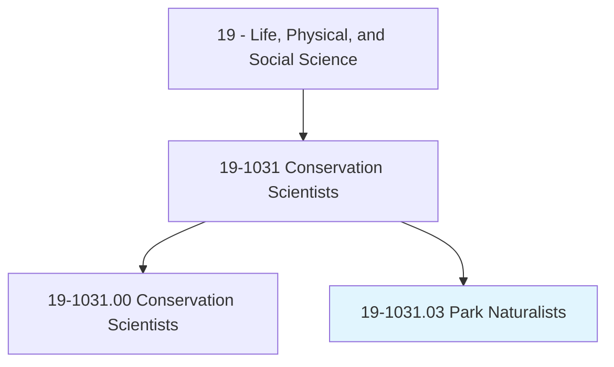
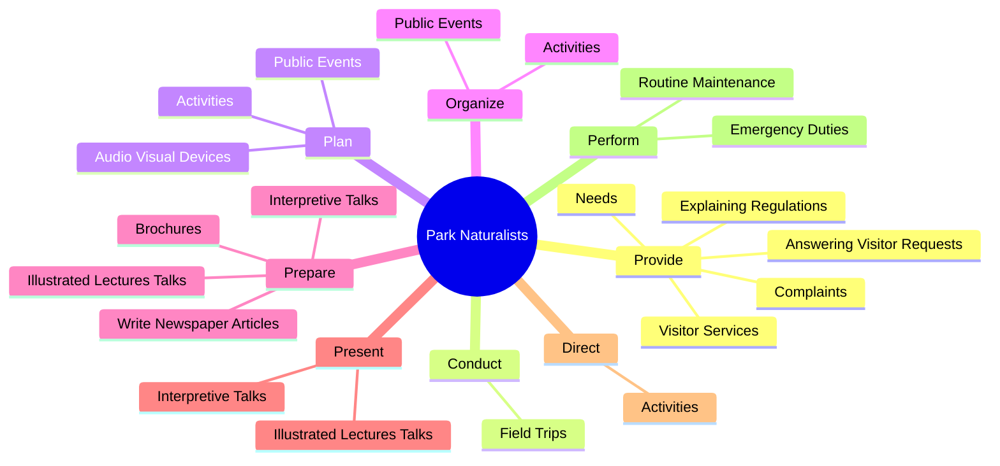
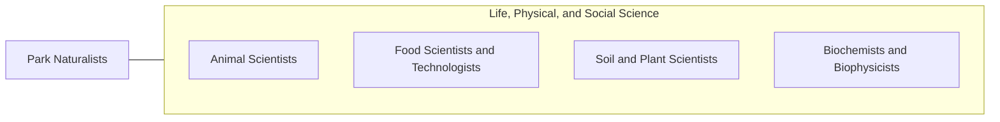

# Park Naturalists

> Plan, develop, and conduct programs to inform public of historical, natural, and scientific features of national, state, or local park.

## Overview

Park Naturalists is classified under Life, Physical, and Social Science (SOC 19). Plan, develop, and conduct programs to inform public of historical, natural, and scientific features of national, state, or local park.

## Classification Hierarchy

## Key Statistics

| Metric | Value |
|--------|-------|
| SOC Code | 19-1031.03 |
| Category | [Life, Physical, and Social Science](/occupations/Science) |
| Task Count | 51 |
| Source | O*NET |

## Core Tasks

### provide.VisitorServices

Park Naturalists provide visitor services as part of their core responsibilities.

**Actions:**
- `provide.VisitorServices`
- `provide.ExplainingRegulations`
- `provide.AnsweringVisitorRequests`
- `provide.Needs`

### conduct.FieldTrips

Park Naturalists conduct field trips as part of their core responsibilities.

**Actions:**
- `conduct.FieldTrips.to.PointOutScientific`
- `conduct.FieldTrips.to.Historic`
- `conduct.FieldTrips.to.NaturalFeaturesOfParks`
- `conduct.FieldTrips.to.Forests`

### plan.PublicEvents

Park Naturalists plan public events as part of their core responsibilities.

**Actions:**
- `plan.PublicEvents.at.Park`
- `plan.Activities.of.SeasonalStaffMembers`
- `plan.AudioVisualDevices.for.PublicPrograms`

## Skills & Competencies

### Technical Skills
- **Research Methods** - Advanced
- **Data Analysis** - Advanced
- **Laboratory Techniques** - Advanced

### Soft Skills
- **Communication** - Essential
- **Problem Solving** - Essential
- **Critical Thinking** - Important
- **Teamwork** - Important
- **Adaptability** - Important

## Related Occupations

## Industries

This occupation is found across multiple industries. See [Industries](/industries) for sector-specific employment data.

## Career Progression

---

*Source: O*NET 19-1031.03 - ONETOccupation*
