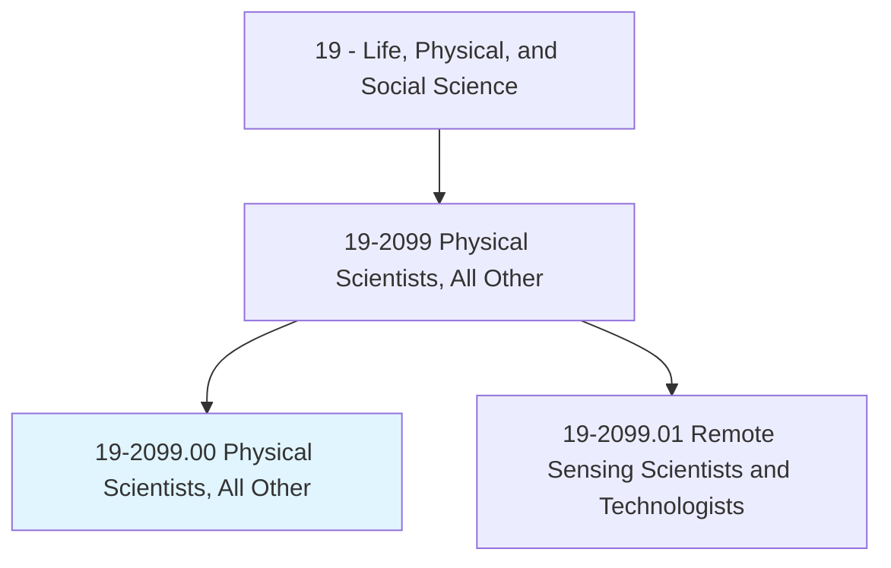
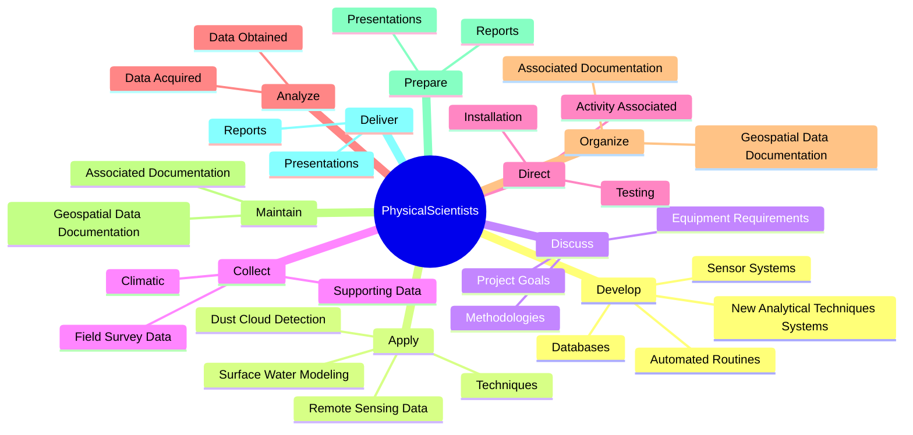
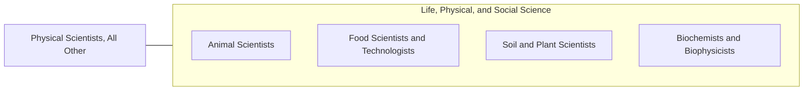

# Physical Scientists, All Other

> All physical scientists not listed separately.

## Overview

Physical Scientists, All Other is classified under Life, Physical, and Social Science (SOC 19). All physical scientists not listed separately.

## Classification Hierarchy

## Key Statistics

| Metric | Value |
|--------|-------|
| SOC Code | 19-2099.00 |
| Category | [Life, Physical, and Social Science](/occupations/Science) |
| Task Count | 69 |
| Source | O*NET |

## Core Tasks

### develop.Databases

Physical Scientists, All Other develop databases as part of their core responsibilities.

**Actions:**
- `develop.Databases.for.RemoteSensing`
- `develop.Databases.for.RelatedGeospatialProjectInformation`
- `develop.AutomatedRoutines.to.Presence`
- `develop.AutomatedRoutines.to.GroundVegetation`

### apply.RemoteSensingData

Physical Scientists, All Other apply remote sensing data as part of their core responsibilities.

**Actions:**
- `apply.RemoteSensingData.to.EnvironmentalIssues`
- `apply.Techniques.to.EnvironmentalIssues`
- `apply.SurfaceWaterModeling.to.EnvironmentalIssues`
- `apply.DustCloudDetection.to.EnvironmentalIssues`

### discuss.ProjectGoals

Physical Scientists, All Other discuss project goals as part of their core responsibilities.

**Actions:**
- `discuss.ProjectGoals.with.ColleaguesMembers`
- `discuss.ProjectGoals.with.TeamMembers`
- `discuss.EquipmentRequirements.with.ColleaguesMembers`
- `discuss.EquipmentRequirements.with.TeamMembers`

## Skills & Competencies

### Technical Skills
- **Research Methods** - Advanced
- **Data Analysis** - Advanced
- **Laboratory Techniques** - Advanced

### Soft Skills
- **Communication** - Essential
- **Problem Solving** - Essential
- **Critical Thinking** - Important
- **Teamwork** - Important
- **Adaptability** - Important

## Related Occupations

## Industries

This occupation is found across multiple industries. See [Industries](/industries) for sector-specific employment data.

## Career Progression

---

*Source: O*NET 19-2099.00 - ONETOccupation*
