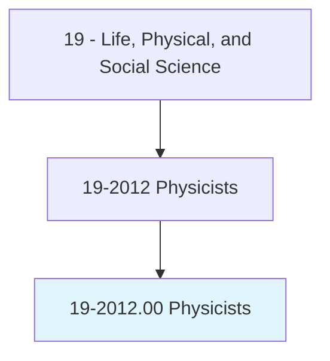
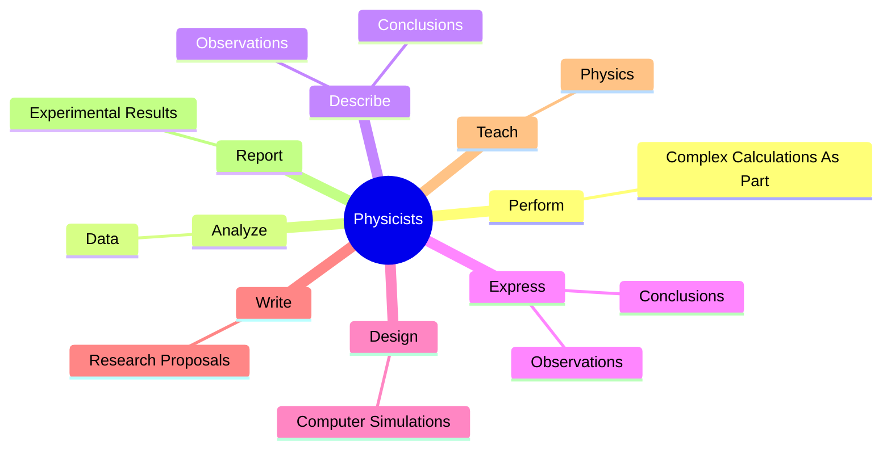
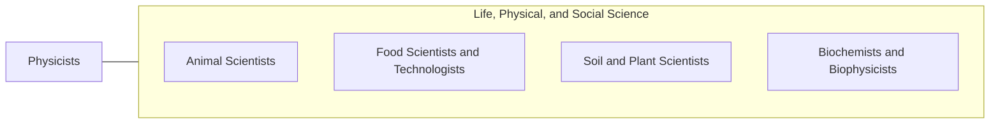

# Physicists

> Conduct research into physical phenomena, develop theories on the basis of observation and experiments, and devise methods to apply physical laws and theories.

## Overview

Physicists is classified under Life, Physical, and Social Science (SOC 19). Conduct research into physical phenomena, develop theories on the basis of observation and experiments, and devise methods to apply physical laws and theories.

## Classification Hierarchy

## Key Statistics

| Metric | Value |
|--------|-------|
| SOC Code | 19-2012.00 |
| Category | [Life, Physical, and Social Science](/occupations/Science/index) |
| Task Count | 45 |
| Source | O*NET |

## Core Tasks

### perform.ComplexCalculationsAsPart

Physicists perform complex calculations as part as part of their core responsibilities.

**Actions:**
- `perform.ComplexCalculationsAsPart.of.Analysis.of.DataUsingComputers`
- `perform.ComplexCalculationsAsPart.of.Evaluation.of.DataUsingComputers`

### analyze.Data

Physicists analyze data as part of their core responsibilities.

**Actions:**
- `analyze.Data.from.ResearchConducted.to.Detect`
- `analyze.Data.from.MeasurePhysicalPhenomena`

### describe.Observations

Physicists describe observations as part of their core responsibilities.

**Actions:**
- `describe.Observations.in.MathematicalTerms`
- `describe.Conclusions.in.MathematicalTerms`

## Skills & Competencies

### Technical Skills
- **Research Methods** - Advanced
- **Data Analysis** - Advanced
- **Laboratory Techniques** - Advanced

### Soft Skills
- **Communication** - Essential
- **Problem Solving** - Essential
- **Critical Thinking** - Important
- **Teamwork** - Important
- **Adaptability** - Important

## Related Occupations

## Industries

This occupation is found across multiple industries. See [Industries](/industries) for sector-specific employment data.

## Career Progression

---

*Source: O*NET 19-2012.00 - ONETOccupation*
