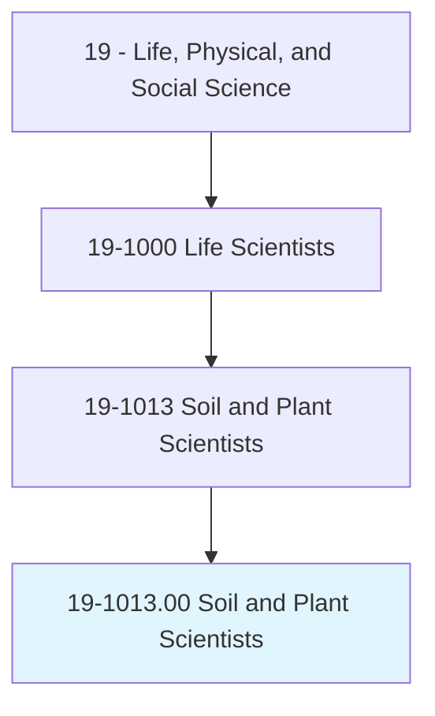
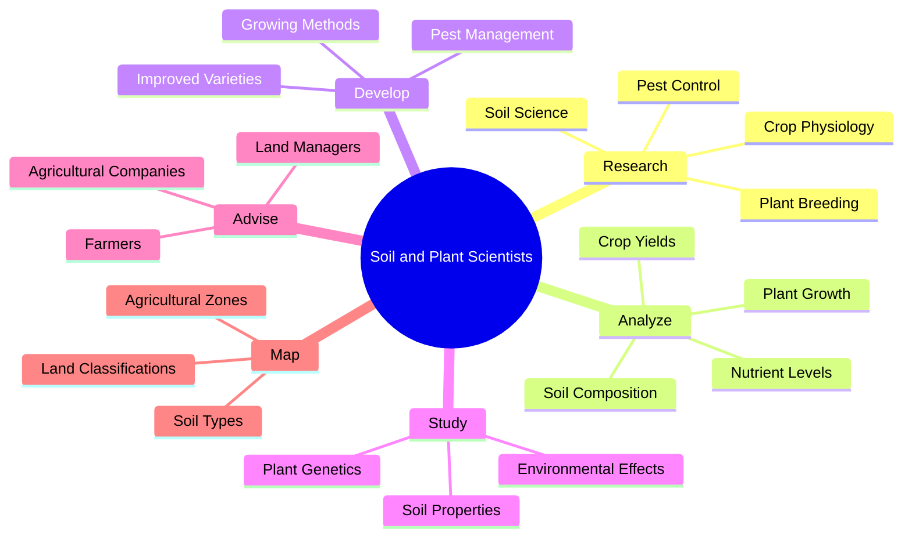
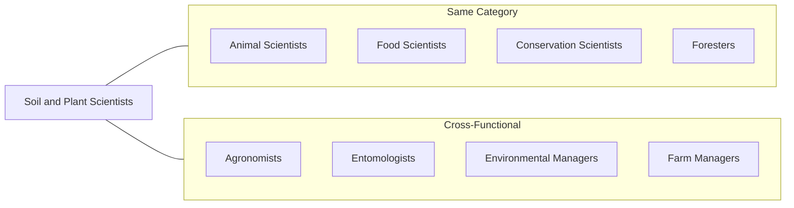
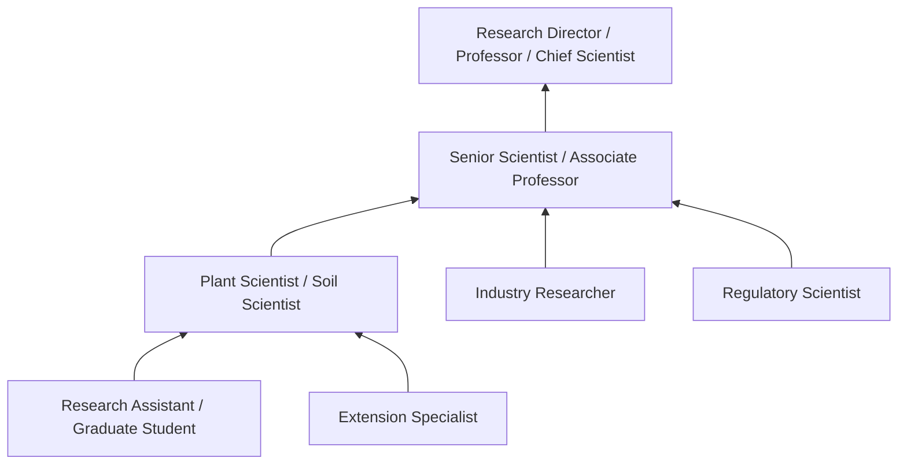

# Soil and Plant Scientists

> Conduct research in breeding, physiology, production, yield, and management of crops and agricultural plants or trees, shrubs, and nursery stock, their growth in soils, and control of pests; or study the chemical, physical, biological, and mineralogical composition of soils as they relate to plant or crop growth. May classify and map soils and investigate effects of alternative practices on soil and crop productivity.

## Overview

Soil and Plant Scientists are researchers who advance agricultural productivity and environmental sustainability through systematic study of plants and soils. They investigate plant genetics, physiology, and breeding to develop improved crop varieties, while also analyzing soil composition and properties to optimize growing conditions. Their work spans from fundamental research in plant biology to applied agricultural science, addressing global challenges in food security, climate adaptation, and sustainable land management. They work in universities, government agencies, agricultural companies, and environmental consulting firms.

## Classification Hierarchy



## Key Statistics

| Metric | Value |
|--------|-------|
| SOC Code | 19-1013.00 |
| Job Zone | 5 (Extensive Preparation) |
| Category | [Life, Physical, and Social Science](/occupations/Science/index) |
| Core Tasks | 14+ |
| Source | O*NET |

## Core Tasks



### conduct.Research.on.PlantBreeding

Soil and Plant Scientists develop improved crop varieties through breeding research.

**Actions:**
- `conduct.Research.on.PlantBreeding.to.develop.ImprovedVarieties` - Create crops with superior traits
- `study.PlantGenetics.to.identify.DesirableTraits` - Analyze hereditary characteristics
- `develop.HybridVarieties.to.increase.Yields` - Combine genetic traits for productivity
- `evaluate.CropPerformance.under.DifferentConditions` - Test varieties across environments
- `apply.BiotechnologyMethods.to.accelerate.BreedingPrograms` - Use molecular tools for crop improvement

### analyze.SoilComposition

Soil and Plant Scientists study soil properties and their effects on plant growth.

**Actions:**
- `analyze.SoilComposition.to.determine.NutrientLevels` - Measure essential soil elements
- `study.SoilStructure.to.assess.Drainage.Properties` - Evaluate physical soil characteristics
- `test.SoilpH.to.recommend.Amendments` - Measure and optimize soil acidity
- `evaluate.SoilMicrobiology.to.understand.NutrientCycling` - Study beneficial soil organisms
- `analyze.SoilContamination.to.assess.EnvironmentalRisks` - Identify pollutants and remediation needs

### study.PlantPhysiology

Soil and Plant Scientists investigate how plants function and respond to their environment.

**Actions:**
- `study.PlantPhysiology.to.understand.GrowthProcesses` - Research plant development mechanisms
- `analyze.Photosynthesis.to.optimize.CropProductivity` - Study energy capture and conversion
- `investigate.WaterUse.to.improve.DroughtTolerance` - Research plant water relations
- `evaluate.NutrientUptake.to.enhance.FertilizationStrategies` - Study plant nutrition
- `study.StressResponses.to.develop.ResilientCrops` - Investigate plant adaptation mechanisms

### develop.PestManagement

Soil and Plant Scientists create strategies to control agricultural pests.

**Actions:**
- `develop.PestManagement.Strategies.to.protect.Crops` - Design integrated pest control programs
- `research.BiologicalControls.to.reduce.PesticideUse` - Study natural pest enemies
- `evaluate.PestResistance.to.inform.BreedingPrograms` - Identify resistance mechanisms
- `test.PestControlMethods.to.assess.Effectiveness` - Compare management approaches
- `advise.Farmers.on.IntegratedPestManagement` - Share best practices for pest control

### map.SoilTypes

Soil and Plant Scientists classify and document soil distribution across landscapes.

**Actions:**
- `map.SoilTypes.to.guide.LandUseDecisions` - Create soil distribution maps
- `classify.Soils.according.to.TaxonomicSystems` - Apply scientific classification schemes
- `survey.AgriculturalLands.to.assess.Productivity.Potential` - Evaluate land capabilities
- `analyze.SoilDistribution.to.predict.CropSuitability` - Match soils to appropriate crops
- `document.SoilChanges.to.monitor.LandDegradation` - Track soil health over time

### advise.Farmers

Soil and Plant Scientists provide expert guidance to agricultural producers.

**Actions:**
- `advise.Farmers.on.CropSelection.for.SoilConditions` - Match crops to local soils
- `recommend.FertilizationPrograms.to.optimize.Yields` - Develop nutrient management plans
- `consult.Growers.on.SustainablePractices` - Promote environmentally sound agriculture
- `educate.Producers.on.NewVarieties.and.Technologies` - Transfer research findings to practice
- `provide.Guidance.on.SoilConservation.Methods` - Recommend erosion control measures

## Skills & Competencies

### Technical Skills
- **Plant Genetics and Breeding** - Expert
- **Soil Science** - Expert
- **Agronomy** - Advanced
- **Plant Physiology** - Advanced
- **Statistical Analysis** - Advanced
- **Laboratory Techniques** - Advanced
- **GIS and Remote Sensing** - Advanced
- **Field Research Methods** - Expert

### Soft Skills
- **Analytical Thinking** - Critical
- **Scientific Writing** - Critical
- **Problem Solving** - Essential
- **Communication** - Essential
- **Patience and Persistence** - Essential

## Related Occupations



## Industries

- [Agricultural Research](/industries/AgriculturalResearch) - High Employment
- [Seed and Crop Development Companies](/industries/SeedIndustry) - High Employment
- [Universities and Research Institutions](/industries/Education) - Moderate Employment
- [Government Agricultural Agencies](/industries/Government) - Moderate Employment
- [Environmental Consulting](/industries/EnvironmentalConsulting) - Growing Employment
- [Agrochemical Companies](/industries/Agrochemicals) - Moderate Employment

## Career Progression



## Industry Variations

### Academic Research
Focus on fundamental plant biology and soil science research. Teaching responsibilities combined with publication-oriented research.

### Seed and Biotechnology Companies
Applied research for variety development and trait improvement. Emphasis on commercial product development and intellectual property.

### Government Agencies
Research supporting agricultural policy and environmental protection. Focus on public interest research and regulatory science.

### Extension Services
Knowledge transfer to farmers and agricultural producers. Applied research addressing local agricultural challenges.

### Environmental Consulting
Soil assessment, remediation planning, and environmental impact evaluation. Project-based work for various clients.

## Education & Training

| Requirement | Details |
|-------------|---------|
| Typical Education | Doctoral degree in Plant Science, Soil Science, Agronomy, or related field |
| Work Experience | 2-5 years postdoctoral or industry research experience |
| On-the-Job Training | Moderate - specialized techniques and regional conditions |
| Common Certifications | CPSS (Certified Professional Soil Scientist), CCA (Certified Crop Adviser) |

## Departments

This occupation typically works in:
- [Research and Development](/departments/Research/index)
- [Plant Science Department](/departments/PlantScience)
- [Soil Science Department](/departments/SoilScience)
- [Agricultural Extension](/departments/Extension)
- [Environmental Science](/departments/EnvironmentalScience)

## GraphDL Semantic Structure

```
Soil and Plant Scientists perform:
- conduct.Research.on.PlantBreeding.to.develop.ImprovedVarieties
- analyze.SoilComposition.to.determine.NutrientLevels
- study.PlantPhysiology.to.understand.GrowthProcesses
- develop.PestManagement.to.protect.Crops
- map.SoilTypes.to.guide.LandUseDecisions
- advise.Farmers.on.SustainablePractices
```

---

*Source: O*NET 19-1013.00 - ONETOccupation*
