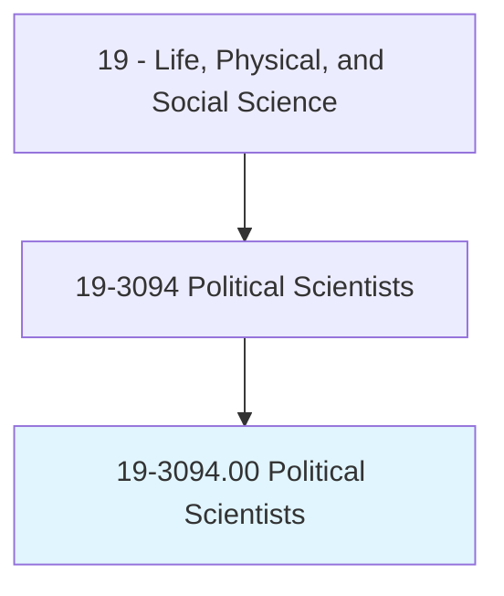
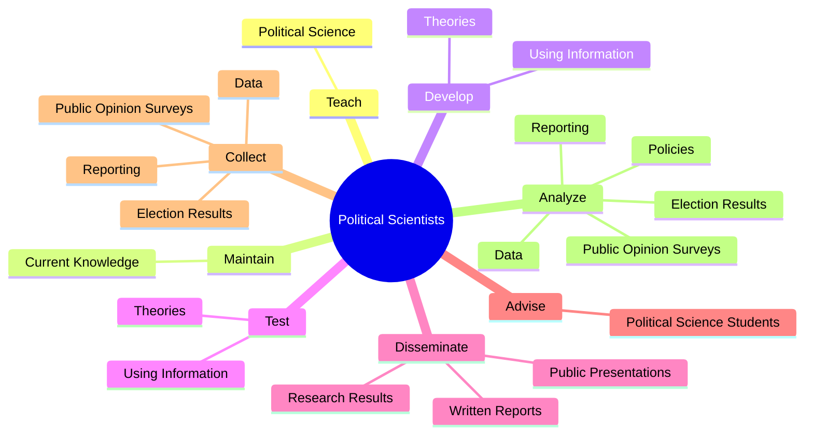

# Political Scientists

> Study the origin, development, and operation of political systems. May study topics, such as public opinion, political decisionmaking, and ideology. May analyze the structure and operation of governments, as well as various political entities. May conduct public opinion surveys, analyze election results, or analyze public documents.

## Overview

Political Scientists is an occupation within the Life, Physical, and Social Science category. Study the origin, development, and operation of political systems. May study topics, such as public opinion, political decisionmaking, and ideology.

## Classification Hierarchy

## Key Statistics

| Metric | Value |
|--------|-------|
| SOC Code | 19-3094.00 |
| Category | [Life, Physical, and Social Science](/occupations/Science/index) |
| Task Count | 119 |
| Source | O*NET |

## Core Tasks

### teach.PoliticalScience

Political Scientists teach political science as part of their core responsibilities.

**Actions:**
- `teach.PoliticalScience`

### maintain.CurrentKnowledge

Political Scientists maintain current knowledge as part of their core responsibilities.

**Actions:**
- `maintain.CurrentKnowledge.of.GovernmentPolicyDecisions`

### develop.Theories

Political Scientists develop theories as part of their core responsibilities.

**Actions:**
- `develop.Theories.from.Interviews`
- `develop.Theories.from.Newspapers`
- `develop.Theories.from.Periodicals`
- `develop.Theories.from.CaseLaw`

## Skills & Competencies

### Technical Skills
- **Research Methods** - Advanced
- **Data Analysis** - Advanced
- **Laboratory Techniques** - Advanced

### Soft Skills
- **Communication** - Essential
- **Problem Solving** - Essential
- **Critical Thinking** - Important
- **Teamwork** - Important
- **Adaptability** - Important

## Related Occupations

## Industries

This occupation is found across multiple industries. See [Industries](/industries) for sector-specific employment data.

## Career Progression

---

*Source: O*NET 19-3094.00 - ONETOccupation*
