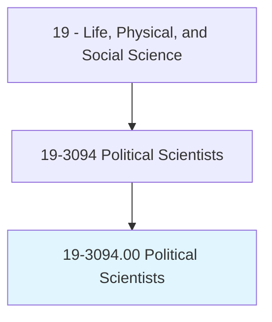
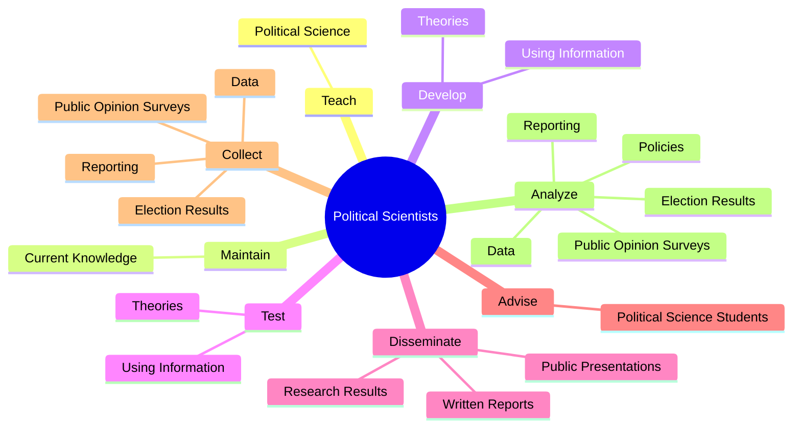
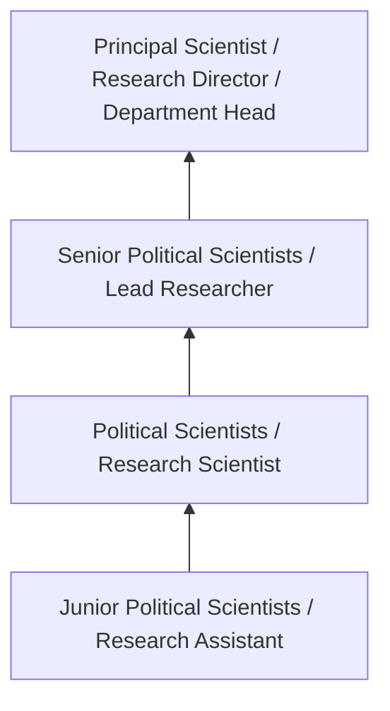

# Political Scientists

> Study the origin, development, and operation of political systems. May study topics, such as public opinion, political decisionmaking, and ideology. May analyze the structure and operation of governments, as well as various political entities. May conduct public opinion surveys, analyze election results, or analyze public documents.

## Overview

Political Scientists professionals study the origin, development, and operation of political systems. This occupation falls within the Life, Physical, and Social Science category and requires a combination of specialized knowledge, technical skills, and practical experience.

These professionals work across diverse settings and organizational contexts, applying their expertise to meet the demands of their field. They must stay current with industry standards, emerging practices, and regulatory requirements that affect their work. The role demands both independent judgment and collaborative skills, as practitioners regularly interact with colleagues, stakeholders, and the public.

As the field continues to evolve, Political Scientists professionals increasingly leverage technology and data-driven approaches to enhance their effectiveness. Career opportunities span the public and private sectors, with demand influenced by economic conditions, demographic shifts, and technological advancement.

## Classification Hierarchy



## Key Statistics

| Metric | Value |
|--------|-------|
| SOC Code | 19-3094.00 |
| Job Zone | N/A |
| Category | [Life, Physical, and Social Science](/occupations/Science/index) |
| Core Tasks | 119+ |
| Salary Range | $50,000 - $130,000 |
| Median Salary | $78,000 |
| Growth Outlook | 7% (Faster than average) |
| Source | O*NET |

## Core Tasks



### analyze.Data

Political Scientists analyze data as part of their core responsibilities.

**Actions:**
- `analyze.Data.on.Findings` - Collect, analyze, and interpret data, such as election results and public opi...
- `analyze.Data.on.Recommendations` - Collect, analyze, and interpret data, such as election results and public opi...
- `analyze.Data.on.Conclusions` - Collect, analyze, and interpret data, such as election results and public opi...
- `analyze.ElectionResults.on.Findings` - Collect, analyze, and interpret data, such as election results and public opi...
- `analyze.ElectionResults.on.Recommendations` - Collect, analyze, and interpret data, such as election results and public opi...

### interpret.Data

Political Scientists interpret data as part of their core responsibilities.

**Actions:**
- `interpret.Data.on.Findings` - Collect, analyze, and interpret data, such as election results and public opi...
- `interpret.Data.on.Recommendations` - Collect, analyze, and interpret data, such as election results and public opi...
- `interpret.Data.on.Conclusions` - Collect, analyze, and interpret data, such as election results and public opi...
- `interpret.ElectionResults.on.Findings` - Collect, analyze, and interpret data, such as election results and public opi...
- `interpret.ElectionResults.on.Recommendations` - Collect, analyze, and interpret data, such as election results and public opi...

### develop.Theories

Political Scientists develop theories as part of their core responsibilities.

**Actions:**
- `develop.Theories.from.Interviews` - Develop and test theories, using information from interviews, newspapers, per...
- `develop.Theories.from.Newspapers` - Develop and test theories, using information from interviews, newspapers, per...
- `develop.Theories.from.Periodicals` - Develop and test theories, using information from interviews, newspapers, per...
- `develop.Theories.from.CaseLaw` - Develop and test theories, using information from interviews, newspapers, per...
- `develop.Theories.from.HistoricalPapers` - Develop and test theories, using information from interviews, newspapers, per...

### test.Theories

Political Scientists test theories as part of their core responsibilities.

**Actions:**
- `test.Theories.from.Interviews` - Develop and test theories, using information from interviews, newspapers, per...
- `test.Theories.from.Newspapers` - Develop and test theories, using information from interviews, newspapers, per...
- `test.Theories.from.Periodicals` - Develop and test theories, using information from interviews, newspapers, per...
- `test.Theories.from.CaseLaw` - Develop and test theories, using information from interviews, newspapers, per...
- `test.Theories.from.HistoricalPapers` - Develop and test theories, using information from interviews, newspapers, per...


## Skills & Competencies

### Technical Skills
- **Research Methodology** - Expert
- **Data Analysis** - Advanced
- **Laboratory Techniques** - Advanced
- **Scientific Writing** - Advanced
- **Statistical Software** - Advanced
- **Quality Control** - Proficient

### Soft Skills
- **Analytical Thinking** - Critical
- **Attention to Detail** - Critical
- **Problem Solving** - Essential
- **Collaboration** - Essential
- **Written Communication** - Essential

## Education & Certifications

| Requirement | Details |
|-------------|---------|
| Typical Education | Bachelor's or Master's degree in relevant scientific field |
| Work Experience | 1-3 years research or laboratory experience |
| On-the-Job Training | Moderate - specialized laboratory techniques |
| Certifications | Field-specific certifications may be required |

## Career Progression



## Industry Variations

### Academic Research
Focus on fundamental research and publication. Political Scientists professionals in academia often combine research with teaching responsibilities and mentoring graduate students.

### Industry Research and Development
Applied research for product development and commercial applications. Emphasis on innovation timelines and market-driven objectives.

### Government and Regulatory
Mission-oriented research supporting public policy and regulatory decisions. Focus on public health, environmental protection, or national security.

### Consulting and Contract Research
Project-based work for diverse clients. Requires strong communication skills and ability to translate findings for non-technical audiences.

## Technology & Tools

- **Laboratory Information Management Systems (LIMS)**
- **Statistical software (R, SAS, SPSS)**
- **Spectroscopy and chromatography equipment**
- **Microscopy and imaging systems**
- **Data analysis and visualization tools**

## Related Occupations


## Industries

- Research and Development - High Employment
- Pharmaceutical Manufacturing - High Employment
- [Government Agencies](/industries/PublicAdministration) - Moderate Employment
- [Higher Education](/industries/Education) - Moderate Employment

## Departments

This occupation typically works in:
- [Research and Development](/departments/Research/index)
- Quality Assurance
- Laboratory Operations

## GraphDL Semantic Structure

```graphdl
Political Scientists perform:
- teach.PoliticalScience
- maintain.CurrentKnowledge.of.GovernmentPolicyDecisions
- develop.Theories.from.Interviews
- develop.Theories.from.Newspapers
- develop.Theories.from.Periodicals
- develop.Theories.from.CaseLaw
```

---

*Source: O*NET 19-3094.00 - ONETOccupation*
