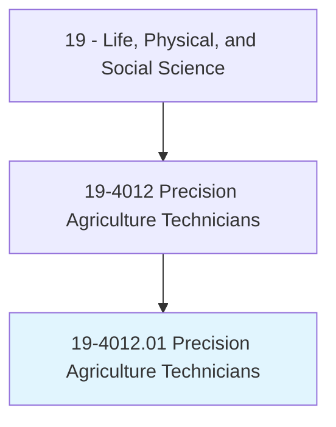
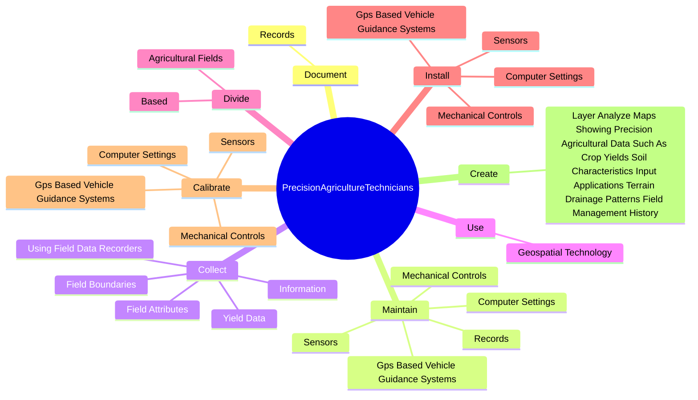
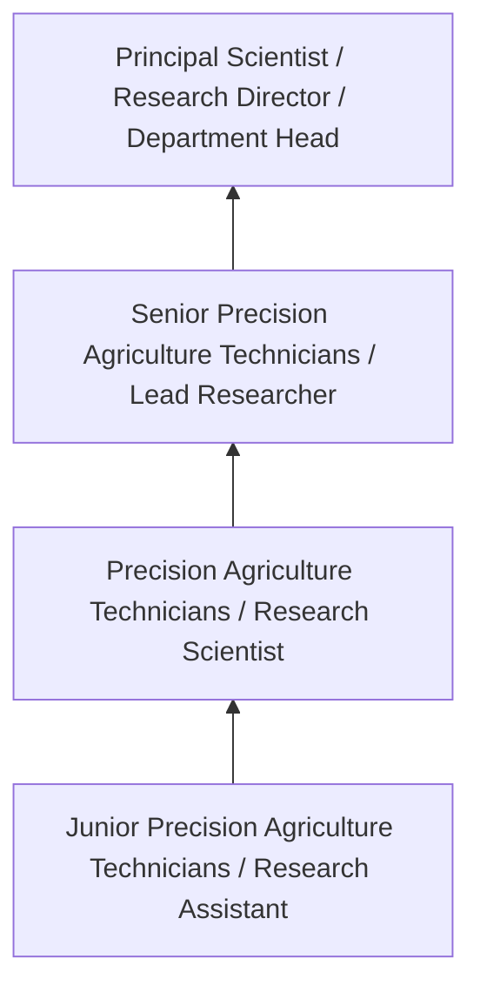
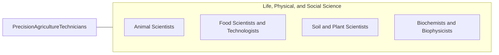

# Precision Agriculture Technicians

> Apply geospatial technologies, including geographic information systems (GIS) and Global Positioning System (GPS), to agricultural production or management activities, such as pest scouting, site-specific pesticide application, yield mapping, or variable-rate irrigation. May use computers to develop or analyze maps or remote sensing images to compare physical topography with data on soils, fertilizer, pests, or weather.

## Overview

Precision Agriculture Technicians professionals apply geospatial technologies, including geographic information systems (GIS) and Global Positioning System (GPS), to agricultural production or management activities, such as pest scouting, site-specific pesticide application, yield mapping, or variable-rate irrigation. This occupation falls within the Life, Physical, and Social Science category and requires a combination of specialized knowledge, technical skills, and practical experience.

These professionals work across diverse settings and organizational contexts, applying their expertise to meet the demands of their field. They must stay current with industry standards, emerging practices, and regulatory requirements that affect their work. The role demands both independent judgment and collaborative skills, as practitioners regularly interact with colleagues, stakeholders, and the public.

As the field continues to evolve, Precision Agriculture Technicians professionals increasingly leverage technology and data-driven approaches to enhance their effectiveness. Career opportunities span the public and private sectors, with demand influenced by economic conditions, demographic shifts, and technological advancement.

## Classification Hierarchy



## Key Statistics

| Metric | Value |
|--------|-------|
| SOC Code | 19-4012.01 |
| Job Zone | N/A |
| Category | [Life, Physical, and Social Science](/occupations/Science/index) |
| Core Tasks | 88+ |
| Salary Range | $50,000 - $130,000 |
| Median Salary | $78,000 |
| Growth Outlook | 7% (Faster than average) |
| Source | O*NET |

## Core Tasks



### analyze.GeospatialData

Precision Agriculture Technicians analyze geospatial data as part of their core responsibilities.

**Actions:**
- `analyze.GeospatialData.to.determine.AgriculturalImplicationsOfFactors` - Analyze geospatial data to determine agricultural implications of factors suc...
- `analyze.GeospatialData.to.SoilQuality` - Analyze geospatial data to determine agricultural implications of factors suc...
- `analyze.GeospatialData.to.Terrain` - Analyze geospatial data to determine agricultural implications of factors suc...
- `analyze.GeospatialData.to.FieldProductivity` - Analyze geospatial data to determine agricultural implications of factors suc...
- `analyze.GeospatialData.to.Fertilizers` - Analyze geospatial data to determine agricultural implications of factors suc...

### program.FarmEquipment

Precision Agriculture Technicians program farm equipment as part of their core responsibilities.

**Actions:**
- `program.FarmEquipment.on.Input.from.CropScoutingOfFieldConditionVariability` - Program farm equipment, such as variable-rate planting equipment or pesticide...
- `program.FarmEquipment.on.Analysis.of.FieldConditionVariability` - Program farm equipment, such as variable-rate planting equipment or pesticide...
- `program.VariableRatePlantingEquipment.on.Input.from.CropScoutingOfFieldConditionVariability` - Program farm equipment, such as variable-rate planting equipment or pesticide...
- `program.VariableRatePlantingEquipment.on.Analysis.of.FieldConditionVariability` - Program farm equipment, such as variable-rate planting equipment or pesticide...
- `program.PesticideSprayers.on.Input.from.CropScoutingOfFieldConditionVariability` - Program farm equipment, such as variable-rate planting equipment or pesticide...

### use.GeospatialTechnology

Precision Agriculture Technicians use geospatial technology as part of their core responsibilities.

**Actions:**
- `use.GeospatialTechnology.to.develop.SoilSamplingGrids` - Use geospatial technology to develop soil sampling grids or identify sampling...
- `use.GeospatialTechnology.to.identify.SamplingSitesForTestingCharacteristics` - Use geospatial technology to develop soil sampling grids or identify sampling...
- `use.GeospatialTechnology.to.Nitrogen` - Use geospatial technology to develop soil sampling grids or identify sampling...
- `use.GeospatialTechnology.to.Phosphorus` - Use geospatial technology to develop soil sampling grids or identify sampling...
- `use.GeospatialTechnology.to.PotassiumContent` - Use geospatial technology to develop soil sampling grids or identify sampling...

### demonstrate.Applications

Precision Agriculture Technicians demonstrate applications as part of their core responsibilities.

**Actions:**
- `demonstrate.Applications.of.GeospatialTechnology` - Demonstrate the applications of geospatial technology, such as Global Positio...
- `demonstrate.Applications.of.GlobalPositioningSystemGps` - Demonstrate the applications of geospatial technology, such as Global Positio...
- `demonstrate.Applications.of.GeographicInformationSystemsGis` - Demonstrate the applications of geospatial technology, such as Global Positio...
- `demonstrate.Applications.of.AutomaticTractorGuidanceSystems` - Demonstrate the applications of geospatial technology, such as Global Positio...
- `demonstrate.Applications.of.VariableRateChemicalInputApplicators` - Demonstrate the applications of geospatial technology, such as Global Positio...


## Skills & Competencies

### Technical Skills
- **Research Methodology** - Expert
- **Data Analysis** - Advanced
- **Laboratory Techniques** - Advanced
- **Scientific Writing** - Advanced
- **Statistical Software** - Advanced
- **Quality Control** - Proficient

### Soft Skills
- **Analytical Thinking** - Critical
- **Attention to Detail** - Critical
- **Problem Solving** - Essential
- **Collaboration** - Essential
- **Written Communication** - Essential

## Education & Certifications

| Requirement | Details |
|-------------|---------|
| Typical Education | Bachelor's or Master's degree in relevant scientific field |
| Work Experience | 1-3 years research or laboratory experience |
| On-the-Job Training | Moderate - specialized laboratory techniques |
| Certifications | Field-specific certifications may be required |

## Career Progression



## Industry Variations

### Academic Research
Focus on fundamental research and publication. Precision Agriculture Technicians professionals in academia often combine research with teaching responsibilities and mentoring graduate students.

### Industry Research and Development
Applied research for product development and commercial applications. Emphasis on innovation timelines and market-driven objectives.

### Government and Regulatory
Mission-oriented research supporting public policy and regulatory decisions. Focus on public health, environmental protection, or national security.

### Consulting and Contract Research
Project-based work for diverse clients. Requires strong communication skills and ability to translate findings for non-technical audiences.

## Technology & Tools

- **Laboratory Information Management Systems (LIMS)**
- **Statistical software (R, SAS, SPSS)**
- **Spectroscopy and chromatography equipment**
- **Microscopy and imaging systems**
- **Data analysis and visualization tools**

## Related Occupations



## Industries

- Research and Development - High Employment
- Pharmaceutical Manufacturing - High Employment
- [Government Agencies](/industries/PublicAdministration) - Moderate Employment
- [Higher Education](/industries/Education) - Moderate Employment

## Departments

This occupation typically works in:
- [Research and Development](/departments/Research/index)
- Quality Assurance
- Laboratory Operations

## GraphDL Semantic Structure

```graphdl
Precision Agriculture Technicians perform:
- document.Records.of.PrecisionAgricultureInformation
- maintain.Records.of.PrecisionAgricultureInformation
- collect.Information.about.SoilAttributes
- collect.FieldAttributes
- collect.YieldData
- collect.FieldBoundaries
```

---

*Source: O*NET 19-4012.01 - ONETOccupation*
