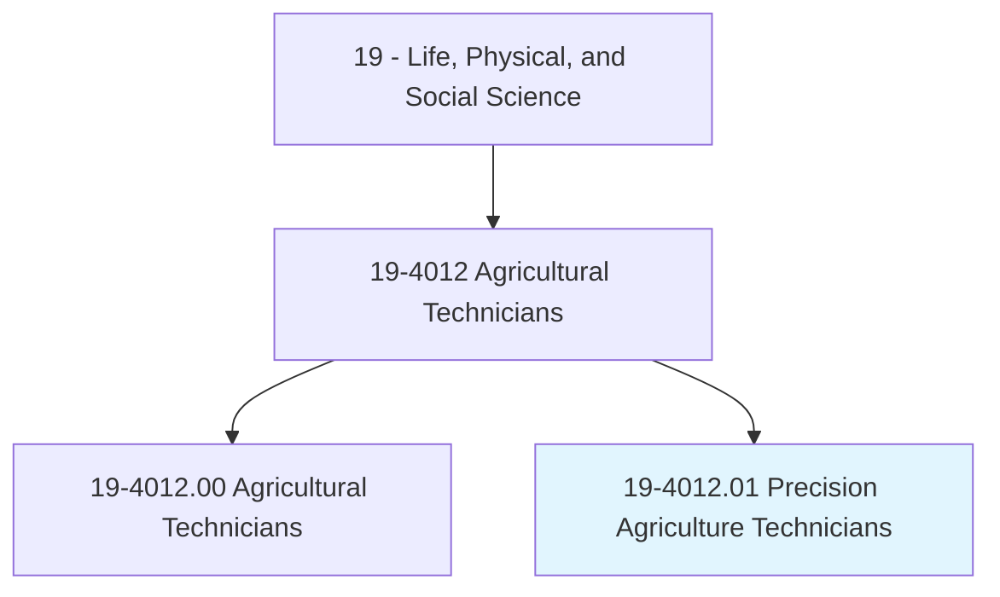
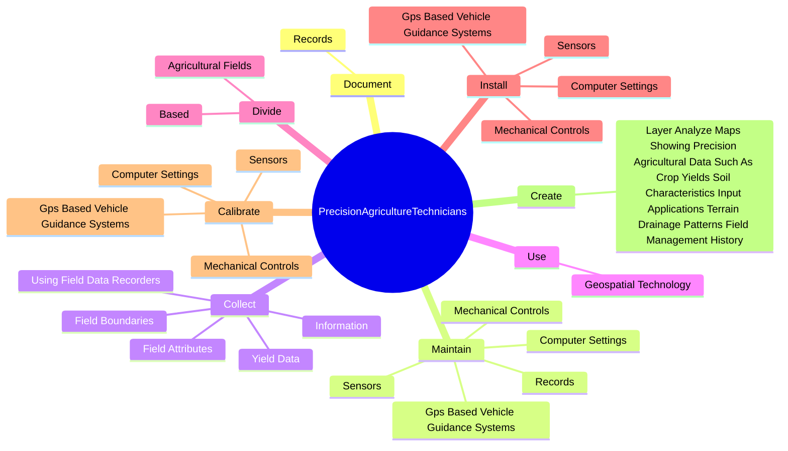
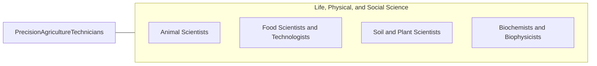

# Precision Agriculture Technicians

> Apply geospatial technologies, including geographic information systems (GIS) and Global Positioning System (GPS), to agricultural production or management activities, such as pest scouting, site-specific pesticide application, yield mapping, or variable-rate irrigation. May use computers to develop or analyze maps or remote sensing images to compare physical topography with data on soils, fertilizer, pests, or weather.

## Overview

Precision Agriculture Technicians is a specialized variant within the Life, Physical, and Social Science category. Apply geospatial technologies, including geographic information systems (GIS) and Global Positioning System (GPS), to agricultural production or management activities, such as pest scouting, site-specific pesticide application, yield mapping, or variable-rate irrigation. 

## Classification Hierarchy

## Key Statistics

| Metric | Value |
|--------|-------|
| SOC Code | 19-4012.01 |
| Category | [Life, Physical, and Social Science](/occupations/Science/index) |
| Task Count | 88 |
| Source | O*NET |

## Core Tasks

### document.Records

Precision Agriculture Technicians document records as part of their core responsibilities.

**Actions:**
- `document.Records.of.PrecisionAgricultureInformation`

### maintain.Records

Precision Agriculture Technicians maintain records as part of their core responsibilities.

**Actions:**
- `maintain.Records.of.PrecisionAgricultureInformation`
- `maintain.Sensors`
- `maintain.MechanicalControls`
- `maintain.GpsBasedVehicleGuidanceSystems`

### collect.Information

Precision Agriculture Technicians collect information as part of their core responsibilities.

**Actions:**
- `collect.Information.about.SoilAttributes`
- `collect.FieldAttributes`
- `collect.YieldData`
- `collect.FieldBoundaries`

## Skills & Competencies

### Technical Skills
- **Research Methods** - Advanced
- **Data Analysis** - Advanced
- **Laboratory Techniques** - Advanced

### Soft Skills
- **Communication** - Essential
- **Problem Solving** - Essential
- **Critical Thinking** - Important
- **Teamwork** - Important
- **Adaptability** - Important

## Related Occupations

## Industries

This occupation is found across multiple industries. See [Industries](/industries) for sector-specific employment data.

## Career Progression

---

*Source: O*NET 19-4012.01 - ONETOccupation*
