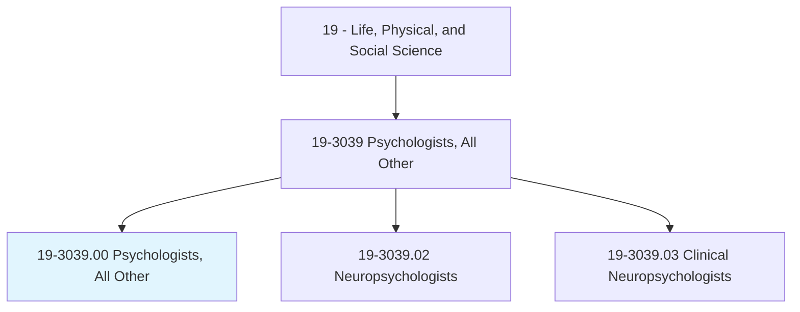
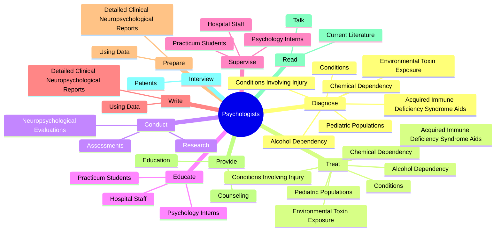

# Psychologists, All Other

> All psychologists not listed separately.

## Overview

Psychologists, All Other is classified under Life, Physical, and Social Science (SOC 19). All psychologists not listed separately.

## Classification Hierarchy

## Key Statistics

| Metric | Value |
|--------|-------|
| SOC Code | 19-3039.00 |
| Category | [Life, Physical, and Social Science](/occupations/Science/index) |
| Task Count | 96 |
| Source | O*NET |

## Core Tasks

### diagnose.ConditionsInvolvingInjury

Psychologists, All Other diagnose conditions involving injury as part of their core responsibilities.

**Actions:**
- `diagnose.ConditionsInvolvingInjury.to.CentralNervousSystem`
- `diagnose.ConditionsInvolvingInjury.to.CerebrovascularAccidents`
- `diagnose.ConditionsInvolvingInjury.to.Neoplasms`
- `diagnose.ConditionsInvolvingInjury.to.Infectious`

### treat.ConditionsInvolvingInjury

Psychologists, All Other treat conditions involving injury as part of their core responsibilities.

**Actions:**
- `treat.ConditionsInvolvingInjury.to.CentralNervousSystem`
- `treat.ConditionsInvolvingInjury.to.CerebrovascularAccidents`
- `treat.ConditionsInvolvingInjury.to.Neoplasms`
- `treat.ConditionsInvolvingInjury.to.Infectious`

### conduct.NeuropsychologicalEvaluations

Psychologists, All Other conduct neuropsychological evaluations as part of their core responsibilities.

**Actions:**
- `conduct.NeuropsychologicalEvaluations.of.Intelligence`
- `conduct.NeuropsychologicalEvaluations.of.AcademicAbility`
- `conduct.NeuropsychologicalEvaluations.of.Attention`
- `conduct.NeuropsychologicalEvaluations.of.Concentration`

## Skills & Competencies

### Technical Skills
- **Research Methods** - Advanced
- **Data Analysis** - Advanced
- **Laboratory Techniques** - Advanced

### Soft Skills
- **Communication** - Essential
- **Problem Solving** - Essential
- **Critical Thinking** - Important
- **Teamwork** - Important
- **Adaptability** - Important

## Related Occupations

## Industries

This occupation is found across multiple industries. See [Industries](/industries) for sector-specific employment data.

## Career Progression

---

*Source: O*NET 19-3039.00 - ONETOccupation*
