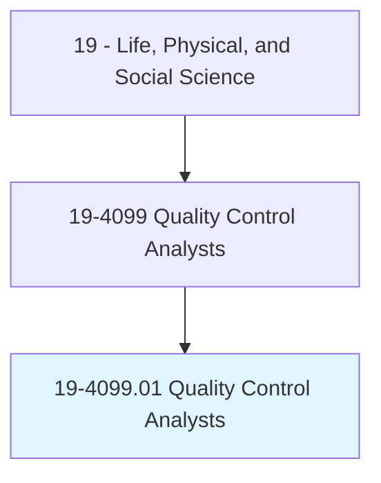
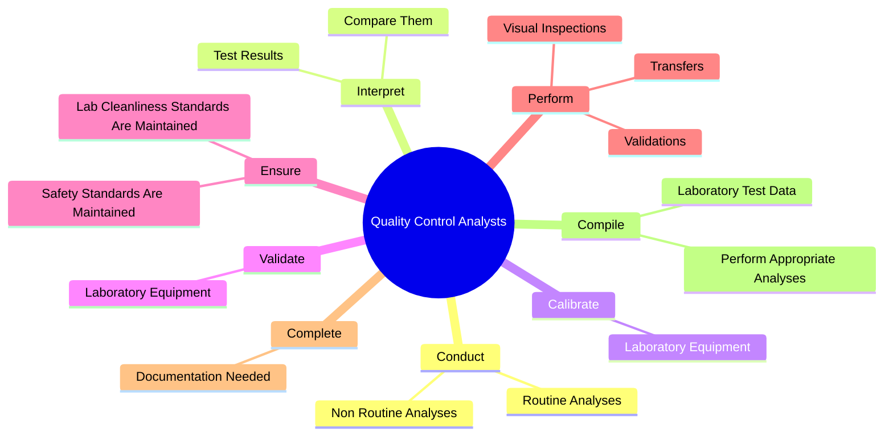
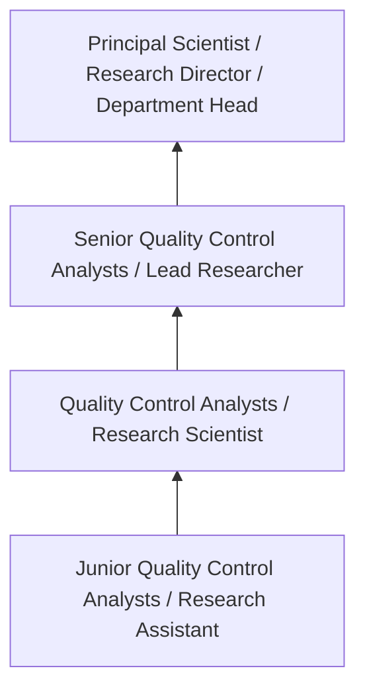
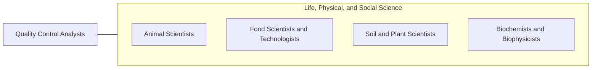

# Quality Control Analysts

> Conduct tests to determine quality of raw materials, bulk intermediate and finished products. May conduct stability sample tests.

## Overview

Quality Control Analysts professionals conduct tests to determine quality of raw materials, bulk intermediate and finished products. This occupation falls within the Life, Physical, and Social Science category and requires a combination of specialized knowledge, technical skills, and practical experience.

These professionals work across diverse settings and organizational contexts, applying their expertise to meet the demands of their field. They must stay current with industry standards, emerging practices, and regulatory requirements that affect their work. The role demands both independent judgment and collaborative skills, as practitioners regularly interact with colleagues, stakeholders, and the public.

As the field continues to evolve, Quality Control Analysts professionals increasingly leverage technology and data-driven approaches to enhance their effectiveness. Career opportunities span the public and private sectors, with demand influenced by economic conditions, demographic shifts, and technological advancement.

## Classification Hierarchy



## Key Statistics

| Metric | Value |
|--------|-------|
| SOC Code | 19-4099.01 |
| Job Zone | N/A |
| Category | [Life, Physical, and Social Science](/occupations/Science/index) |
| Core Tasks | 72+ |
| Salary Range | $50,000 - $130,000 |
| Median Salary | $78,000 |
| Growth Outlook | 7% (Faster than average) |
| Source | O*NET |

## Core Tasks



### conduct.RoutineAnalyses

Quality Control Analysts conduct routine analyses as part of their core responsibilities.

**Actions:**
- `conduct.RoutineAnalyses.of.InProcessMaterials` - Conduct routine and non-routine analyses of in-process materials, raw materia...
- `conduct.RoutineAnalyses.of.RawMaterials` - Conduct routine and non-routine analyses of in-process materials, raw materia...
- `conduct.RoutineAnalyses.of.EnvironmentalSamples` - Conduct routine and non-routine analyses of in-process materials, raw materia...
- `conduct.RoutineAnalyses.of.FinishedGoods` - Conduct routine and non-routine analyses of in-process materials, raw materia...
- `conduct.RoutineAnalyses.of.StabilitySamples` - Conduct routine and non-routine analyses of in-process materials, raw materia...

### interpret.TestResults

Quality Control Analysts interpret test results as part of their core responsibilities.

**Actions:**
- `interpret.TestResults.to.established.Specifications` - Interpret test results, compare them to established specifications and contro...
- `interpret.TestResults.to.control.Limits` - Interpret test results, compare them to established specifications and contro...
- `interpret.TestResults.to.MakeRecommendationsOnAppropriatenessOfDataF` - Interpret test results, compare them to established specifications and contro...
- `interpret.TestResults.to.release` - Interpret test results, compare them to established specifications and contro...
- `interpret.CompareThem.to.established.Specifications` - Interpret test results, compare them to established specifications and contro...

### perform.VisualInspections

Quality Control Analysts perform visual inspections as part of their core responsibilities.

**Actions:**
- `perform.VisualInspections.of.FinishedProducts` - Perform visual inspections of finished products.
- `perform.Validations.of.AnalyticalMethods.in.AccordanceWithApplicablePolicies` - Perform validations or transfers of analytical methods in accordance with app...
- `perform.Validations.of.Guidelines` - Perform validations or transfers of analytical methods in accordance with app...
- `perform.Transfers.of.AnalyticalMethods.in.AccordanceWithApplicablePolicies` - Perform validations or transfers of analytical methods in accordance with app...
- `perform.Transfers.of.Guidelines` - Perform validations or transfers of analytical methods in accordance with app...

### write.Documentation

Quality Control Analysts write documentation as part of their core responsibilities.

**Actions:**
- `write.Documentation` - Write technical reports or documentation, such as deviation reports, testing ...
- `write.DeviationReports` - Write technical reports or documentation, such as deviation reports, testing ...
- `write.TestingProtocols` - Write technical reports or documentation, such as deviation reports, testing ...
- `write.TrendAnalyses` - Write technical reports or documentation, such as deviation reports, testing ...
- `write.StandardQualitycontrolOperatingProcedures` - Write or revise standard quality control operating procedures.


## Skills & Competencies

### Technical Skills
- **Research Methodology** - Expert
- **Data Analysis** - Advanced
- **Laboratory Techniques** - Advanced
- **Scientific Writing** - Advanced
- **Statistical Software** - Advanced
- **Quality Control** - Proficient

### Soft Skills
- **Analytical Thinking** - Critical
- **Attention to Detail** - Critical
- **Problem Solving** - Essential
- **Collaboration** - Essential
- **Written Communication** - Essential

## Education & Certifications

| Requirement | Details |
|-------------|---------|
| Typical Education | Bachelor's or Master's degree in relevant scientific field |
| Work Experience | 1-3 years research or laboratory experience |
| On-the-Job Training | Moderate - specialized laboratory techniques |
| Certifications | Field-specific certifications may be required |

## Career Progression



## Industry Variations

### Academic Research
Focus on fundamental research and publication. Quality Control Analysts professionals in academia often combine research with teaching responsibilities and mentoring graduate students.

### Industry Research and Development
Applied research for product development and commercial applications. Emphasis on innovation timelines and market-driven objectives.

### Government and Regulatory
Mission-oriented research supporting public policy and regulatory decisions. Focus on public health, environmental protection, or national security.

### Consulting and Contract Research
Project-based work for diverse clients. Requires strong communication skills and ability to translate findings for non-technical audiences.

## Technology & Tools

- **Laboratory Information Management Systems (LIMS)**
- **Statistical software (R, SAS, SPSS)**
- **Spectroscopy and chromatography equipment**
- **Microscopy and imaging systems**
- **Data analysis and visualization tools**

## Related Occupations



## Industries

- [Research and Development](/industries/ResearchDevelopment) - High Employment
- [Pharmaceutical Manufacturing](/industries/Pharma) - High Employment
- [Government Agencies](/industries/Government) - Moderate Employment
- [Higher Education](/industries/Education) - Moderate Employment

## Departments

This occupation typically works in:
- [Research and Development](/departments/Research/index)
- [Quality Assurance](/departments/QualityAssurance)
- [Laboratory Operations](/departments/Laboratory)

## GraphDL Semantic Structure

```
Quality Control Analysts perform:
- conduct.RoutineAnalyses.of.InProcessMaterials
- conduct.RoutineAnalyses.of.RawMaterials
- conduct.RoutineAnalyses.of.EnvironmentalSamples
- conduct.RoutineAnalyses.of.FinishedGoods
- conduct.RoutineAnalyses.of.StabilitySamples
- conduct.NonRoutineAnalyses.of.InProcessMaterials
```

---

*Source: O*NET 19-4099.01 - ONETOccupation*
