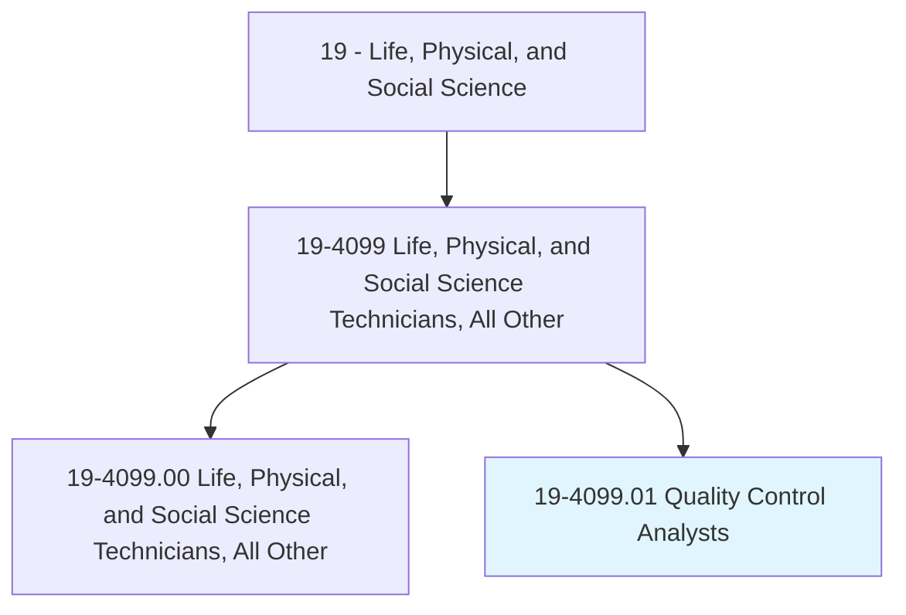
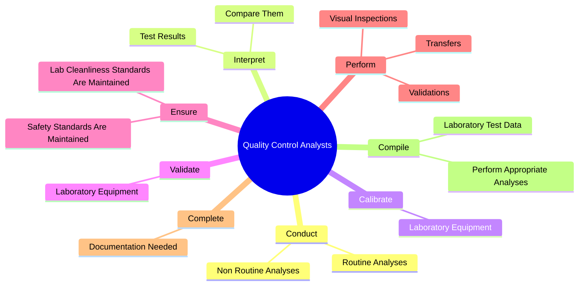
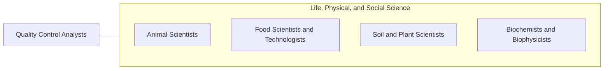

# Quality Control Analysts

> Conduct tests to determine quality of raw materials, bulk intermediate and finished products. May conduct stability sample tests.

## Overview

Quality Control Analysts is a specialized variant within the Life, Physical, and Social Science category. Conduct tests to determine quality of raw materials, bulk intermediate and finished products. 

## Classification Hierarchy

## Key Statistics

| Metric | Value |
|--------|-------|
| SOC Code | 19-4099.01 |
| Category | [Life, Physical, and Social Science](/occupations/Science/index) |
| Task Count | 72 |
| Source | O*NET |

## Core Tasks

### conduct.RoutineAnalyses

Quality Control Analysts conduct routine analyses as part of their core responsibilities.

**Actions:**
- `conduct.RoutineAnalyses.of.InProcessMaterials`
- `conduct.RoutineAnalyses.of.RawMaterials`
- `conduct.RoutineAnalyses.of.EnvironmentalSamples`
- `conduct.RoutineAnalyses.of.FinishedGoods`

### interpret.TestResults

Quality Control Analysts interpret test results as part of their core responsibilities.

**Actions:**
- `interpret.TestResults.to.established.Specifications`
- `interpret.TestResults.to.control.Limits`
- `interpret.TestResults.to.MakeRecommendationsOnAppropriatenessOfDataF`
- `interpret.TestResults.to.release`

### calibrate.LaboratoryEquipment

Quality Control Analysts calibrate laboratory equipment as part of their core responsibilities.

**Actions:**
- `calibrate.LaboratoryEquipment`

## Skills & Competencies

### Technical Skills
- **Research Methods** - Advanced
- **Data Analysis** - Advanced
- **Laboratory Techniques** - Advanced

### Soft Skills
- **Communication** - Essential
- **Problem Solving** - Essential
- **Critical Thinking** - Important
- **Teamwork** - Important
- **Adaptability** - Important

## Related Occupations

## Industries

This occupation is found across multiple industries. See [Industries](/industries) for sector-specific employment data.

## Career Progression

---

*Source: O*NET 19-4099.01 - ONETOccupation*
