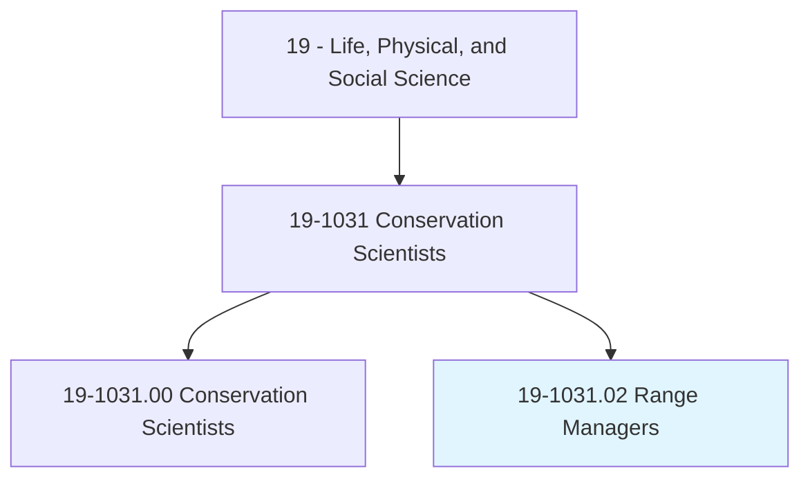
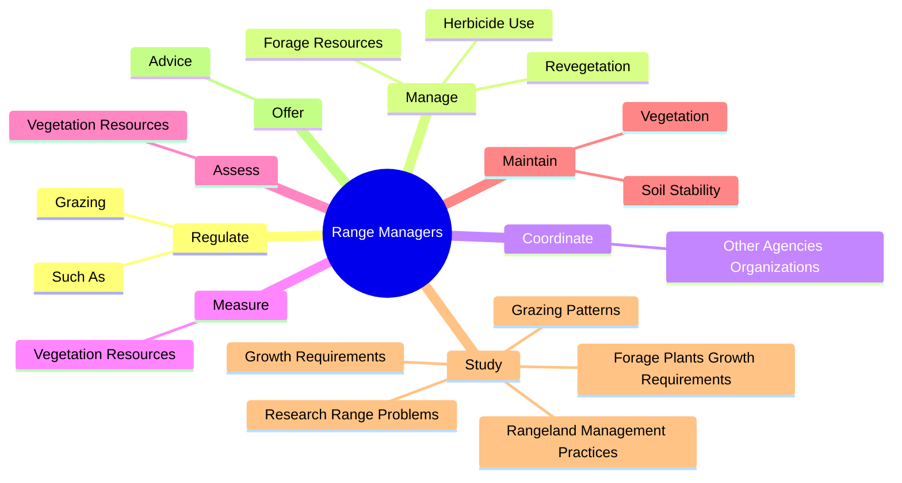
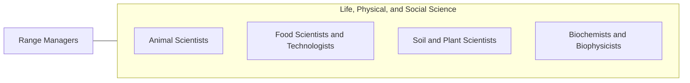

# Range Managers

> Research or study range land management practices to provide sustained production of forage, livestock, and wildlife.

## Overview

Range Managers is classified under Life, Physical, and Social Science (SOC 19). Research or study range land management practices to provide sustained production of forage, livestock, and wildlife.

## Classification Hierarchy

## Key Statistics

| Metric | Value |
|--------|-------|
| SOC Code | 19-1031.02 |
| Category | [Life, Physical, and Social Science](/occupations/Science) |
| Task Count | 90 |
| Source | O*NET |

## Core Tasks

### regulate.Grazing

Range Managers regulate grazing as part of their core responsibilities.

**Actions:**
- `regulate.Grazing.by.IssuingPermits`
- `regulate.Grazing.by.Checking.for.ComplianceWithStandards`
- `regulate.Grazing.by.HelpRanchersPlan`
- `regulate.Grazing.by.OrganizeGrazingSystems.to.Manage`

### manage.ForageResources

Range Managers manage forage resources as part of their core responsibilities.

**Actions:**
- `manage.ForageResources.through.Fire.to.maintain.SustainableYieldFromLand`
- `manage.HerbicideUse.to.maintain.SustainableYieldFromLand`
- `manage.Revegetation.to.maintain.SustainableYieldFromLand`

### coordinate.OtherAgenciesOrganizations

Range Managers coordinate other agencies organizations as part of their core responsibilities.

**Actions:**
- `coordinate.OtherAgenciesOrganizations.to.manage.Rangelands`
- `coordinate.OtherAgenciesOrganizations.to.protect.Rangelands`

## Skills & Competencies

### Technical Skills
- **Research Methods** - Advanced
- **Data Analysis** - Advanced
- **Laboratory Techniques** - Advanced

### Soft Skills
- **Communication** - Essential
- **Problem Solving** - Essential
- **Critical Thinking** - Important
- **Teamwork** - Important
- **Adaptability** - Important

## Related Occupations

## Industries

This occupation is found across multiple industries. See [Industries](/industries) for sector-specific employment data.

## Career Progression

---

*Source: O*NET 19-1031.02 - ONETOccupation*
