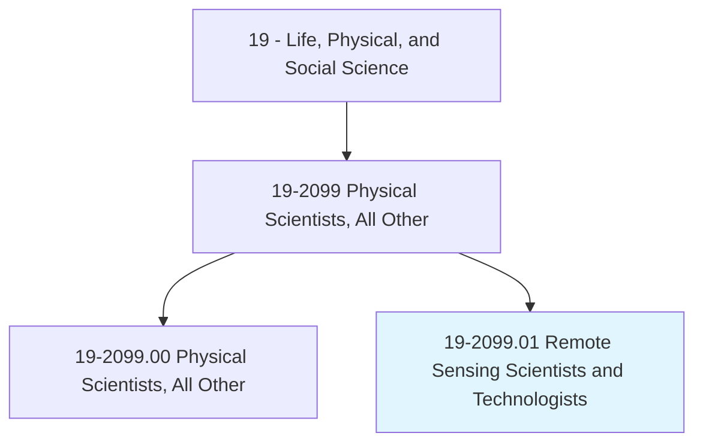
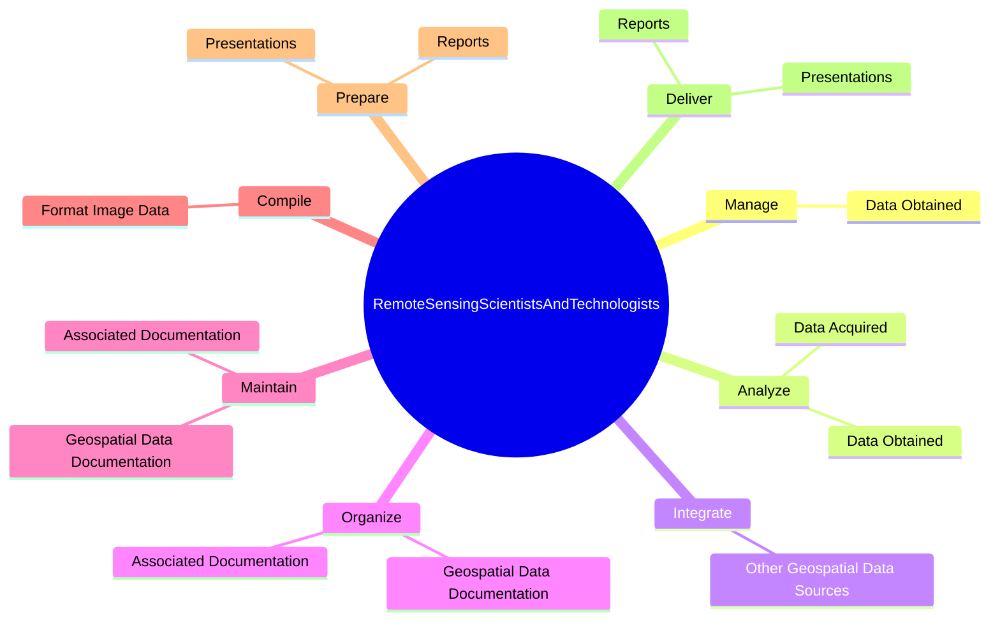
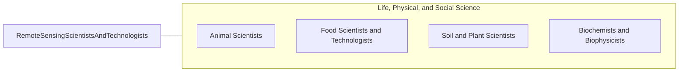

# Remote Sensing Scientists and Technologists

> Apply remote sensing principles and methods to analyze data and solve problems in areas such as natural resource management, urban planning, or homeland security. May develop new sensor systems, analytical techniques, or new applications for existing systems.

## Overview

Remote Sensing Scientists and Technologists is a specialized variant within the Life, Physical, and Social Science category. Apply remote sensing principles and methods to analyze data and solve problems in areas such as natural resource management, urban planning, or homeland security. 

## Classification Hierarchy

## Key Statistics

| Metric | Value |
|--------|-------|
| SOC Code | 19-2099.01 |
| Category | [Life, Physical, and Social Science](/occupations/Science) |
| Task Count | 69 |
| Source | O*NET |

## Core Tasks

### manage.DataObtained

Remote Sensing Scientists and Technologists manage data obtained as part of their core responsibilities.

**Actions:**
- `manage.DataObtained.from.RemoteSensingSystems.to.obtain.MeaningfulResults`

### analyze.DataObtained

Remote Sensing Scientists and Technologists analyze data obtained as part of their core responsibilities.

**Actions:**
- `analyze.DataObtained.from.RemoteSensingSystems.to.obtain.MeaningfulResults`
- `analyze.DataAcquired.from.Aircraft`
- `analyze.DataAcquired.from.Satellites`
- `analyze.DataAcquired.from.GroundBasedPlatforms`

### integrate.OtherGeospatialDataSources

Remote Sensing Scientists and Technologists integrate other geospatial data sources as part of their core responsibilities.

**Actions:**
- `integrate.OtherGeospatialDataSources.into.Projects`

## Skills & Competencies

### Technical Skills
- **Research Methods** - Advanced
- **Data Analysis** - Advanced
- **Laboratory Techniques** - Advanced

### Soft Skills
- **Communication** - Essential
- **Problem Solving** - Essential
- **Critical Thinking** - Important
- **Teamwork** - Important
- **Adaptability** - Important

## Related Occupations

## Industries

This occupation is found across multiple industries. See [Industries](/industries) for sector-specific employment data.

## Career Progression

---

*Source: O*NET 19-2099.01 - ONETOccupation*
