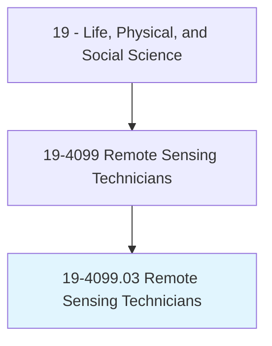
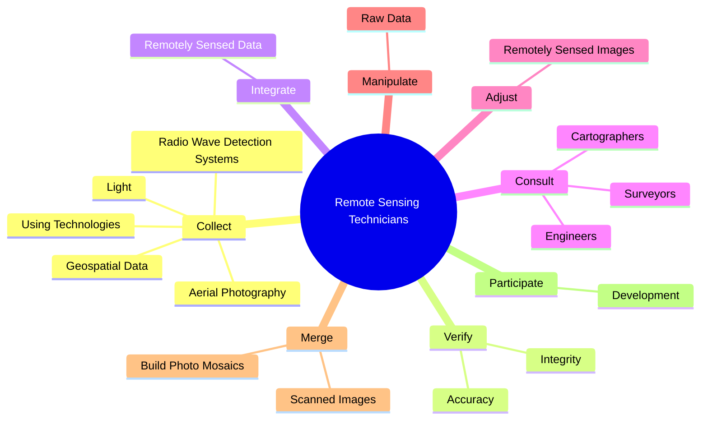
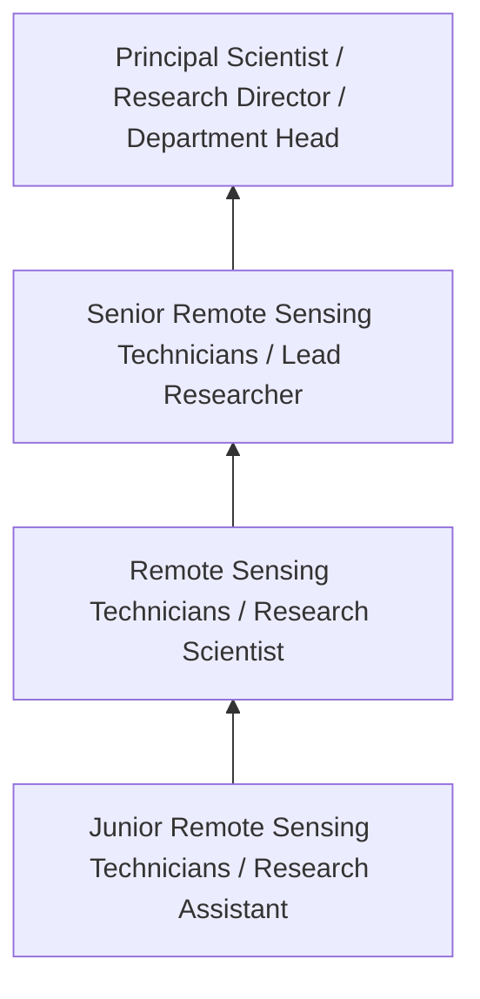
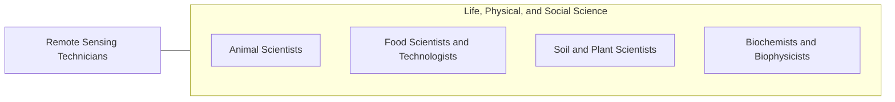

# Remote Sensing Technicians

> Apply remote sensing technologies to assist scientists in areas such as natural resources, urban planning, or homeland security. May prepare flight plans or sensor configurations for flight trips.

## Overview

Remote Sensing Technicians professionals apply remote sensing technologies to assist scientists in areas such as natural resources, urban planning, or homeland security. This occupation falls within the Life, Physical, and Social Science category and requires a combination of specialized knowledge, technical skills, and practical experience.

These professionals work across diverse settings and organizational contexts, applying their expertise to meet the demands of their field. They must stay current with industry standards, emerging practices, and regulatory requirements that affect their work. The role demands both independent judgment and collaborative skills, as practitioners regularly interact with colleagues, stakeholders, and the public.

As the field continues to evolve, Remote Sensing Technicians professionals increasingly leverage technology and data-driven approaches to enhance their effectiveness. Career opportunities span the public and private sectors, with demand influenced by economic conditions, demographic shifts, and technological advancement.

## Classification Hierarchy



## Key Statistics

| Metric | Value |
|--------|-------|
| SOC Code | 19-4099.03 |
| Job Zone | N/A |
| Category | [Life, Physical, and Social Science](/occupations/Science/index) |
| Core Tasks | 55+ |
| Salary Range | $50,000 - $130,000 |
| Median Salary | $78,000 |
| Growth Outlook | 7% (Faster than average) |
| Source | O*NET |

## Core Tasks



### collect.GeospatialData

Remote Sensing Technicians collect geospatial data as part of their core responsibilities.

**Actions:**
- `collect.GeospatialData` - Collect geospatial data, using technologies such as aerial photography, light...
- `collect.UsingTechnologies` - Collect geospatial data, using technologies such as aerial photography, light...
- `collect.AerialPhotography` - Collect geospatial data, using technologies such as aerial photography, light...
- `collect.Light` - Collect geospatial data, using technologies such as aerial photography, light...
- `collect.RadioWaveDetectionSystems` - Collect geospatial data, using technologies such as aerial photography, light...

### merge.ScannedImages

Remote Sensing Technicians merge scanned images as part of their core responsibilities.

**Actions:**
- `merge.ScannedImages.of.LargeAreas` - Merge scanned images or build photo mosaics of large areas, using image proce...
- `merge.ScannedImages.of.UsingImageProcessingSoftware` - Merge scanned images or build photo mosaics of large areas, using image proce...
- `merge.BuildPhotoMosaics.of.LargeAreas` - Merge scanned images or build photo mosaics of large areas, using image proce...
- `merge.BuildPhotoMosaics.of.UsingImageProcessingSoftware` - Merge scanned images or build photo mosaics of large areas, using image proce...

### prepare.Documentation

Remote Sensing Technicians prepare documentation as part of their core responsibilities.

**Actions:**
- `prepare.Documentation` - Prepare documentation or presentations, including charts, photos, or graphs.
- `prepare.Presentations` - Prepare documentation or presentations, including charts, photos, or graphs.
- `prepare.IncludingCharts` - Prepare documentation or presentations, including charts, photos, or graphs.
- `prepare.Photos` - Prepare documentation or presentations, including charts, photos, or graphs.

### evaluate.RemoteSensingProjectRequirements

Remote Sensing Technicians evaluate remote sensing project requirements as part of their core responsibilities.

**Actions:**
- `evaluate.RemoteSensingProjectRequirements.to.determine.TypesOfEquipmentSoftwareNecessaryToMeetProjectRequirements` - Evaluate remote sensing project requirements to determine the types of equipm...
- `evaluate.RemoteSensingProjectRequirements.to.ComputerSoftwareNecessaryToMeetProjectRequirements` - Evaluate remote sensing project requirements to determine the types of equipm...
- `evaluate.RemoteSensingProjectRequirements.to.SpecificImageTypes` - Evaluate remote sensing project requirements to determine the types of equipm...
- `evaluate.RemoteSensingProjectRequirements.to.OutputResolutions` - Evaluate remote sensing project requirements to determine the types of equipm...


## Skills & Competencies

### Technical Skills
- **Research Methodology** - Expert
- **Data Analysis** - Advanced
- **Laboratory Techniques** - Advanced
- **Scientific Writing** - Advanced
- **Statistical Software** - Advanced
- **Quality Control** - Proficient

### Soft Skills
- **Analytical Thinking** - Critical
- **Attention to Detail** - Critical
- **Problem Solving** - Essential
- **Collaboration** - Essential
- **Written Communication** - Essential

## Education & Certifications

| Requirement | Details |
|-------------|---------|
| Typical Education | Bachelor's or Master's degree in relevant scientific field |
| Work Experience | 1-3 years research or laboratory experience |
| On-the-Job Training | Moderate - specialized laboratory techniques |
| Certifications | Field-specific certifications may be required |

## Career Progression



## Industry Variations

### Academic Research
Focus on fundamental research and publication. Remote Sensing Technicians professionals in academia often combine research with teaching responsibilities and mentoring graduate students.

### Industry Research and Development
Applied research for product development and commercial applications. Emphasis on innovation timelines and market-driven objectives.

### Government and Regulatory
Mission-oriented research supporting public policy and regulatory decisions. Focus on public health, environmental protection, or national security.

### Consulting and Contract Research
Project-based work for diverse clients. Requires strong communication skills and ability to translate findings for non-technical audiences.

## Technology & Tools

- **Laboratory Information Management Systems (LIMS)**
- **Statistical software (R, SAS, SPSS)**
- **Spectroscopy and chromatography equipment**
- **Microscopy and imaging systems**
- **Data analysis and visualization tools**

## Related Occupations



## Industries

- Research and Development - High Employment
- Pharmaceutical Manufacturing - High Employment
- [Government Agencies](/industries/PublicAdministration) - Moderate Employment
- [Higher Education](/industries/Education) - Moderate Employment

## Departments

This occupation typically works in:
- [Research and Development](/departments/Research/index)
- Quality Assurance
- Laboratory Operations

## GraphDL Semantic Structure

```graphdl
Remote Sensing Technicians perform:
- collect.GeospatialData
- collect.UsingTechnologies
- collect.AerialPhotography
- collect.Light
- collect.RadioWaveDetectionSystems
- collect.DigitalSatellites
```

---

*Source: O*NET 19-4099.03 - ONETOccupation*
