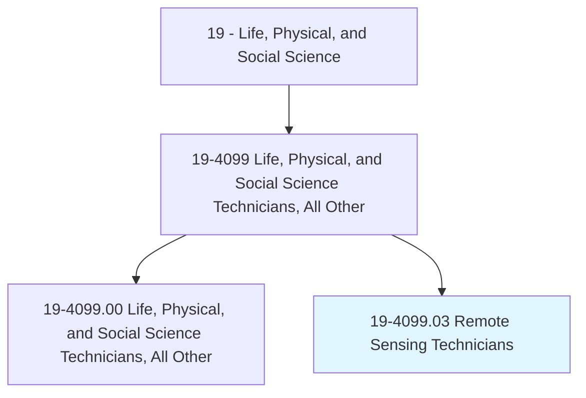
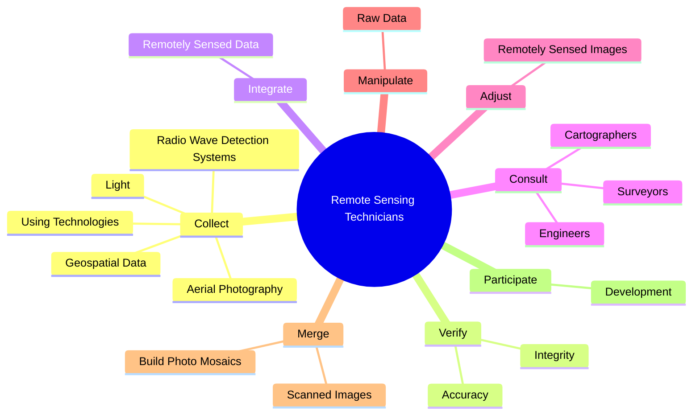

# Remote Sensing Technicians

> Apply remote sensing technologies to assist scientists in areas such as natural resources, urban planning, or homeland security. May prepare flight plans or sensor configurations for flight trips.

## Overview

Remote Sensing Technicians is a specialized variant within the Life, Physical, and Social Science category. Apply remote sensing technologies to assist scientists in areas such as natural resources, urban planning, or homeland security. 

## Classification Hierarchy

## Key Statistics

| Metric | Value |
|--------|-------|
| SOC Code | 19-4099.03 |
| Category | [Life, Physical, and Social Science](/occupations/Science) |
| Task Count | 55 |
| Source | O*NET |

## Core Tasks

### collect.GeospatialData

Remote Sensing Technicians collect geospatial data as part of their core responsibilities.

**Actions:**
- `collect.GeospatialData`
- `collect.UsingTechnologies`
- `collect.AerialPhotography`
- `collect.Light`

### verify.Integrity

Remote Sensing Technicians verify integrity as part of their core responsibilities.

**Actions:**
- `verify.Integrity.of.DataContained.in.RemoteSensingImageAnalysisSystems`
- `verify.Accuracy.of.DataContained.in.RemoteSensingImageAnalysisSystems`

### integrate.RemotelySensedData

Remote Sensing Technicians integrate remotely sensed data as part of their core responsibilities.

**Actions:**
- `integrate.RemotelySensedData.with.OtherGeospatialData`

## Skills & Competencies

### Technical Skills
- **Research Methods** - Advanced
- **Data Analysis** - Advanced
- **Laboratory Techniques** - Advanced

### Soft Skills
- **Communication** - Essential
- **Problem Solving** - Essential
- **Critical Thinking** - Important
- **Teamwork** - Important
- **Adaptability** - Important

## Related Occupations

## Industries

This occupation is found across multiple industries. See [Industries](/industries) for sector-specific employment data.

## Career Progression

---

*Source: O*NET 19-4099.03 - ONETOccupation*
