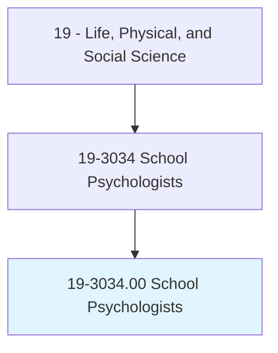
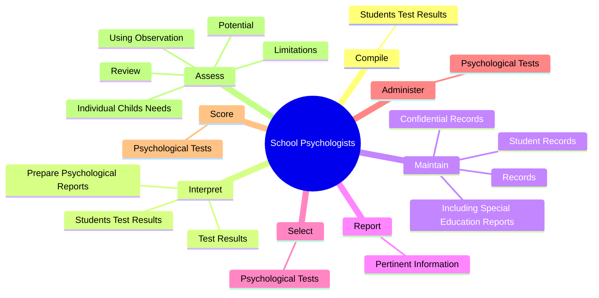

# School Psychologists

> Diagnose and implement individual or schoolwide interventions or strategies to address educational, behavioral, or developmental issues that adversely impact educational functioning in a school. May address student learning and behavioral problems and counsel students or families. May design and implement performance plans, and evaluate performance. May consult with other school-based personnel.

## Overview

School Psychologists is an occupation within the Life, Physical, and Social Science category. Diagnose and implement individual or schoolwide interventions or strategies to address educational, behavioral, or developmental issues that adversely impact educational functioning in a school. May address student learning and behavioral problems and counsel students or families.

## Classification Hierarchy

## Key Statistics

| Metric | Value |
|--------|-------|
| SOC Code | 19-3034.00 |
| Category | [Life, Physical, and Social Science](/occupations/Science) |
| Task Count | 90 |
| Source | O*NET |

## Core Tasks

### compile.StudentsTestResults

School Psychologists compile students test results as part of their core responsibilities.

**Actions:**
- `compile.StudentsTestResults.with.Information.from.Teachers`
- `compile.StudentsTestResults.with.Parents`
- `compile.StudentsTestResults.with.diagnose.Conditions`
- `compile.StudentsTestResults.with.help.AssessEligibilityForSpecialServices`

### interpret.StudentsTestResults

School Psychologists interpret students test results as part of their core responsibilities.

**Actions:**
- `interpret.StudentsTestResults.with.Information.from.Teachers`
- `interpret.StudentsTestResults.with.Parents`
- `interpret.StudentsTestResults.with.diagnose.Conditions`
- `interpret.StudentsTestResults.with.help.AssessEligibilityForSpecialServices`

### maintain.StudentRecords

School Psychologists maintain student records as part of their core responsibilities.

**Actions:**
- `maintain.StudentRecords.of.ServicesProvided`
- `maintain.StudentRecords.of.BehavioralData`
- `maintain.IncludingSpecialEducationReports.of.ServicesProvided`
- `maintain.IncludingSpecialEducationReports.of.BehavioralData`

## Skills & Competencies

### Technical Skills
- **Research Methods** - Advanced
- **Data Analysis** - Advanced
- **Laboratory Techniques** - Advanced

### Soft Skills
- **Communication** - Essential
- **Problem Solving** - Essential
- **Critical Thinking** - Important
- **Teamwork** - Important
- **Adaptability** - Important

## Related Occupations

## Industries

This occupation is found across multiple industries. See [Industries](/industries) for sector-specific employment data.

## Career Progression

---

*Source: O*NET 19-3034.00 - ONETOccupation*
