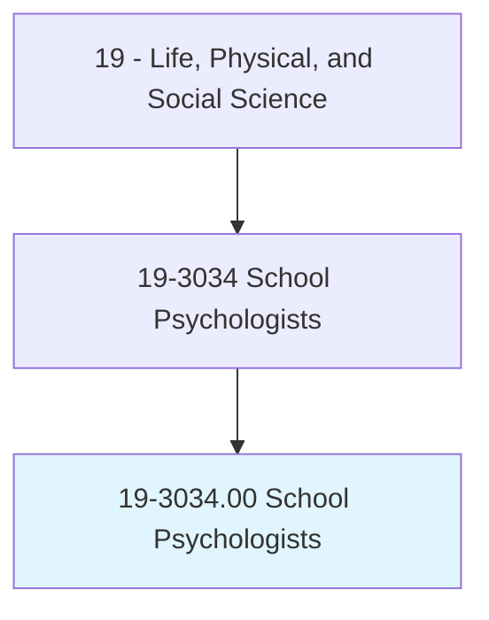
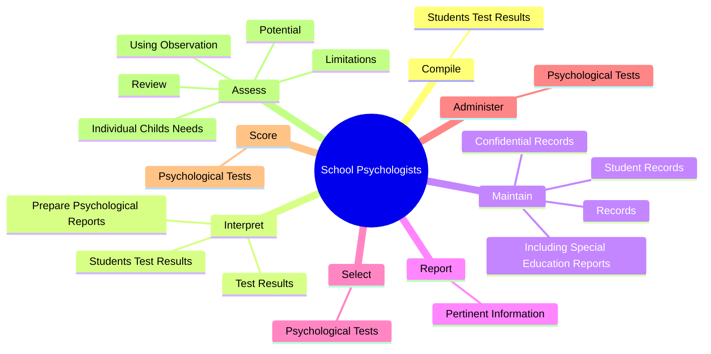
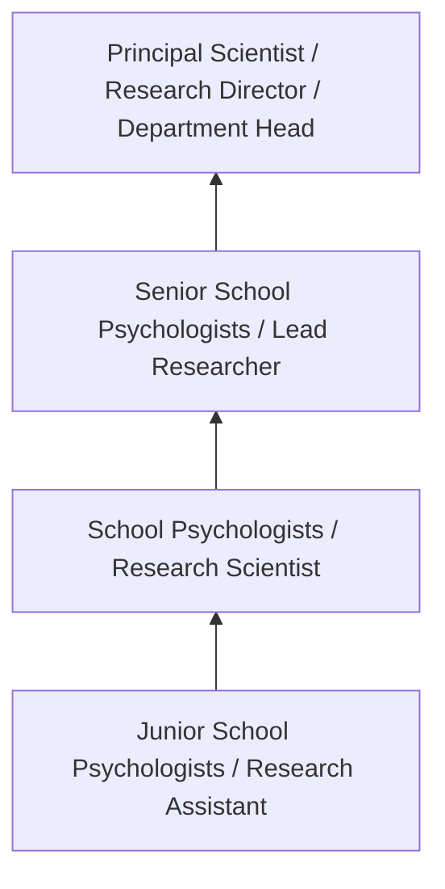
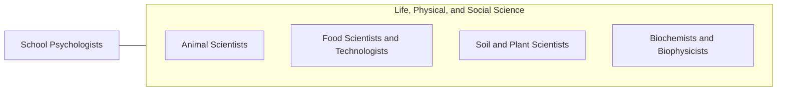

# School Psychologists

> Diagnose and implement individual or schoolwide interventions or strategies to address educational, behavioral, or developmental issues that adversely impact educational functioning in a school. May address student learning and behavioral problems and counsel students or families. May design and implement performance plans, and evaluate performance. May consult with other school-based personnel.

## Overview

School Psychologists professionals diagnose and implement individual or schoolwide interventions or strategies to address educational, behavioral, or developmental issues that adversely impact educational functioning in a school. This occupation falls within the Life, Physical, and Social Science category and requires a combination of specialized knowledge, technical skills, and practical experience.

These professionals work across diverse settings and organizational contexts, applying their expertise to meet the demands of their field. They must stay current with industry standards, emerging practices, and regulatory requirements that affect their work. The role demands both independent judgment and collaborative skills, as practitioners regularly interact with colleagues, stakeholders, and the public.

As the field continues to evolve, School Psychologists professionals increasingly leverage technology and data-driven approaches to enhance their effectiveness. Career opportunities span the public and private sectors, with demand influenced by economic conditions, demographic shifts, and technological advancement.

## Classification Hierarchy



## Key Statistics

| Metric | Value |
|--------|-------|
| SOC Code | 19-3034.00 |
| Job Zone | N/A |
| Category | [Life, Physical, and Social Science](/occupations/Science/index) |
| Core Tasks | 90+ |
| Salary Range | $50,000 - $130,000 |
| Median Salary | $78,000 |
| Growth Outlook | 7% (Faster than average) |
| Source | O*NET |

## Core Tasks



### assess.IndividualChildsNeeds

School Psychologists assess individual childs needs as part of their core responsibilities.

**Actions:**
- `assess.IndividualChildsNeeds.of.SchoolRecords` - Assess an individual child's needs, limitations, and potential, using observa...
- `assess.IndividualChildsNeeds.of.Consultation.with.Parents` - Assess an individual child's needs, limitations, and potential, using observa...
- `assess.IndividualChildsNeeds.of.SchoolPersonnel` - Assess an individual child's needs, limitations, and potential, using observa...
- `assess.Limitations.of.SchoolRecords` - Assess an individual child's needs, limitations, and potential, using observa...
- `assess.Limitations.of.Consultation.with.Parents` - Assess an individual child's needs, limitations, and potential, using observa...

### interpret.StudentsTestResults

School Psychologists interpret students test results as part of their core responsibilities.

**Actions:**
- `interpret.StudentsTestResults.with.Information.from.Teachers` - Compile and interpret students' test results, along with information from tea...
- `interpret.StudentsTestResults.with.Parents` - Compile and interpret students' test results, along with information from tea...
- `interpret.StudentsTestResults.with.diagnose.Conditions` - Compile and interpret students' test results, along with information from tea...
- `interpret.StudentsTestResults.with.help.AssessEligibilityForSpecialServices` - Compile and interpret students' test results, along with information from tea...
- `interpret.TestResults.for.Teachers` - Interpret test results and prepare psychological reports for teachers, admini...

### provide.Consultation

School Psychologists provide consultation as part of their core responsibilities.

**Actions:**
- `provide.Consultation.to.Parents` - Provide consultation to parents, teachers, administrators, and others on topi...
- `provide.Consultation.to.Teachers` - Provide consultation to parents, teachers, administrators, and others on topi...
- `provide.Consultation.to.Administrators` - Provide consultation to parents, teachers, administrators, and others on topi...
- `provide.Consultation.to.OthersOnTopics` - Provide consultation to parents, teachers, administrators, and others on topi...
- `provide.Consultation.to.LearningStyles` - Provide consultation to parents, teachers, administrators, and others on topi...

### maintain.StudentRecords

School Psychologists maintain student records as part of their core responsibilities.

**Actions:**
- `maintain.StudentRecords.of.ServicesProvided` - Maintain student records, including special education reports, confidential r...
- `maintain.StudentRecords.of.BehavioralData` - Maintain student records, including special education reports, confidential r...
- `maintain.IncludingSpecialEducationReports.of.ServicesProvided` - Maintain student records, including special education reports, confidential r...
- `maintain.IncludingSpecialEducationReports.of.BehavioralData` - Maintain student records, including special education reports, confidential r...
- `maintain.ConfidentialRecords.of.ServicesProvided` - Maintain student records, including special education reports, confidential r...


## Skills & Competencies

### Technical Skills
- **Research Methodology** - Expert
- **Data Analysis** - Advanced
- **Laboratory Techniques** - Advanced
- **Scientific Writing** - Advanced
- **Statistical Software** - Advanced
- **Quality Control** - Proficient

### Soft Skills
- **Analytical Thinking** - Critical
- **Attention to Detail** - Critical
- **Problem Solving** - Essential
- **Collaboration** - Essential
- **Written Communication** - Essential

## Education & Certifications

| Requirement | Details |
|-------------|---------|
| Typical Education | Bachelor's or Master's degree in relevant scientific field |
| Work Experience | 1-3 years research or laboratory experience |
| On-the-Job Training | Moderate - specialized laboratory techniques |
| Certifications | Field-specific certifications may be required |

## Career Progression



## Industry Variations

### Academic Research
Focus on fundamental research and publication. School Psychologists professionals in academia often combine research with teaching responsibilities and mentoring graduate students.

### Industry Research and Development
Applied research for product development and commercial applications. Emphasis on innovation timelines and market-driven objectives.

### Government and Regulatory
Mission-oriented research supporting public policy and regulatory decisions. Focus on public health, environmental protection, or national security.

### Consulting and Contract Research
Project-based work for diverse clients. Requires strong communication skills and ability to translate findings for non-technical audiences.

## Technology & Tools

- **Laboratory Information Management Systems (LIMS)**
- **Statistical software (R, SAS, SPSS)**
- **Spectroscopy and chromatography equipment**
- **Microscopy and imaging systems**
- **Data analysis and visualization tools**

## Related Occupations



## Industries

- [Research and Development](/industries/ResearchDevelopment) - High Employment
- [Pharmaceutical Manufacturing](/industries/Pharma) - High Employment
- [Government Agencies](/industries/Government) - Moderate Employment
- [Higher Education](/industries/Education) - Moderate Employment

## Departments

This occupation typically works in:
- [Research and Development](/departments/Research/index)
- [Quality Assurance](/departments/QualityAssurance)
- [Laboratory Operations](/departments/Laboratory)

## GraphDL Semantic Structure

```
School Psychologists perform:
- compile.StudentsTestResults.with.Information.from.Teachers
- compile.StudentsTestResults.with.Parents
- compile.StudentsTestResults.with.diagnose.Conditions
- compile.StudentsTestResults.with.help.AssessEligibilityForSpecialServices
- interpret.StudentsTestResults.with.Information.from.Teachers
- interpret.StudentsTestResults.with.Parents
```

---

*Source: O*NET 19-3034.00 - ONETOccupation*
