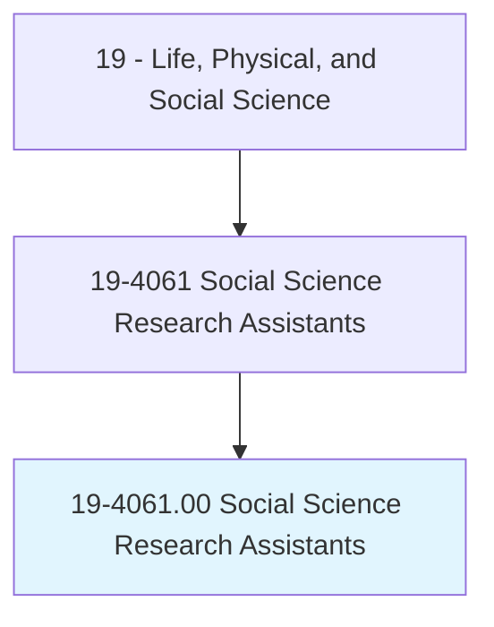
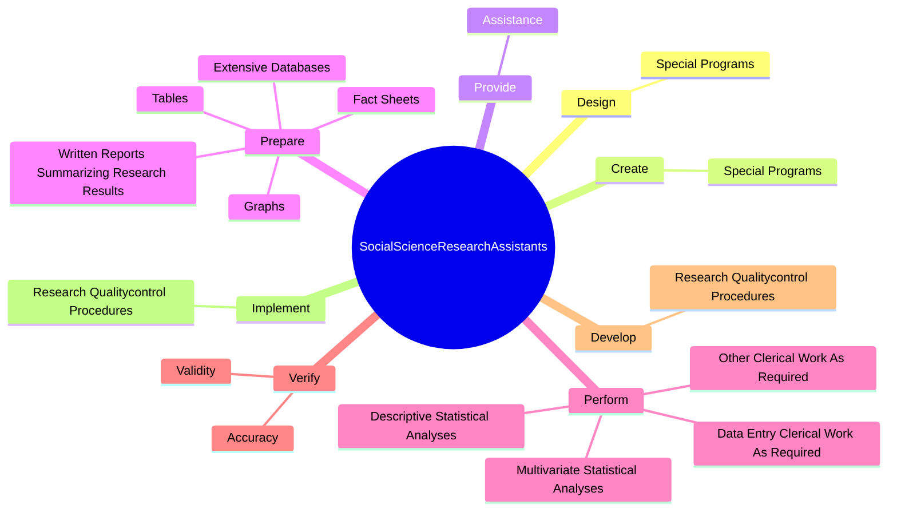
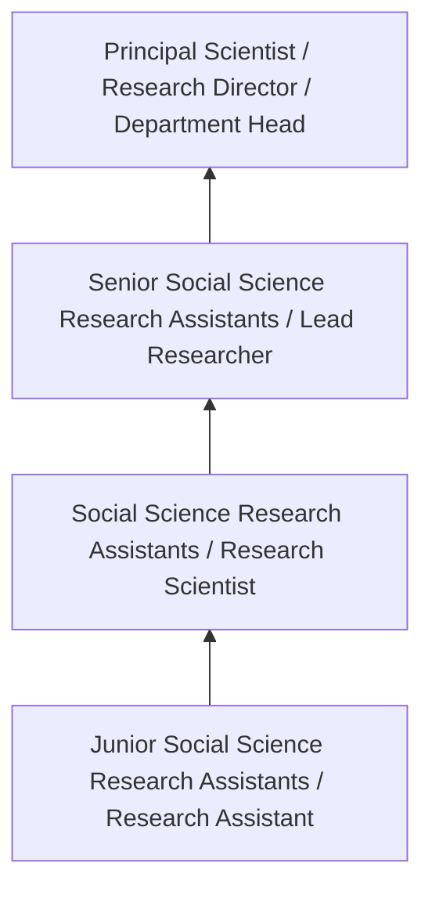
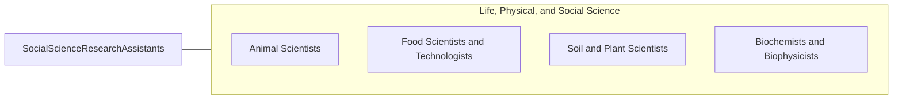

# Social Science Research Assistants

> Assist social scientists in laboratory, survey, and other social science research. May help prepare findings for publication and assist in laboratory analysis, quality control, or data management.

## Overview

Social Science Research Assistants professionals assist social scientists in laboratory, survey, and other social science research. This occupation falls within the Life, Physical, and Social Science category and requires a combination of specialized knowledge, technical skills, and practical experience.

These professionals work across diverse settings and organizational contexts, applying their expertise to meet the demands of their field. They must stay current with industry standards, emerging practices, and regulatory requirements that affect their work. The role demands both independent judgment and collaborative skills, as practitioners regularly interact with colleagues, stakeholders, and the public.

As the field continues to evolve, Social Science Research Assistants professionals increasingly leverage technology and data-driven approaches to enhance their effectiveness. Career opportunities span the public and private sectors, with demand influenced by economic conditions, demographic shifts, and technological advancement.

## Classification Hierarchy



## Key Statistics

| Metric | Value |
|--------|-------|
| SOC Code | 19-4061.00 |
| Job Zone | N/A |
| Category | [Life, Physical, and Social Science](/occupations/Science/index) |
| Core Tasks | 61+ |
| Salary Range | $50,000 - $130,000 |
| Median Salary | $78,000 |
| Growth Outlook | 7% (Faster than average) |
| Source | O*NET |

## Core Tasks



### perform.DescriptiveStatisticalAnalyses

Social Science Research Assistants perform descriptive statistical analyses as part of their core responsibilities.

**Actions:**
- `perform.DescriptiveStatisticalAnalyses.of.Data` - Perform descriptive and multivariate statistical analyses of data, using comp...
- `perform.DescriptiveStatisticalAnalyses.of.UsingComputerSoftware` - Perform descriptive and multivariate statistical analyses of data, using comp...
- `perform.MultivariateStatisticalAnalyses.of.Data` - Perform descriptive and multivariate statistical analyses of data, using comp...
- `perform.MultivariateStatisticalAnalyses.of.UsingComputerSoftware` - Perform descriptive and multivariate statistical analyses of data, using comp...
- `perform.DataEntryClericalWorkAsRequired.for.ProjectCompletion` - Perform data entry and other clerical work as required for project completion.

### provide.Assistance

Social Science Research Assistants provide assistance as part of their core responsibilities.

**Actions:**
- `provide.Assistance.with.Preparation.of.ProjectRelatedReports` - Provide assistance with the preparation of project-related reports, manuscrip...
- `provide.Assistance.with.Manuscripts` - Provide assistance with the preparation of project-related reports, manuscrip...
- `provide.Assistance.with.Presentations` - Provide assistance with the preparation of project-related reports, manuscrip...
- `provide.Assistance.in.Design.of.SurveyInstruments` - Provide assistance in the design of survey instruments such as questionnaires.
- `provide.Assistance.in.Questionnaires` - Provide assistance in the design of survey instruments such as questionnaires.

### prepare.Tables

Social Science Research Assistants prepare tables as part of their core responsibilities.

**Actions:**
- `prepare.Tables` - Prepare tables, graphs, fact sheets, and written reports summarizing research...
- `prepare.Graphs` - Prepare tables, graphs, fact sheets, and written reports summarizing research...
- `prepare.FactSheets` - Prepare tables, graphs, fact sheets, and written reports summarizing research...
- `prepare.WrittenReportsSummarizingResearchResults` - Prepare tables, graphs, fact sheets, and written reports summarizing research...
- `prepare.ExtensiveDatabases` - Prepare, manipulate, and manage extensive databases.

### track.ResearchParticipants

Social Science Research Assistants track research participants as part of their core responsibilities.

**Actions:**
- `track.ResearchParticipants` - Track research participants, and perform any necessary follow-up tasks.
- `track.PerformNecessaryFollow.up.Tasks` - Track research participants, and perform any necessary follow-up tasks.
- `track.LaboratorySupplies` - Track laboratory supplies and expenses such as participant reimbursement.
- `track.ParticipantReimbursement` - Track laboratory supplies and expenses such as participant reimbursement.
- `track.Expenses` - Track laboratory supplies and expenses such as participant reimbursement.


## Skills & Competencies

### Technical Skills
- **Research Methodology** - Expert
- **Data Analysis** - Advanced
- **Laboratory Techniques** - Advanced
- **Scientific Writing** - Advanced
- **Statistical Software** - Advanced
- **Quality Control** - Proficient

### Soft Skills
- **Analytical Thinking** - Critical
- **Attention to Detail** - Critical
- **Problem Solving** - Essential
- **Collaboration** - Essential
- **Written Communication** - Essential

## Education & Certifications

| Requirement | Details |
|-------------|---------|
| Typical Education | Bachelor's or Master's degree in relevant scientific field |
| Work Experience | 1-3 years research or laboratory experience |
| On-the-Job Training | Moderate - specialized laboratory techniques |
| Certifications | Field-specific certifications may be required |

## Career Progression



## Industry Variations

### Academic Research
Focus on fundamental research and publication. Social Science Research Assistants professionals in academia often combine research with teaching responsibilities and mentoring graduate students.

### Industry Research and Development
Applied research for product development and commercial applications. Emphasis on innovation timelines and market-driven objectives.

### Government and Regulatory
Mission-oriented research supporting public policy and regulatory decisions. Focus on public health, environmental protection, or national security.

### Consulting and Contract Research
Project-based work for diverse clients. Requires strong communication skills and ability to translate findings for non-technical audiences.

## Technology & Tools

- **Laboratory Information Management Systems (LIMS)**
- **Statistical software (R, SAS, SPSS)**
- **Spectroscopy and chromatography equipment**
- **Microscopy and imaging systems**
- **Data analysis and visualization tools**

## Related Occupations



## Industries

- Research and Development - High Employment
- Pharmaceutical Manufacturing - High Employment
- [Government Agencies](/industries/PublicAdministration) - Moderate Employment
- [Higher Education](/industries/Education) - Moderate Employment

## Departments

This occupation typically works in:
- [Research and Development](/departments/Research/index)
- Quality Assurance
- Laboratory Operations

## GraphDL Semantic Structure

```graphdl
Social Science Research Assistants perform:
- design.SpecialPrograms.for.Tasks
- design.SpecialPrograms.for.StatisticalAnalysis
- design.SpecialPrograms.for.DataEntry
- design.SpecialPrograms.for.Cleaning
- create.SpecialPrograms.for.Tasks
- create.SpecialPrograms.for.StatisticalAnalysis
```

---

*Source: O*NET 19-4061.00 - ONETOccupation*
