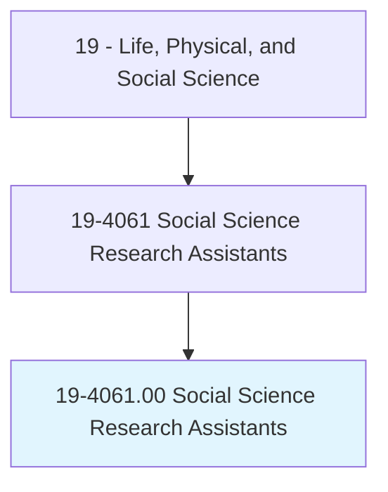
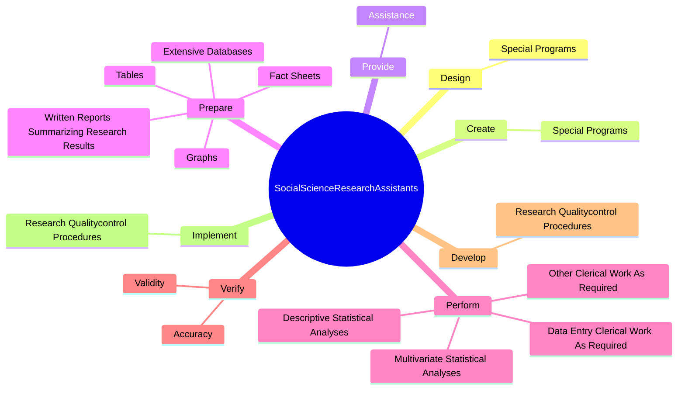
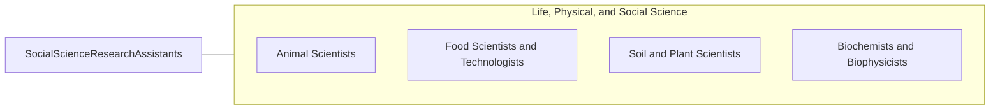

# Social Science Research Assistants

> Assist social scientists in laboratory, survey, and other social science research. May help prepare findings for publication and assist in laboratory analysis, quality control, or data management.

## Overview

Social Science Research Assistants is an occupation within the Life, Physical, and Social Science category. Assist social scientists in laboratory, survey, and other social science research. 

## Classification Hierarchy

## Key Statistics

| Metric | Value |
|--------|-------|
| SOC Code | 19-4061.00 |
| Category | [Life, Physical, and Social Science](/occupations/Science) |
| Task Count | 61 |
| Source | O*NET |

## Core Tasks

### design.SpecialPrograms

Social Science Research Assistants design special programs as part of their core responsibilities.

**Actions:**
- `design.SpecialPrograms.for.Tasks`
- `design.SpecialPrograms.for.StatisticalAnalysis`
- `design.SpecialPrograms.for.DataEntry`
- `design.SpecialPrograms.for.Cleaning`

### create.SpecialPrograms

Social Science Research Assistants create special programs as part of their core responsibilities.

**Actions:**
- `create.SpecialPrograms.for.Tasks`
- `create.SpecialPrograms.for.StatisticalAnalysis`
- `create.SpecialPrograms.for.DataEntry`
- `create.SpecialPrograms.for.Cleaning`

### provide.Assistance

Social Science Research Assistants provide assistance as part of their core responsibilities.

**Actions:**
- `provide.Assistance.with.Preparation.of.ProjectRelatedReports`
- `provide.Assistance.with.Manuscripts`
- `provide.Assistance.with.Presentations`

## Skills & Competencies

### Technical Skills
- **Research Methods** - Advanced
- **Data Analysis** - Advanced
- **Laboratory Techniques** - Advanced

### Soft Skills
- **Communication** - Essential
- **Problem Solving** - Essential
- **Critical Thinking** - Important
- **Teamwork** - Important
- **Adaptability** - Important

## Related Occupations

## Industries

This occupation is found across multiple industries. See [Industries](/industries) for sector-specific employment data.

## Career Progression

---

*Source: O*NET 19-4061.00 - ONETOccupation*
