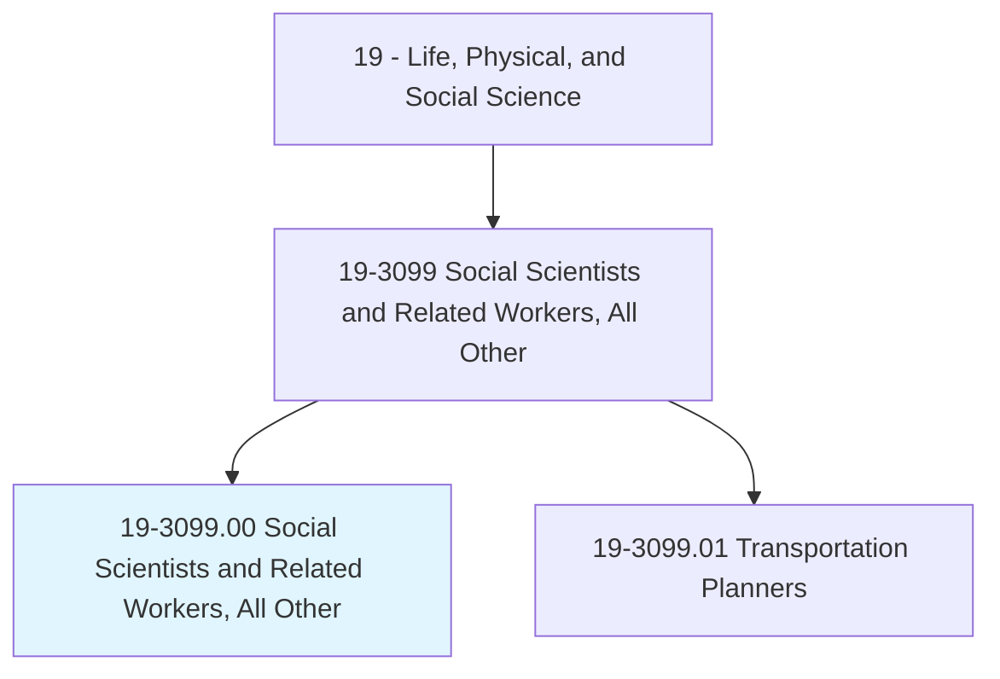
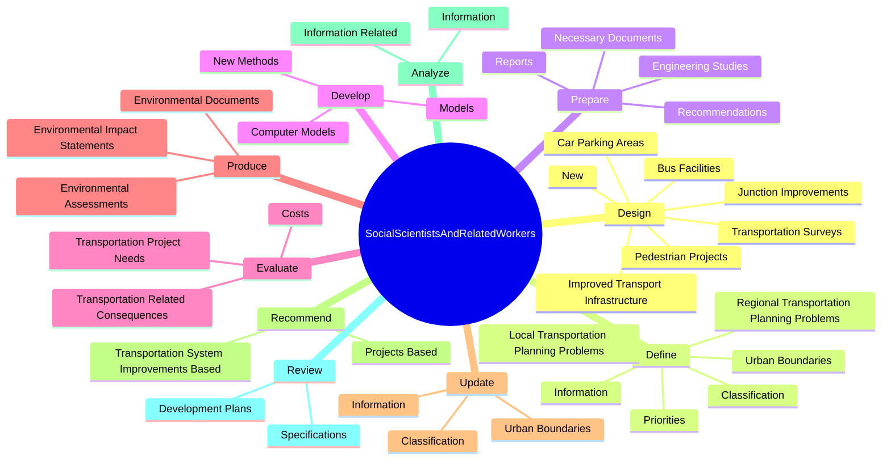
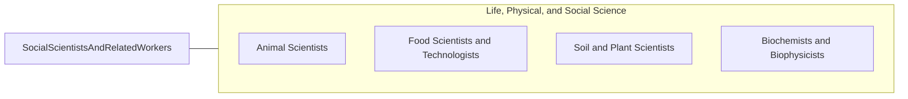

# Social Scientists and Related Workers, All Other

> All social scientists and related workers not listed separately.

## Overview

Social Scientists and Related Workers, All Other is classified under Life, Physical, and Social Science (SOC 19). All social scientists and related workers not listed separately.

## Classification Hierarchy

## Key Statistics

| Metric | Value |
|--------|-------|
| SOC Code | 19-3099.00 |
| Category | [Life, Physical, and Social Science](/occupations/Science) |
| Task Count | 59 |
| Source | O*NET |

## Core Tasks

### design.TransportationSurveys

Social Scientists and Related Workers, All Other design transportation surveys as part of their core responsibilities.

**Actions:**
- `design.TransportationSurveys.to.Areas`
- `design.New`
- `design.ImprovedTransportInfrastructure`
- `design.JunctionImprovements`

### define.RegionalTransportationPlanningProblems

Social Scientists and Related Workers, All Other define regional transportation planning problems as part of their core responsibilities.

**Actions:**
- `define.RegionalTransportationPlanningProblems`
- `define.Priorities`
- `define.LocalTransportationPlanningProblems`
- `define.Information.of.Roadways`

### prepare.Reports

Social Scientists and Related Workers, All Other prepare reports as part of their core responsibilities.

**Actions:**
- `prepare.Reports.on.TransportationPlanning`
- `prepare.Recommendations.on.TransportationPlanning`
- `prepare.NecessaryDocuments.to.ObtainPlannedProjectApprovals`
- `prepare.NecessaryDocuments.to.Permits`

## Skills & Competencies

### Technical Skills
- **Research Methods** - Advanced
- **Data Analysis** - Advanced
- **Laboratory Techniques** - Advanced

### Soft Skills
- **Communication** - Essential
- **Problem Solving** - Essential
- **Critical Thinking** - Important
- **Teamwork** - Important
- **Adaptability** - Important

## Related Occupations

## Industries

This occupation is found across multiple industries. See [Industries](/industries) for sector-specific employment data.

## Career Progression

---

*Source: O*NET 19-3099.00 - ONETOccupation*
