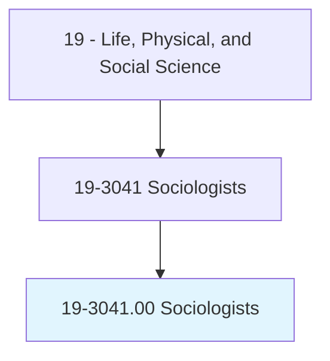
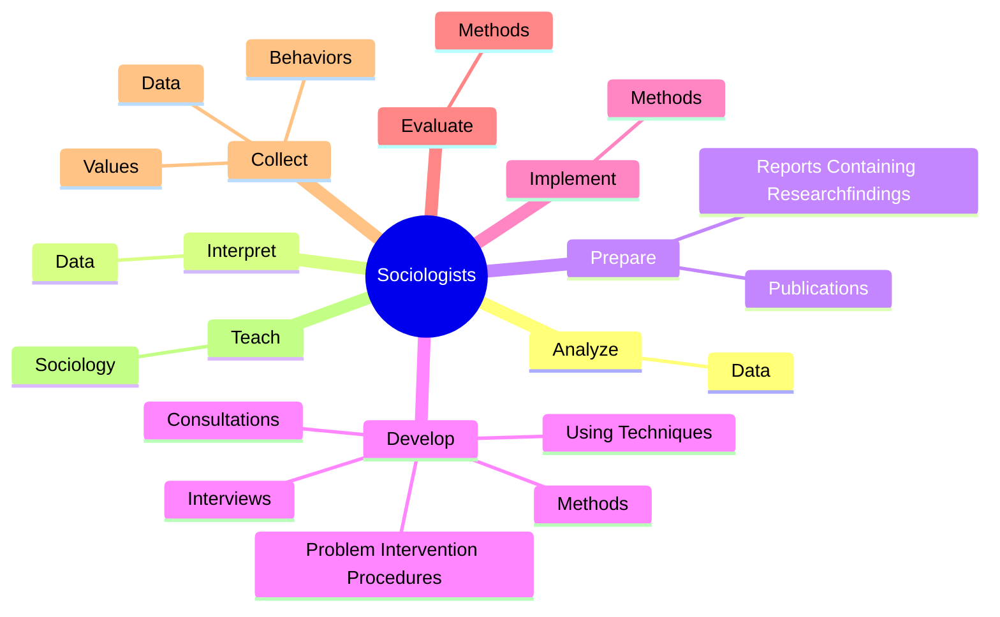
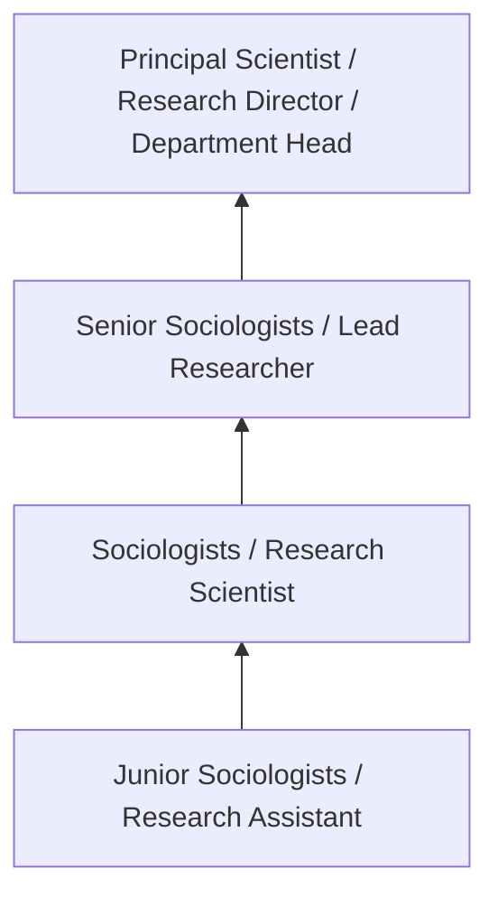
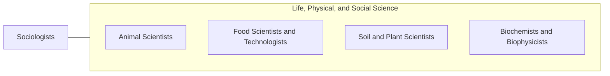

# Sociologists

> Study human society and social behavior by examining the groups and social institutions that people form, as well as various social, religious, political, and business organizations. May study the behavior and interaction of groups, trace their origin and growth, and analyze the influence of group activities on individual members.

## Overview

Sociologists professionals study human society and social behavior by examining the groups and social institutions that people form, as well as various social, religious, political, and business organizations. This occupation falls within the Life, Physical, and Social Science category and requires a combination of specialized knowledge, technical skills, and practical experience.

These professionals work across diverse settings and organizational contexts, applying their expertise to meet the demands of their field. They must stay current with industry standards, emerging practices, and regulatory requirements that affect their work. The role demands both independent judgment and collaborative skills, as practitioners regularly interact with colleagues, stakeholders, and the public.

As the field continues to evolve, Sociologists professionals increasingly leverage technology and data-driven approaches to enhance their effectiveness. Career opportunities span the public and private sectors, with demand influenced by economic conditions, demographic shifts, and technological advancement.

## Classification Hierarchy



## Key Statistics

| Metric | Value |
|--------|-------|
| SOC Code | 19-3041.00 |
| Job Zone | N/A |
| Category | [Life, Physical, and Social Science](/occupations/Science/index) |
| Core Tasks | 68+ |
| Salary Range | $50,000 - $130,000 |
| Median Salary | $78,000 |
| Growth Outlook | 7% (Faster than average) |
| Source | O*NET |

## Core Tasks



### develop.Methods

Sociologists develop methods as part of their core responsibilities.

**Actions:**
- `develop.Methods.of.DataCollection` - Develop, implement, and evaluate methods of data collection, such as question...
- `develop.Methods.of.Questionnaires` - Develop, implement, and evaluate methods of data collection, such as question...
- `develop.Methods.of.Interviews` - Develop, implement, and evaluate methods of data collection, such as question...
- `develop.ProblemInterventionProcedures.of.GroupInteractions` - Develop problem intervention procedures, using techniques such as interviews,...
- `develop.UsingTechniques.of.GroupInteractions` - Develop problem intervention procedures, using techniques such as interviews,...

### collect.Data

Sociologists collect data as part of their core responsibilities.

**Actions:**
- `collect.Data.about.Attitudes.of.PeopleInGroups` - Collect data about the attitudes, values, and behaviors of people in groups, ...
- `collect.Data.about.Attitudes.of.UsingObservation` - Collect data about the attitudes, values, and behaviors of people in groups, ...
- `collect.Data.about.Attitudes.of.Interviews` - Collect data about the attitudes, values, and behaviors of people in groups, ...
- `collect.Data.about.Attitudes.of.ReviewOfDocuments` - Collect data about the attitudes, values, and behaviors of people in groups, ...
- `collect.Values.of.People.in.Groups` - Collect data about the attitudes, values, and behaviors of people in groups, ...

### observe.GroupInteractionsAffiliations

Sociologists observe group interactions affiliations as part of their core responsibilities.

**Actions:**
- `observe.GroupInteractionsAffiliations.to.collect.Data` - Observe group interactions and role affiliations to collect data, identify pr...
- `observe.GroupInteractionsAffiliations.to.identify.Problems` - Observe group interactions and role affiliations to collect data, identify pr...
- `observe.GroupInteractionsAffiliations.to.evaluate.Progress` - Observe group interactions and role affiliations to collect data, identify pr...
- `observe.GroupInteractionsAffiliations.to.determine.NeedForAdditionalChange` - Observe group interactions and role affiliations to collect data, identify pr...
- `observe.RoleAffiliations.to.collect.Data` - Observe group interactions and role affiliations to collect data, identify pr...

### plan.Research

Sociologists plan research as part of their core responsibilities.

**Actions:**
- `plan.Research.to.develop.TheoriesAboutSocietalIssues` - Plan and conduct research to develop and test theories about societal issues ...
- `plan.Research.to.test.TheoriesAboutSocietalIssues` - Plan and conduct research to develop and test theories about societal issues ...
- `plan.Research.to.Crime` - Plan and conduct research to develop and test theories about societal issues ...
- `plan.Research.to.GroupRelations` - Plan and conduct research to develop and test theories about societal issues ...
- `plan.Research.to.Poverty` - Plan and conduct research to develop and test theories about societal issues ...


## Skills & Competencies

### Technical Skills
- **Research Methodology** - Expert
- **Data Analysis** - Advanced
- **Laboratory Techniques** - Advanced
- **Scientific Writing** - Advanced
- **Statistical Software** - Advanced
- **Quality Control** - Proficient

### Soft Skills
- **Analytical Thinking** - Critical
- **Attention to Detail** - Critical
- **Problem Solving** - Essential
- **Collaboration** - Essential
- **Written Communication** - Essential

## Education & Certifications

| Requirement | Details |
|-------------|---------|
| Typical Education | Bachelor's or Master's degree in relevant scientific field |
| Work Experience | 1-3 years research or laboratory experience |
| On-the-Job Training | Moderate - specialized laboratory techniques |
| Certifications | Field-specific certifications may be required |

## Career Progression



## Industry Variations

### Academic Research
Focus on fundamental research and publication. Sociologists professionals in academia often combine research with teaching responsibilities and mentoring graduate students.

### Industry Research and Development
Applied research for product development and commercial applications. Emphasis on innovation timelines and market-driven objectives.

### Government and Regulatory
Mission-oriented research supporting public policy and regulatory decisions. Focus on public health, environmental protection, or national security.

### Consulting and Contract Research
Project-based work for diverse clients. Requires strong communication skills and ability to translate findings for non-technical audiences.

## Technology & Tools

- **Laboratory Information Management Systems (LIMS)**
- **Statistical software (R, SAS, SPSS)**
- **Spectroscopy and chromatography equipment**
- **Microscopy and imaging systems**
- **Data analysis and visualization tools**

## Related Occupations



## Industries

- [Research and Development](/industries/ResearchDevelopment) - High Employment
- [Pharmaceutical Manufacturing](/industries/Pharma) - High Employment
- [Government Agencies](/industries/Government) - Moderate Employment
- [Higher Education](/industries/Education) - Moderate Employment

## Departments

This occupation typically works in:
- [Research and Development](/departments/Research/index)
- [Quality Assurance](/departments/QualityAssurance)
- [Laboratory Operations](/departments/Laboratory)

## GraphDL Semantic Structure

```
Sociologists perform:
- analyze.Data.to.increase.UnderstandingOfHumanSocialBehavior
- interpret.Data.to.increase.UnderstandingOfHumanSocialBehavior
- prepare.Publications
- prepare.ReportsContainingResearchfindings
- develop.Methods.of.DataCollection
- develop.Methods.of.Questionnaires
```

---

*Source: O*NET 19-3041.00 - ONETOccupation*
