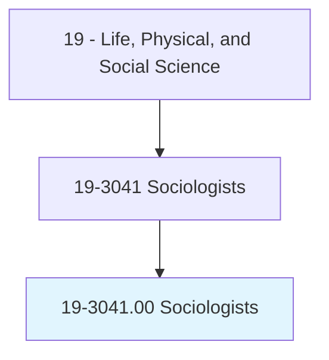
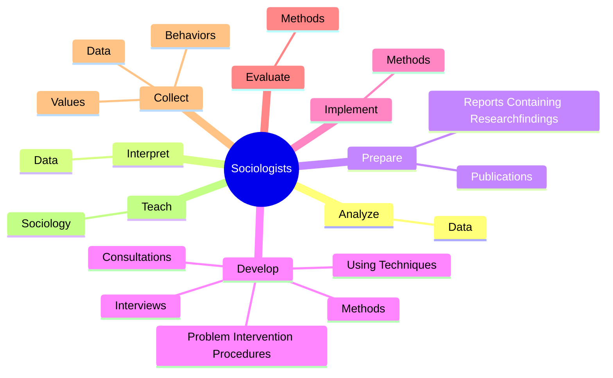
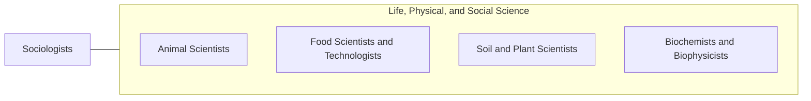

# Sociologists

> Study human society and social behavior by examining the groups and social institutions that people form, as well as various social, religious, political, and business organizations. May study the behavior and interaction of groups, trace their origin and growth, and analyze the influence of group activities on individual members.

## Overview

Sociologists is an occupation within the Life, Physical, and Social Science category. Study human society and social behavior by examining the groups and social institutions that people form, as well as various social, religious, political, and business organizations. 

## Classification Hierarchy

## Key Statistics

| Metric | Value |
|--------|-------|
| SOC Code | 19-3041.00 |
| Category | [Life, Physical, and Social Science](/occupations/Science) |
| Task Count | 68 |
| Source | O*NET |

## Core Tasks

### analyze.Data

Sociologists analyze data as part of their core responsibilities.

**Actions:**
- `analyze.Data.to.increase.UnderstandingOfHumanSocialBehavior`

### interpret.Data

Sociologists interpret data as part of their core responsibilities.

**Actions:**
- `interpret.Data.to.increase.UnderstandingOfHumanSocialBehavior`

### prepare.Publications

Sociologists prepare publications as part of their core responsibilities.

**Actions:**
- `prepare.Publications`
- `prepare.ReportsContainingResearchfindings`

## Skills & Competencies

### Technical Skills
- **Research Methods** - Advanced
- **Data Analysis** - Advanced
- **Laboratory Techniques** - Advanced

### Soft Skills
- **Communication** - Essential
- **Problem Solving** - Essential
- **Critical Thinking** - Important
- **Teamwork** - Important
- **Adaptability** - Important

## Related Occupations

## Industries

This occupation is found across multiple industries. See [Industries](/industries) for sector-specific employment data.

## Career Progression

---

*Source: O*NET 19-3041.00 - ONETOccupation*
