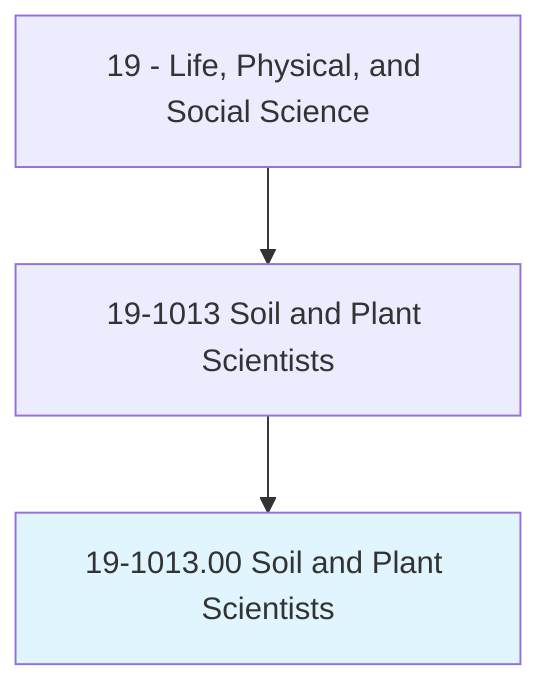
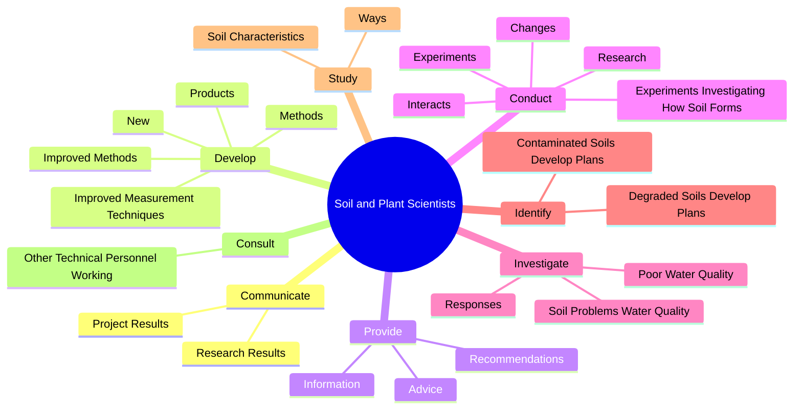
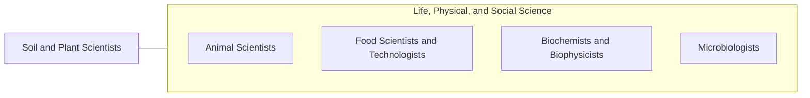

# Soil and Plant Scientists

> Conduct research in breeding, physiology, production, yield, and management of crops and agricultural plants or trees, shrubs, and nursery stock, their growth in soils, and control of pests; or study the chemical, physical, biological, and mineralogical composition of soils as they relate to plant or crop growth. May classify and map soils and investigate effects of alternative practices on soil and crop productivity.

## Overview

Soil and Plant Scientists is an occupation within the Life, Physical, and Social Science category. Conduct research in breeding, physiology, production, yield, and management of crops and agricultural plants or trees, shrubs, and nursery stock, their growth in soils, and control of pests; or study the chemical, physical, biological, and mineralogical composition of soils as they relate to plant or crop growth. 

## Classification Hierarchy

## Key Statistics

| Metric | Value |
|--------|-------|
| SOC Code | 19-1013.00 |
| Category | [Life, Physical, and Social Science](/occupations/Science) |
| Task Count | 138 |
| Source | O*NET |

## Core Tasks

### communicate.ResearchResults

Soil and Plant Scientists communicate research results as part of their core responsibilities.

**Actions:**
- `communicate.ResearchResults.to.OtherProfessionals`
- `communicate.ResearchResults.to.Public`
- `communicate.ResearchResults.to.teach.RelatedCourses`
- `communicate.ResearchResults.to.Seminars`

### develop.Methods

Soil and Plant Scientists develop methods as part of their core responsibilities.

**Actions:**
- `develop.Methods.of.ConservingSoilCanBeApplied.by.FarmersForestryCompanies`
- `develop.Methods.of.ManagingSoilCanBeApplied.by.FarmersForestryCompanies`
- `develop.New.for.ControllingWeeds`
- `develop.New.for.EliminatingWeeds`

### provide.Information

Soil and Plant Scientists provide information as part of their core responsibilities.

**Actions:**
- `provide.Information.to.FarmersRegardingWaysInWhichTheyCanBestUseLand`
- `provide.Information.to.FarmersRegardingPromotePlantGrowth`
- `provide.Information.to.FarmersRegardingAvoidCorrectProblems`
- `provide.Information.to.OtherLandownersRegardingWaysInWhichTheyCanBestUseLand`

## Skills & Competencies

### Technical Skills
- **Research Methods** - Advanced
- **Data Analysis** - Advanced
- **Laboratory Techniques** - Advanced

### Soft Skills
- **Communication** - Essential
- **Problem Solving** - Essential
- **Critical Thinking** - Important
- **Teamwork** - Important
- **Adaptability** - Important

## Related Occupations

## Industries

This occupation is found across multiple industries. See [Industries](/industries) for sector-specific employment data.

## Career Progression

---

*Source: O*NET 19-1013.00 - ONETOccupation*
