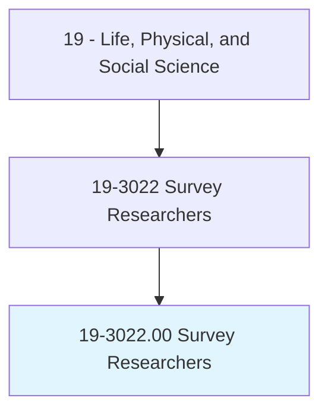
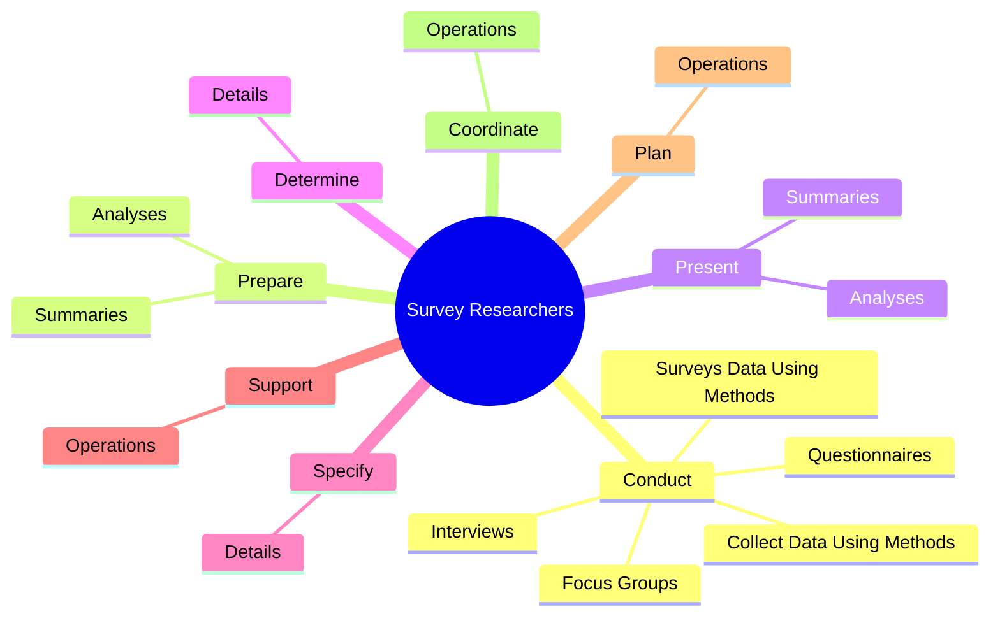

# Survey Researchers

> Plan, develop, or conduct surveys. May analyze and interpret the meaning of survey data, determine survey objectives, or suggest or test question wording. Includes social scientists who primarily design questionnaires or supervise survey teams.

## Overview

Survey Researchers is an occupation within the Life, Physical, and Social Science category. Plan, develop, or conduct surveys. May analyze and interpret the meaning of survey data, determine survey objectives, or suggest or test question wording.

## Classification Hierarchy

## Key Statistics

| Metric | Value |
|--------|-------|
| SOC Code | 19-3022.00 |
| Category | [Life, Physical, and Social Science](/occupations/Science/index) |
| Task Count | 78 |
| Source | O*NET |

## Core Tasks

### conduct.SurveysDataUsingMethods

Survey Researchers conduct surveys data using methods as part of their core responsibilities.

**Actions:**
- `conduct.SurveysDataUsingMethods`
- `conduct.CollectDataUsingMethods`
- `conduct.Interviews`
- `conduct.Questionnaires`

### prepare.Summaries

Survey Researchers prepare summaries as part of their core responsibilities.

**Actions:**
- `prepare.Summaries.of.SurveyData`
- `prepare.Summaries.of.IncludingTables`
- `prepare.Summaries.of.Graphs`
- `prepare.Summaries.of.FactSheetsDescribeSurveyTechniques`

### present.Summaries

Survey Researchers present summaries as part of their core responsibilities.

**Actions:**
- `present.Summaries.of.SurveyData`
- `present.Summaries.of.IncludingTables`
- `present.Summaries.of.Graphs`
- `present.Summaries.of.FactSheetsDescribeSurveyTechniques`

## Skills & Competencies

### Technical Skills
- **Research Methods** - Advanced
- **Data Analysis** - Advanced
- **Laboratory Techniques** - Advanced

### Soft Skills
- **Communication** - Essential
- **Problem Solving** - Essential
- **Critical Thinking** - Important
- **Teamwork** - Important
- **Adaptability** - Important

## Related Occupations

## Industries

This occupation is found across multiple industries. See [Industries](/industries) for sector-specific employment data.

## Career Progression

---

*Source: O*NET 19-3022.00 - ONETOccupation*
