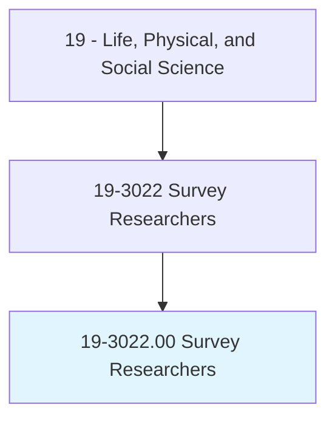
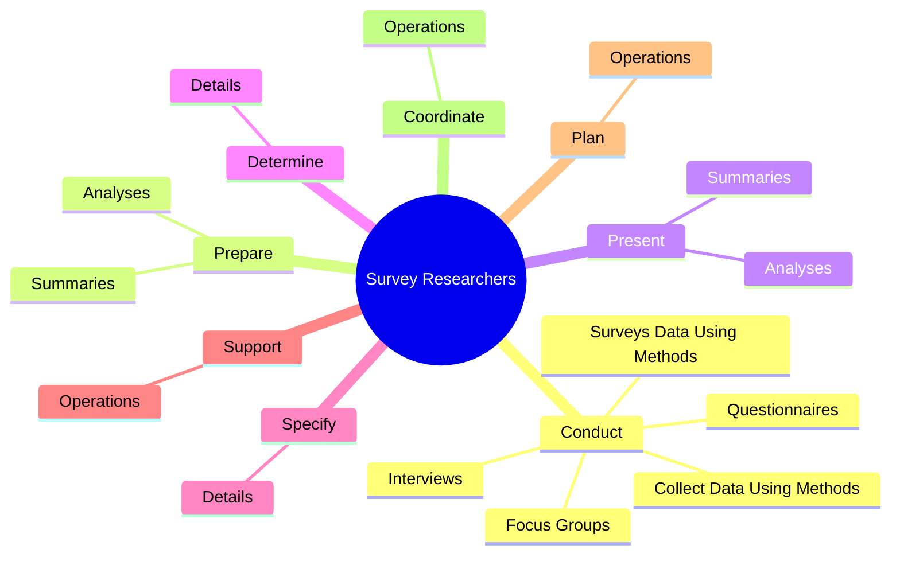
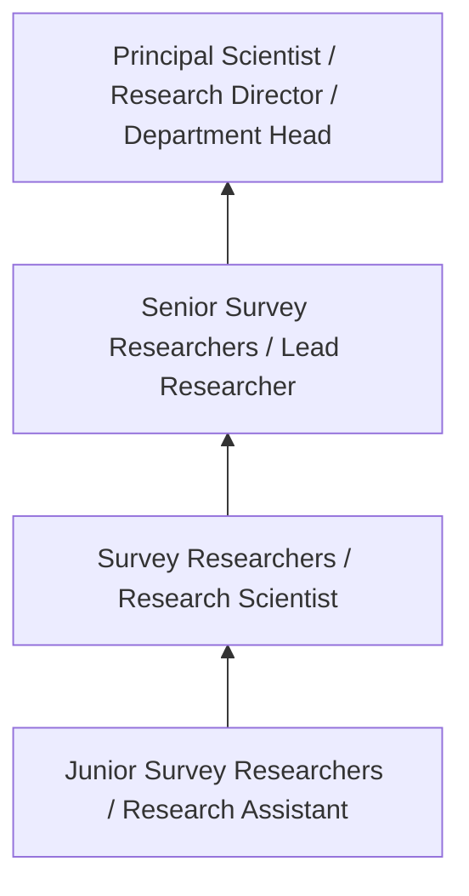
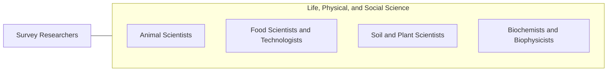

# Survey Researchers

> Plan, develop, or conduct surveys. May analyze and interpret the meaning of survey data, determine survey objectives, or suggest or test question wording. Includes social scientists who primarily design questionnaires or supervise survey teams.

## Overview

Survey Researchers professionals plan, develop, or conduct surveys. This occupation falls within the Life, Physical, and Social Science category and requires a combination of specialized knowledge, technical skills, and practical experience.

These professionals work across diverse settings and organizational contexts, applying their expertise to meet the demands of their field. They must stay current with industry standards, emerging practices, and regulatory requirements that affect their work. The role demands both independent judgment and collaborative skills, as practitioners regularly interact with colleagues, stakeholders, and the public.

As the field continues to evolve, Survey Researchers professionals increasingly leverage technology and data-driven approaches to enhance their effectiveness. Career opportunities span the public and private sectors, with demand influenced by economic conditions, demographic shifts, and technological advancement.

## Classification Hierarchy



## Key Statistics

| Metric | Value |
|--------|-------|
| SOC Code | 19-3022.00 |
| Job Zone | N/A |
| Category | [Life, Physical, and Social Science](/occupations/Science/index) |
| Core Tasks | 78+ |
| Salary Range | $50,000 - $130,000 |
| Median Salary | $78,000 |
| Growth Outlook | 7% (Faster than average) |
| Source | O*NET |

## Core Tasks



### prepare.Summaries

Survey Researchers prepare summaries as part of their core responsibilities.

**Actions:**
- `prepare.Summaries.of.SurveyData` - Prepare and present summaries and analyses of survey data, including tables, ...
- `prepare.Summaries.of.IncludingTables` - Prepare and present summaries and analyses of survey data, including tables, ...
- `prepare.Summaries.of.Graphs` - Prepare and present summaries and analyses of survey data, including tables, ...
- `prepare.Summaries.of.FactSheetsDescribeSurveyTechniques` - Prepare and present summaries and analyses of survey data, including tables, ...
- `prepare.Summaries.of.Results` - Prepare and present summaries and analyses of survey data, including tables, ...

### present.Summaries

Survey Researchers present summaries as part of their core responsibilities.

**Actions:**
- `present.Summaries.of.SurveyData` - Prepare and present summaries and analyses of survey data, including tables, ...
- `present.Summaries.of.IncludingTables` - Prepare and present summaries and analyses of survey data, including tables, ...
- `present.Summaries.of.Graphs` - Prepare and present summaries and analyses of survey data, including tables, ...
- `present.Summaries.of.FactSheetsDescribeSurveyTechniques` - Prepare and present summaries and analyses of survey data, including tables, ...
- `present.Summaries.of.Results` - Prepare and present summaries and analyses of survey data, including tables, ...

### conduct.SurveysDataUsingMethods

Survey Researchers conduct surveys data using methods as part of their core responsibilities.

**Actions:**
- `conduct.SurveysDataUsingMethods` - Conduct surveys and collect data, using methods such as interviews, questionn...
- `conduct.CollectDataUsingMethods` - Conduct surveys and collect data, using methods such as interviews, questionn...
- `conduct.Interviews` - Conduct surveys and collect data, using methods such as interviews, questionn...
- `conduct.Questionnaires` - Conduct surveys and collect data, using methods such as interviews, questionn...
- `conduct.FocusGroups` - Conduct surveys and collect data, using methods such as interviews, questionn...

### direct.Work

Survey Researchers direct work as part of their core responsibilities.

**Actions:**
- `direct.Work.of.StaffMembers` - Direct and review the work of staff members, including survey support staff a...
- `direct.Work.of.IncludingSurveySupportStaff` - Direct and review the work of staff members, including survey support staff a...
- `direct.Work.of.InterviewersWhoGatherSurveyData` - Direct and review the work of staff members, including survey support staff a...
- `direct.Updates.in.SurveyImplementation` - Direct updates and changes in survey implementation and methods.
- `direct.Updates.in.Methods` - Direct updates and changes in survey implementation and methods.


## Skills & Competencies

### Technical Skills
- **Research Methodology** - Expert
- **Data Analysis** - Advanced
- **Laboratory Techniques** - Advanced
- **Scientific Writing** - Advanced
- **Statistical Software** - Advanced
- **Quality Control** - Proficient

### Soft Skills
- **Analytical Thinking** - Critical
- **Attention to Detail** - Critical
- **Problem Solving** - Essential
- **Collaboration** - Essential
- **Written Communication** - Essential

## Education & Certifications

| Requirement | Details |
|-------------|---------|
| Typical Education | Bachelor's or Master's degree in relevant scientific field |
| Work Experience | 1-3 years research or laboratory experience |
| On-the-Job Training | Moderate - specialized laboratory techniques |
| Certifications | Field-specific certifications may be required |

## Career Progression



## Industry Variations

### Academic Research
Focus on fundamental research and publication. Survey Researchers professionals in academia often combine research with teaching responsibilities and mentoring graduate students.

### Industry Research and Development
Applied research for product development and commercial applications. Emphasis on innovation timelines and market-driven objectives.

### Government and Regulatory
Mission-oriented research supporting public policy and regulatory decisions. Focus on public health, environmental protection, or national security.

### Consulting and Contract Research
Project-based work for diverse clients. Requires strong communication skills and ability to translate findings for non-technical audiences.

## Technology & Tools

- **Laboratory Information Management Systems (LIMS)**
- **Statistical software (R, SAS, SPSS)**
- **Spectroscopy and chromatography equipment**
- **Microscopy and imaging systems**
- **Data analysis and visualization tools**

## Related Occupations



## Industries

- [Research and Development](/industries/ResearchDevelopment) - High Employment
- [Pharmaceutical Manufacturing](/industries/Pharma) - High Employment
- [Government Agencies](/industries/Government) - Moderate Employment
- [Higher Education](/industries/Education) - Moderate Employment

## Departments

This occupation typically works in:
- [Research and Development](/departments/Research/index)
- [Quality Assurance](/departments/QualityAssurance)
- [Laboratory Operations](/departments/Laboratory)

## GraphDL Semantic Structure

```
Survey Researchers perform:
- conduct.SurveysDataUsingMethods
- conduct.CollectDataUsingMethods
- conduct.Interviews
- conduct.Questionnaires
- conduct.FocusGroups
- conduct.MarketAnalysisSurveys
```

---

*Source: O*NET 19-3022.00 - ONETOccupation*
