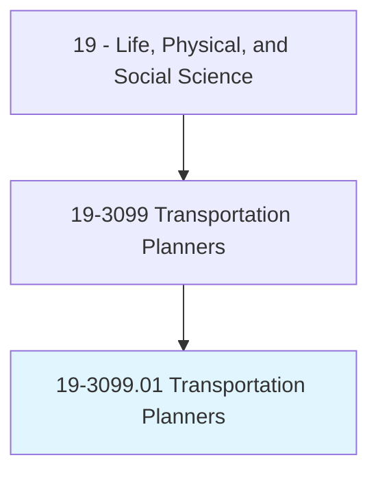
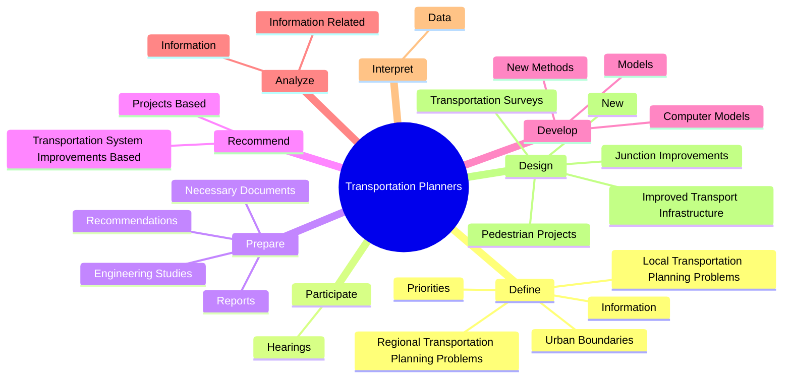
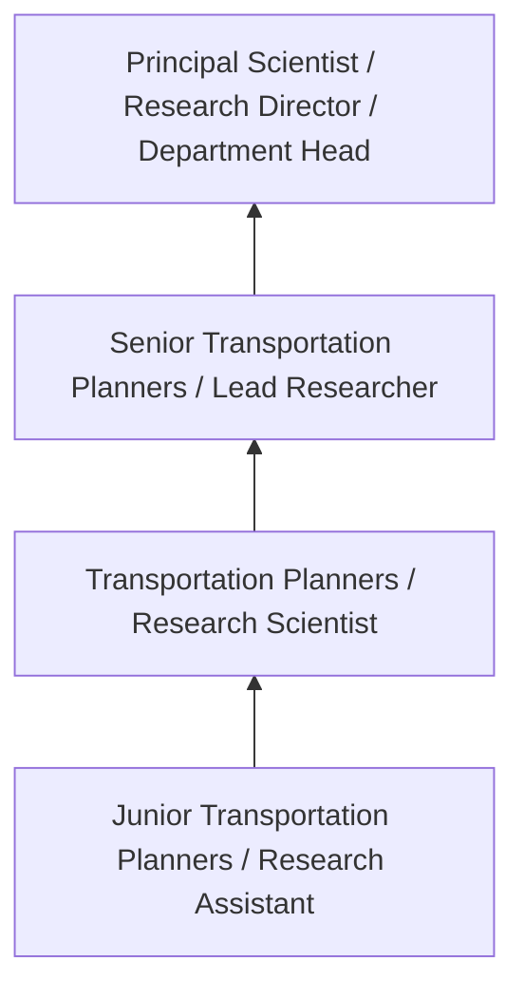
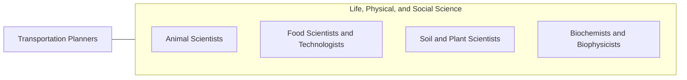

# Transportation Planners

> Prepare studies for proposed transportation projects. Gather, compile, and analyze data. Study the use and operation of transportation systems. Develop transportation models or simulations.

## Overview

Transportation Planners professionals prepare studies for proposed transportation projects. This occupation falls within the Life, Physical, and Social Science category and requires a combination of specialized knowledge, technical skills, and practical experience.

These professionals work across diverse settings and organizational contexts, applying their expertise to meet the demands of their field. They must stay current with industry standards, emerging practices, and regulatory requirements that affect their work. The role demands both independent judgment and collaborative skills, as practitioners regularly interact with colleagues, stakeholders, and the public.

As the field continues to evolve, Transportation Planners professionals increasingly leverage technology and data-driven approaches to enhance their effectiveness. Career opportunities span the public and private sectors, with demand influenced by economic conditions, demographic shifts, and technological advancement.

## Classification Hierarchy



## Key Statistics

| Metric | Value |
|--------|-------|
| SOC Code | 19-3099.01 |
| Job Zone | N/A |
| Category | [Life, Physical, and Social Science](/occupations/Science/index) |
| Core Tasks | 59+ |
| Salary Range | $50,000 - $130,000 |
| Median Salary | $78,000 |
| Growth Outlook | 7% (Faster than average) |
| Source | O*NET |

## Core Tasks



### recommend.TransportationSystemImprovementsBased

Transportation Planners recommend transportation system improvements based as part of their core responsibilities.

**Actions:**
- `recommend.TransportationSystemImprovementsBased.on.Economic` - Recommend transportation system improvements or projects, based on economic, ...
- `recommend.TransportationSystemImprovementsBased.on.Population` - Recommend transportation system improvements or projects, based on economic, ...
- `recommend.TransportationSystemImprovementsBased.on.LandUse` - Recommend transportation system improvements or projects, based on economic, ...
- `recommend.TransportationSystemImprovementsBased.on.TrafficProjections` - Recommend transportation system improvements or projects, based on economic, ...
- `recommend.ProjectsBased.on.Economic` - Recommend transportation system improvements or projects, based on economic, ...

### design.TransportationSurveys

Transportation Planners design transportation surveys as part of their core responsibilities.

**Actions:**
- `design.TransportationSurveys.to.identify.AreasOfPublicConcern` - Design transportation surveys to identify areas of public concern.
- `design.New` - Design new or improved transport infrastructure, such as junction improvement...
- `design.ImprovedTransportInfrastructure` - Design new or improved transport infrastructure, such as junction improvement...
- `design.JunctionImprovements` - Design new or improved transport infrastructure, such as junction improvement...
- `design.PedestrianProjects` - Design new or improved transport infrastructure, such as junction improvement...

### define.RegionalTransportationPlanningProblems

Transportation Planners define regional transportation planning problems as part of their core responsibilities.

**Actions:**
- `define.RegionalTransportationPlanningProblems` - Define regional or local transportation planning problems or priorities.
- `define.Priorities` - Define regional or local transportation planning problems or priorities.
- `define.LocalTransportationPlanningProblems` - Define regional or local transportation planning problems or priorities.
- `define.Information.of.Roadways` - Define or update information such as urban boundaries or classification of ro...
- `define.UrbanBoundaries.of.Roadways` - Define or update information such as urban boundaries or classification of ro...

### prepare.Reports

Transportation Planners prepare reports as part of their core responsibilities.

**Actions:**
- `prepare.Reports.on.TransportationPlanning` - Prepare reports or recommendations on transportation planning.
- `prepare.Recommendations.on.TransportationPlanning` - Prepare reports or recommendations on transportation planning.
- `prepare.NecessaryDocuments.to.obtain.PlannedProjectApprovals` - Prepare necessary documents to obtain planned project approvals or permits.
- `prepare.NecessaryDocuments.to.Permits` - Prepare necessary documents to obtain planned project approvals or permits.
- `prepare.EngineeringStudies` - Prepare or review engineering studies or specifications.


## Skills & Competencies

### Technical Skills
- **Research Methodology** - Expert
- **Data Analysis** - Advanced
- **Laboratory Techniques** - Advanced
- **Scientific Writing** - Advanced
- **Statistical Software** - Advanced
- **Quality Control** - Proficient

### Soft Skills
- **Analytical Thinking** - Critical
- **Attention to Detail** - Critical
- **Problem Solving** - Essential
- **Collaboration** - Essential
- **Written Communication** - Essential

## Education & Certifications

| Requirement | Details |
|-------------|---------|
| Typical Education | Bachelor's or Master's degree in relevant scientific field |
| Work Experience | 1-3 years research or laboratory experience |
| On-the-Job Training | Moderate - specialized laboratory techniques |
| Certifications | Field-specific certifications may be required |

## Career Progression



## Industry Variations

### Academic Research
Focus on fundamental research and publication. Transportation Planners professionals in academia often combine research with teaching responsibilities and mentoring graduate students.

### Industry Research and Development
Applied research for product development and commercial applications. Emphasis on innovation timelines and market-driven objectives.

### Government and Regulatory
Mission-oriented research supporting public policy and regulatory decisions. Focus on public health, environmental protection, or national security.

### Consulting and Contract Research
Project-based work for diverse clients. Requires strong communication skills and ability to translate findings for non-technical audiences.

## Technology & Tools

- **Laboratory Information Management Systems (LIMS)**
- **Statistical software (R, SAS, SPSS)**
- **Spectroscopy and chromatography equipment**
- **Microscopy and imaging systems**
- **Data analysis and visualization tools**

## Related Occupations



## Industries

- [Research and Development](/industries/ResearchDevelopment) - High Employment
- [Pharmaceutical Manufacturing](/industries/Pharma) - High Employment
- [Government Agencies](/industries/Government) - Moderate Employment
- [Higher Education](/industries/Education) - Moderate Employment

## Departments

This occupation typically works in:
- [Research and Development](/departments/Research/index)
- [Quality Assurance](/departments/QualityAssurance)
- [Laboratory Operations](/departments/Laboratory)

## GraphDL Semantic Structure

```
Transportation Planners perform:
- define.RegionalTransportationPlanningProblems
- define.Priorities
- define.LocalTransportationPlanningProblems
- participate.Hearings.to.explain.PlanningProposals
- participate.Hearings.to.ToGatherFeedbackFromAffectedByProjects
- participate.Hearings.to.ToAchieveConsensusOnProjectDesigns
```

---

*Source: O*NET 19-3099.01 - ONETOccupation*
