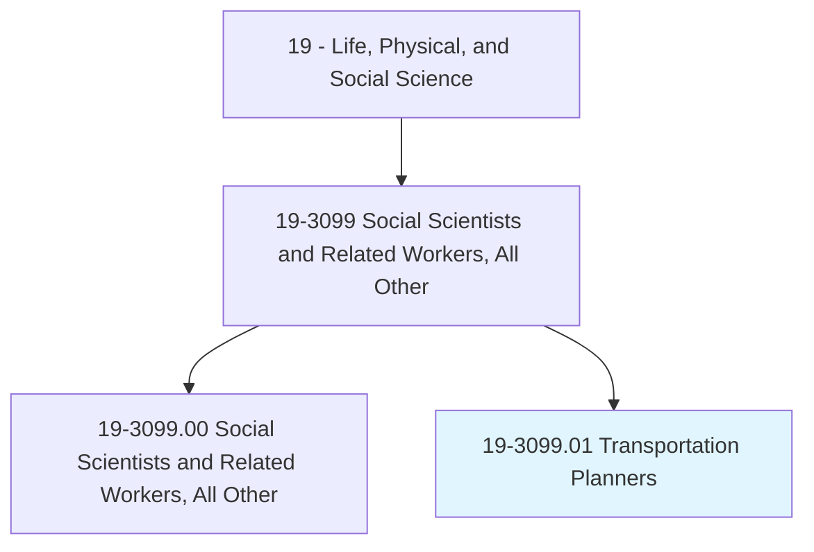
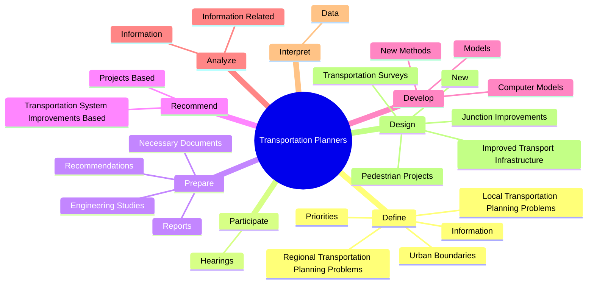
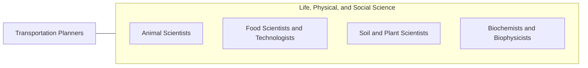

# Transportation Planners

> Prepare studies for proposed transportation projects. Gather, compile, and analyze data. Study the use and operation of transportation systems. Develop transportation models or simulations.

## Overview

Transportation Planners is a specialized variant within the Life, Physical, and Social Science category. Prepare studies for proposed transportation projects. Gather, compile, and analyze data.

## Classification Hierarchy

## Key Statistics

| Metric | Value |
|--------|-------|
| SOC Code | 19-3099.01 |
| Category | [Life, Physical, and Social Science](/occupations/Science) |
| Task Count | 59 |
| Source | O*NET |

## Core Tasks

### define.RegionalTransportationPlanningProblems

Transportation Planners define regional transportation planning problems as part of their core responsibilities.

**Actions:**
- `define.RegionalTransportationPlanningProblems`
- `define.Priorities`
- `define.LocalTransportationPlanningProblems`
- `define.Information.of.Roadways`

### participate.Hearings

Transportation Planners participate hearings as part of their core responsibilities.

**Actions:**
- `participate.Hearings.to.explain.PlanningProposals`
- `participate.Hearings.to.ToGatherFeedbackFromAffectedByProjects`
- `participate.Hearings.to.ToAchieveConsensusOnProjectDesigns`

### prepare.Reports

Transportation Planners prepare reports as part of their core responsibilities.

**Actions:**
- `prepare.Reports.on.TransportationPlanning`
- `prepare.Recommendations.on.TransportationPlanning`
- `prepare.NecessaryDocuments.to.obtain.PlannedProjectApprovals`
- `prepare.NecessaryDocuments.to.Permits`

## Skills & Competencies

### Technical Skills
- **Research Methods** - Advanced
- **Data Analysis** - Advanced
- **Laboratory Techniques** - Advanced

### Soft Skills
- **Communication** - Essential
- **Problem Solving** - Essential
- **Critical Thinking** - Important
- **Teamwork** - Important
- **Adaptability** - Important

## Related Occupations

## Industries

This occupation is found across multiple industries. See [Industries](/industries) for sector-specific employment data.

## Career Progression

---

*Source: O*NET 19-3099.01 - ONETOccupation*
