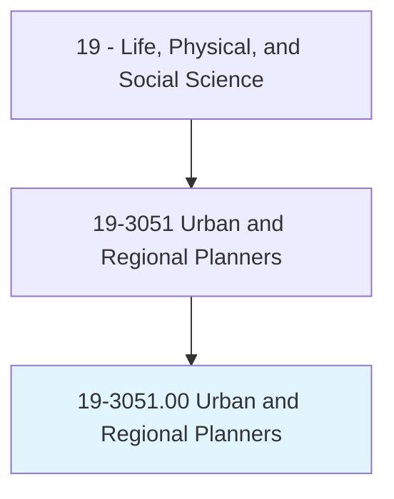
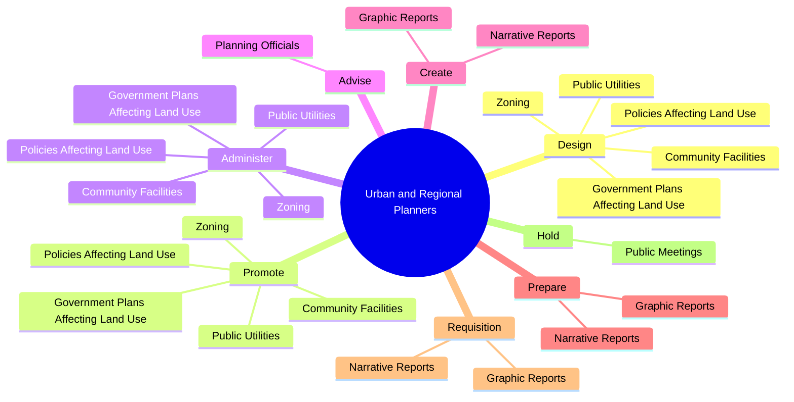

# Urban and Regional Planners

> Develop comprehensive plans and programs for use of land and physical facilities of jurisdictions, such as towns, cities, counties, and metropolitan areas.

## Overview

Urban and Regional Planners is classified under Life, Physical, and Social Science (SOC 19). Develop comprehensive plans and programs for use of land and physical facilities of jurisdictions, such as towns, cities, counties, and metropolitan areas.

## Classification Hierarchy

## Key Statistics

| Metric | Value |
|--------|-------|
| SOC Code | 19-3051.00 |
| Category | [Life, Physical, and Social Science](/occupations/Science/index) |
| Task Count | 164 |
| Source | O*NET |

## Core Tasks

### design.GovernmentPlansAffectingLandUse

Urban and Regional Planners design government plans affecting land use as part of their core responsibilities.

**Actions:**
- `design.GovernmentPlansAffectingLandUse`
- `design.PoliciesAffectingLandUse`
- `design.Zoning`
- `design.PublicUtilities`

### promote.GovernmentPlansAffectingLandUse

Urban and Regional Planners promote government plans affecting land use as part of their core responsibilities.

**Actions:**
- `promote.GovernmentPlansAffectingLandUse`
- `promote.PoliciesAffectingLandUse`
- `promote.Zoning`
- `promote.PublicUtilities`

### administer.GovernmentPlansAffectingLandUse

Urban and Regional Planners administer government plans affecting land use as part of their core responsibilities.

**Actions:**
- `administer.GovernmentPlansAffectingLandUse`
- `administer.PoliciesAffectingLandUse`
- `administer.Zoning`
- `administer.PublicUtilities`

## Skills & Competencies

### Technical Skills
- **Research Methods** - Advanced
- **Data Analysis** - Advanced
- **Laboratory Techniques** - Advanced

### Soft Skills
- **Communication** - Essential
- **Problem Solving** - Essential
- **Critical Thinking** - Important
- **Teamwork** - Important
- **Adaptability** - Important

## Related Occupations

## Industries

This occupation is found across multiple industries. See [Industries](/industries) for sector-specific employment data.

## Career Progression

---

*Source: O*NET 19-3051.00 - ONETOccupation*
