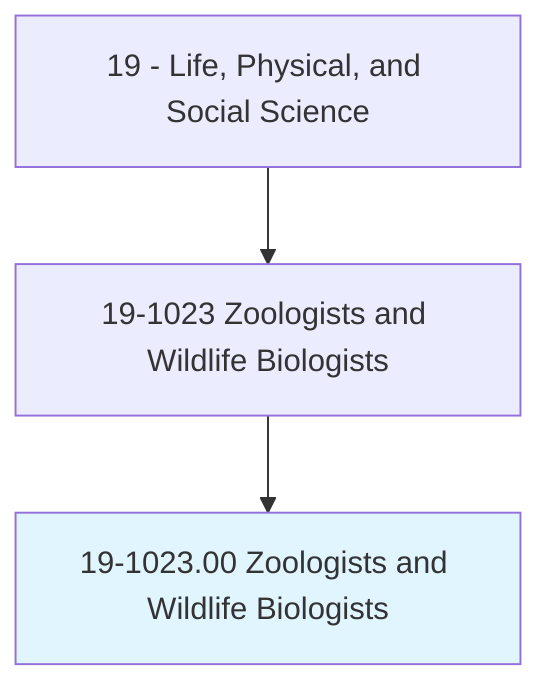
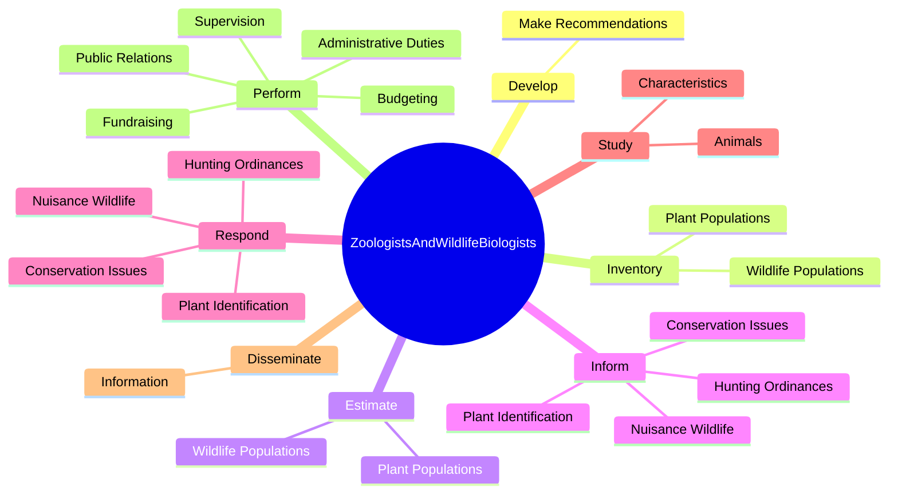
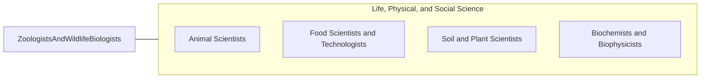

# Zoologists and Wildlife Biologists

> Study the origins, behavior, diseases, genetics, and life processes of animals and wildlife. May specialize in wildlife research and management. May collect and analyze biological data to determine the environmental effects of present and potential use of land and water habitats.

## Overview

Zoologists and Wildlife Biologists is an occupation within the Life, Physical, and Social Science category. Study the origins, behavior, diseases, genetics, and life processes of animals and wildlife. May specialize in wildlife research and management.

## Classification Hierarchy

## Key Statistics

| Metric | Value |
|--------|-------|
| SOC Code | 19-1023.00 |
| Category | [Life, Physical, and Social Science](/occupations/Science) |
| Task Count | 54 |
| Source | O*NET |

## Core Tasks

### develop.MakeRecommendations

Zoologists and Wildlife Biologists develop make recommendations as part of their core responsibilities.

**Actions:**
- `develop.MakeRecommendations.on.ManagementSystemsPlansForWildlifePopulationsHabitatConsultingWithStakeholdersPublicAtLarge.to.explore.Options`

### inventory.PlantPopulations

Zoologists and Wildlife Biologists inventory plant populations as part of their core responsibilities.

**Actions:**
- `inventory.PlantPopulations`
- `inventory.WildlifePopulations`

### estimate.PlantPopulations

Zoologists and Wildlife Biologists estimate plant populations as part of their core responsibilities.

**Actions:**
- `estimate.PlantPopulations`
- `estimate.WildlifePopulations`

## Skills & Competencies

### Technical Skills
- **Research Methods** - Advanced
- **Data Analysis** - Advanced
- **Laboratory Techniques** - Advanced

### Soft Skills
- **Communication** - Essential
- **Problem Solving** - Essential
- **Critical Thinking** - Important
- **Teamwork** - Important
- **Adaptability** - Important

## Related Occupations

## Industries

This occupation is found across multiple industries. See [Industries](/industries) for sector-specific employment data.

## Career Progression

---

*Source: O*NET 19-1023.00 - ONETOccupation*
