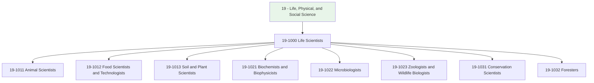
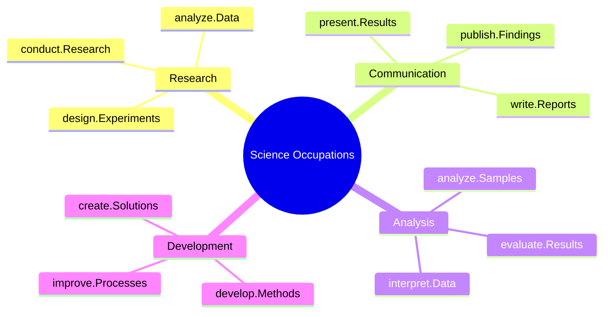
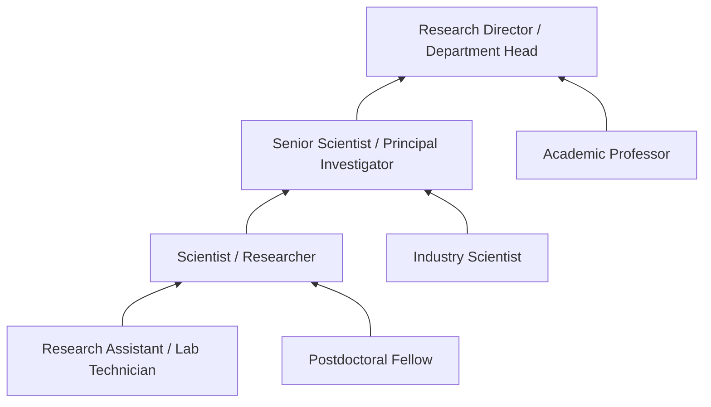

# Life, Physical, and Social Science

> Occupations in the life, physical, and social science category involve scientific research, analysis, and application across biological, chemical, physical, and social domains. These professionals advance human knowledge through systematic investigation and apply scientific principles to solve practical problems.

## Overview

Life, Physical, and Social Science occupations (SOC Major Group 19) encompass professionals who conduct research, perform experiments, analyze data, and apply scientific knowledge across diverse fields. From studying microscopic organisms to understanding animal genetics, these scientists contribute to agriculture, medicine, environmental protection, and fundamental scientific understanding. They work in laboratories, field stations, academic institutions, and industry settings.

## Classification Hierarchy

## Key Statistics

| Metric | Value |
|--------|-------|
| SOC Code | 19-0000 |
| Total Occupations | 30+ |
| Employment Growth | Growing (6-8% projected) |
| Median Education | Master's or Doctoral degree |

## Occupations in this Category

### Life Scientists (19-1000)

- [Animal Scientists](./AnimalScientists.mdx) - Research genetics, nutrition, reproduction, and development of farm animals
- [Food Scientists and Technologists](./FoodScientists.mdx) - Study food processing, safety, and nutrition
- [Soil and Plant Scientists](./PlantScientists.mdx) - Research crop production, plant physiology, and soil science
- [Biochemists and Biophysicists](./Biochemists.mdx) - Study chemical and physical principles of living organisms
- [Microbiologists](./Microbiologists.mdx) - Investigate microscopic organisms and their effects

### Related Life Scientists

- Zoologists and Wildlife Biologists (19-1023)
- Conservation Scientists (19-1031)
- Foresters (19-1032)
- Bioinformatics Scientists (19-1029.01)
- Geneticists (19-1029.03)

## Common Task Patterns

## Skills Across Category

### Technical Skills
- **Research Methodology** - Design and execution of scientific studies
- **Data Analysis** - Statistical analysis and interpretation
- **Laboratory Techniques** - Specialized equipment and procedures
- **Scientific Writing** - Publication and reporting standards
- **Quality Control** - Ensuring accuracy and reproducibility

### Soft Skills
- **Analytical Thinking** - Critical
- **Attention to Detail** - Critical
- **Problem Solving** - Essential
- **Collaboration** - Essential
- **Communication** - Essential

## Industries

- [Agriculture and Food Production](/industries/Agriculture) - High Employment
- [Pharmaceutical and Biotechnology](/industries/Pharma) - High Employment
- [Research and Development](/industries/ResearchDevelopment) - High Employment
- [Government Agencies](/industries/Government) - Moderate Employment
- [Academic Institutions](/industries/Education) - Moderate Employment

## Career Pathways

## Education Requirements

| Level | Typical Positions |
|-------|------------------|
| Bachelor's | Research Assistant, Lab Technician |
| Master's | Scientist, Research Associate |
| Doctoral | Principal Investigator, Professor |

---

*Source: O*NET SOC Major Group 19 - Life, Physical, and Social Science Occupations*
