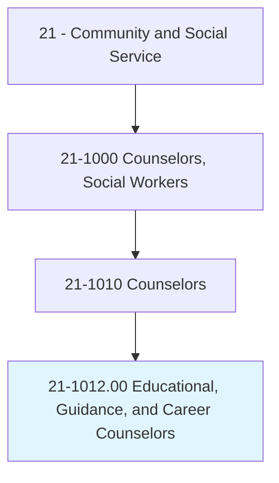
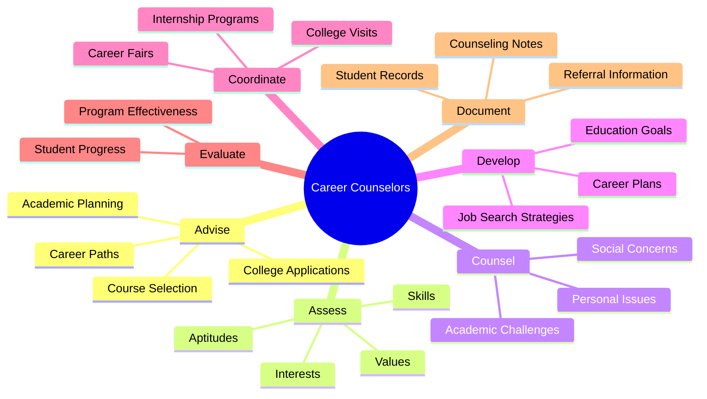
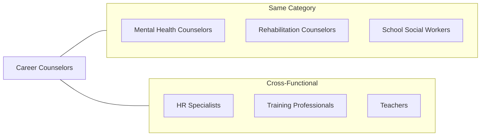
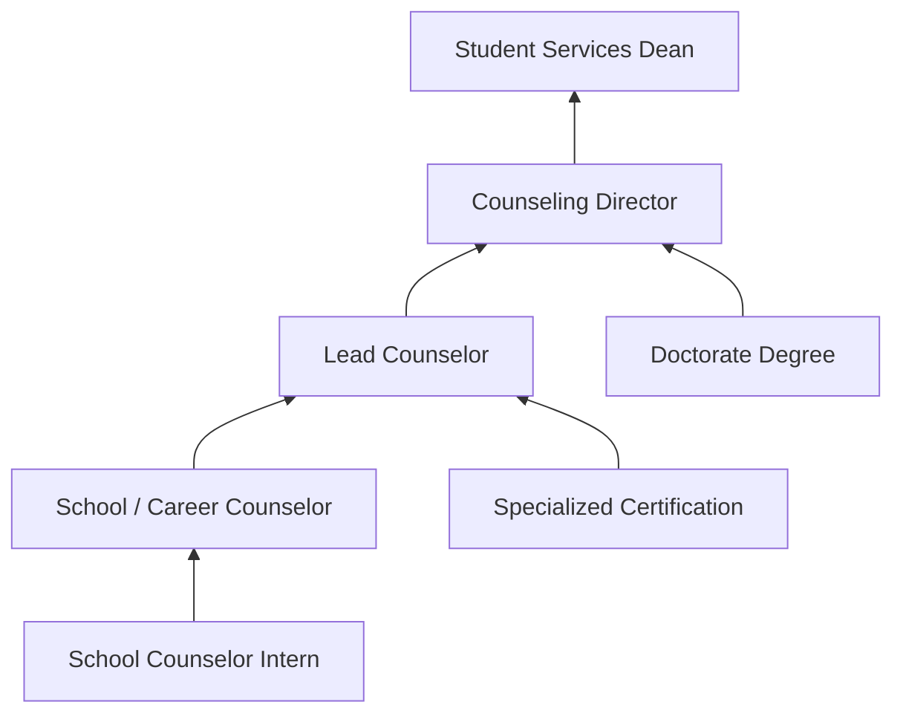

# Educational, Guidance, and Career Counselors and Advisors

> Advise and assist students and provide educational and vocational guidance services.

## Overview

Educational, Guidance, and Career Counselors and Advisors help individuals navigate academic decisions, career paths, and personal development throughout their educational journeys. They work primarily in schools, colleges, and career centers to assist students with course selection, college applications, career exploration, and personal challenges that affect academic performance. These professionals combine knowledge of educational systems, labor markets, and human development to guide individuals toward fulfilling academic and professional goals.

## Classification Hierarchy



## Key Statistics

| Metric | Value |
|--------|-------|
| SOC Code | 21-1012.00 |
| Job Zone | 5 (Extensive Preparation) |
| Category | [Community and Social Service](/occupations/SocialServices) |
| Education Level | Master's degree typically required |
| Source | O*NET |

## Core Tasks



### advise.Students

Counselors provide guidance on academic decisions and educational planning to help students achieve their goals.

**Actions:**
- `advise.Students.on.CourseSelection` - Help students choose appropriate classes
- `advise.Students.on.CollegeApplications` - Guide through admissions processes
- `advise.Students.on.CareerPaths` - Explore vocational and professional options
- `advise.Students.on.FinancialAid` - Assist with scholarship and aid applications

### assess.StudentNeeds

Counselors evaluate students to understand their interests, abilities, and goals.

**Actions:**
- `assess.StudentNeeds.using.InterestInventories` - Administer career interest assessments
- `assess.AcademicAbilities.through.Testing` - Evaluate academic strengths and gaps
- `assess.CareerReadiness.for.Planning` - Determine preparedness for workforce
- `assess.PersonalValues.to.inform.CareerExploration` - Align values with career options

### counsel.Students

Counselors provide support for personal and social issues affecting academic success.

**Actions:**
- `counsel.Students.on.PersonalIssues` - Address emotional and social challenges
- `counsel.Students.on.AcademicChallenges` - Help overcome learning difficulties
- `counsel.Students.on.PeerRelationships` - Navigate social dynamics
- `counsel.Parents.on.StudentProgress` - Engage families in educational planning

### develop.CareerPlans

Counselors help students create actionable plans for academic and career success.

**Actions:**
- `develop.CareerPlans.based.on.Assessment` - Create personalized career roadmaps
- `develop.EducationGoals.with.StudentInput` - Establish academic objectives
- `develop.JobSearchStrategies.for.Graduates` - Prepare students for employment
- `develop.ResumeSkills.for.CareerReadiness` - Build professional materials

### coordinate.Programs

Counselors organize events and programs to support student development.

**Actions:**
- `coordinate.CollegeVisits.for.Students` - Arrange campus tours and information sessions
- `coordinate.CareerFairs.for.Exploration` - Host employer engagement events
- `coordinate.InternshipPrograms.for.Experience` - Connect students with opportunities
- `coordinate.WorkshopSeries.for.SkillDevelopment` - Deliver career readiness training

## Skills & Competencies

### Technical Skills
- **Career Assessment Administration** - Expert
- **Academic Advising** - Expert
- **College Admissions Knowledge** - Advanced
- **Labor Market Information** - Advanced
- **Counseling Techniques** - Advanced
- **Student Information Systems** - Proficient

### Soft Skills
- **Active Listening** - Critical
- **Communication** - Critical
- **Empathy** - Essential
- **Organization** - Essential
- **Problem Solving** - Essential
- **Cultural Competency** - Essential

## Related Occupations



### Same Category
- [Mental Health Counselors](./MentalHealthCounselors.mdx) - Overlapping student support
- [Rehabilitation Counselors](./RehabilitationCounselors.mdx) - Vocational guidance
- School Social Workers - Student welfare services

### Cross-Functional
- Human Resources Specialists - Career development in organizations
- Training and Development Professionals - Workforce skill building
- Teachers - Academic instruction and student support

## Industries

- [Educational Services](/industries/Education) - High Employment
- [Government](/industries/Government) - Moderate Employment
- [Healthcare and Social Assistance](/industries/Healthcare) - Moderate Employment
- [Employment Services](/industries/EmploymentServices) - Moderate Employment
- [Corporate Training](/industries/ProfessionalServices) - Low Employment

## Industry Variations

### K-12 Education
Focus on developmental guidance, academic tracking, college readiness, and addressing personal issues affecting school performance. Work with diverse student populations and coordinate with parents and teachers.

### Higher Education
Emphasis on career exploration, major selection, internship placement, and post-graduation employment. Often specialize in specific academic departments or student populations.

### Career Centers
Work with adults seeking career changes, job placement services, and workforce development. Focus on resume writing, interview skills, and job search strategies.

### Corporate Settings
Internal career development, succession planning, and employee counseling. Help employees navigate career paths within organizations.

## Career Progression



### Career Levels

| Level | Title | Experience | Typical Responsibilities |
|-------|-------|------------|-------------------------|
| Entry | Counselor Intern | 0-1 years | Supervised counseling, program support |
| Mid | School/Career Counselor | 1-5 years | Individual and group counseling |
| Senior | Lead Counselor | 5-10 years | Program development, mentoring |
| Admin | Counseling Director | 10-15 years | Department management, policy |
| Executive | Student Services Dean | 15+ years | Division leadership, strategy |

## Education & Training

| Requirement | Details |
|-------------|---------|
| Typical Education | Master's degree in School Counseling, Career Counseling, or related field |
| Work Experience | Supervised practicum and internship (typically 600+ hours) |
| On-the-Job Training | Moderate - specific to school system or organization |
| Common Certifications | State School Counselor License, NCC, NCCC, GCDF |

### Certification Path

1. **Entry Credentials**: National Certified Counselor (NCC)
2. **School Credentials**: State School Counselor License/Certification
3. **Career Specialty**: National Certified Career Counselor (NCCC)
4. **Facilitation**: Global Career Development Facilitator (GCDF)

## Alternative Job Titles

- Academic Advisor
- Guidance Counselor
- School Counselor
- College Counselor
- Career Advisor
- Career Coach
- Enrollment Counselor
- Employment Counselor
- Vocational Counselor

## Departments

This occupation typically works in:
- [Student Services](/departments/StudentServices)
- [Counseling Services](/departments/CounselingServices)
- [Career Services](/departments/CareerServices)
- [Academic Affairs](/departments/AcademicAffairs)
- [Human Resources](/departments/HumanResources)

## GraphDL Semantic Structure

```
Entity: EducationalGuidanceAndCareerCounselorsAndAdvisors
Namespace: occupations.org.ai
Type: Occupation

Core Actions:
- advise.Students.on.AcademicDecisions
- assess.StudentNeeds.using.Assessments
- counsel.Students.on.PersonalIssues
- develop.CareerPlans.with.Students
- coordinate.Programs.for.StudentDevelopment
- evaluate.StudentProgress.through.Reviews
- document.StudentRecords.for.Compliance

Related Concepts:
- concepts.org.ai/Educational
- concepts.org.ai/Guidance
- concepts.org.ai/CareerCounselorsAnd
- concepts.org.ai/Advisors
```

## Process Alignment

Career Counselors support key educational and HR processes:

| Process Area | Process | Role |
|--------------|---------|------|
| Student Development | Academic Planning | Primary |
| Career Development | Career Exploration | Primary |
| Talent Management | Succession Planning | Support |
| Training | Skill Development | Support |

---

*Source: O*NET 21-1012.00 - ONETOccupation*
