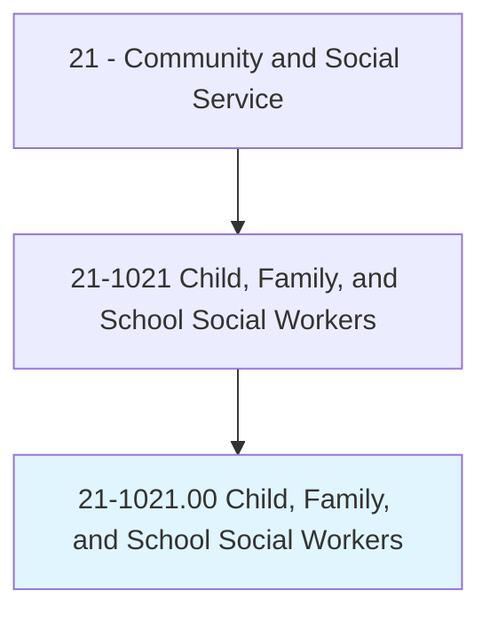
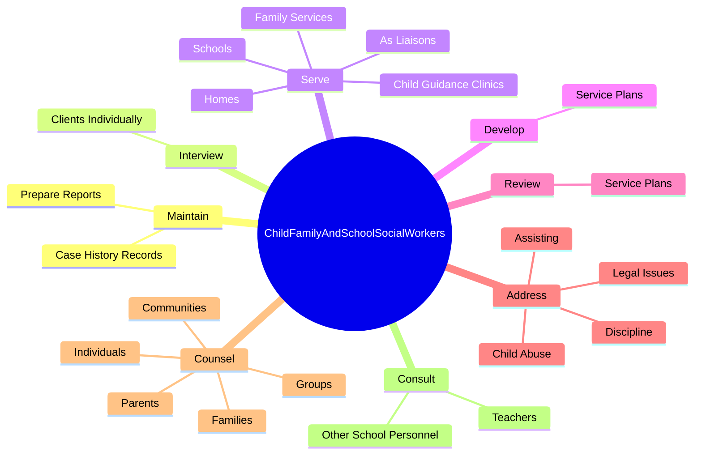
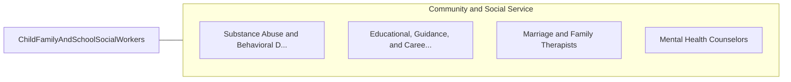

# Child, Family, and School Social Workers

> Provide social services and assistance to improve the social and psychological functioning of children and their families and to maximize the family well-being and the academic functioning of children. May assist parents, arrange adoptions, and find foster homes for abandoned or abused children. In schools, they address such problems as teenage pregnancy, misbehavior, and truancy. May also advise teachers.

## Overview

Child, Family, and School Social Workers is an occupation within the Community and Social Service category. Provide social services and assistance to improve the social and psychological functioning of children and their families and to maximize the family well-being and the academic functioning of children. May assist parents, arrange adoptions, and find foster homes for abandoned or abused children.

## Classification Hierarchy

## Key Statistics

| Metric | Value |
|--------|-------|
| SOC Code | 21-1021.00 |
| Category | [Community and Social Service](/occupations/SocialServices/index) |
| Task Count | 151 |
| Source | O*NET |

## Core Tasks

### maintain.CaseHistoryRecords

Child, Family, and School Social Workers maintain case history records as part of their core responsibilities.

**Actions:**
- `maintain.CaseHistoryRecords`
- `maintain.PrepareReports`

### interview.ClientsIndividually

Child, Family, and School Social Workers interview clients individually as part of their core responsibilities.

**Actions:**
- `interview.ClientsIndividually.in.Families`
- `interview.ClientsIndividually.in.InGroups`
- `interview.ClientsIndividually.in.AssessingSituations`
- `interview.ClientsIndividually.in.Capabilities`

### serve.AsLiaisons

Child, Family, and School Social Workers serve as liaisons as part of their core responsibilities.

**Actions:**
- `serve.AsLiaisons.between.Students.to.help.ChildrenWhoFaceProblems`
- `serve.AsLiaisons.between.Students.to.Disabilities`
- `serve.AsLiaisons.between.Students.to.Abuse`
- `serve.AsLiaisons.between.Students.to.Poverty`

## Skills & Competencies

### Technical Skills
- **Counseling** - Advanced
- **Case Management** - Advanced
- **Community Outreach** - Advanced

### Soft Skills
- **Communication** - Essential
- **Problem Solving** - Essential
- **Critical Thinking** - Important
- **Teamwork** - Important
- **Adaptability** - Important

## Related Occupations

## Industries

This occupation is found across multiple industries. See [Industries](/industries) for sector-specific employment data.

## Career Progression

---

*Source: O*NET 21-1021.00 - ONETOccupation*
