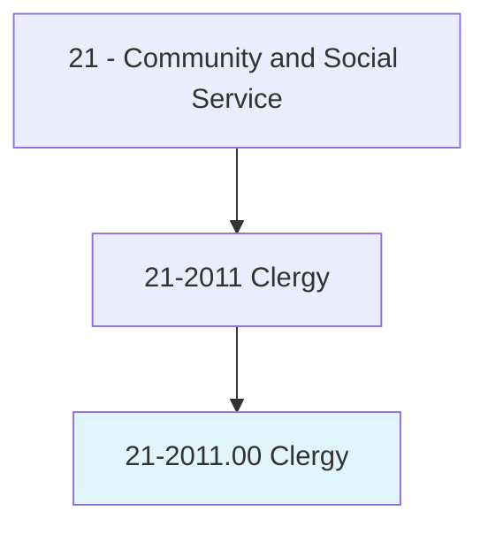
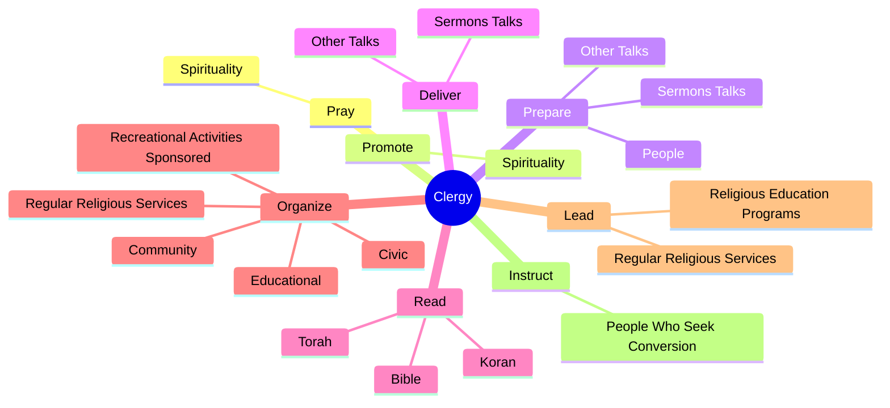
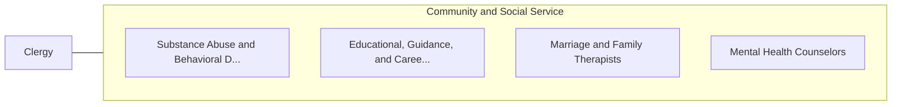

# Clergy

> Conduct religious worship and perform other spiritual functions associated with beliefs and practices of religious faith or denomination. Provide spiritual and moral guidance and assistance to members.

## Overview

Clergy is an occupation within the Community and Social Service category. Conduct religious worship and perform other spiritual functions associated with beliefs and practices of religious faith or denomination. 

## Classification Hierarchy

## Key Statistics

| Metric | Value |
|--------|-------|
| SOC Code | 21-2011.00 |
| Category | [Community and Social Service](/occupations/SocialServices) |
| Task Count | 71 |
| Source | O*NET |

## Core Tasks

### pray.Spirituality

Clergy pray spirituality as part of their core responsibilities.

**Actions:**
- `pray.Spirituality`

### promote.Spirituality

Clergy promote spirituality as part of their core responsibilities.

**Actions:**
- `promote.Spirituality`

### prepare.SermonsTalks

Clergy prepare sermons talks as part of their core responsibilities.

**Actions:**
- `prepare.SermonsTalks`
- `prepare.OtherTalks`
- `prepare.People.for.Participation.in.ReligiousCeremonies`

## Skills & Competencies

### Technical Skills
- **Counseling** - Advanced
- **Case Management** - Advanced
- **Community Outreach** - Advanced

### Soft Skills
- **Communication** - Essential
- **Problem Solving** - Essential
- **Critical Thinking** - Important
- **Teamwork** - Important
- **Adaptability** - Important

## Related Occupations

## Industries

This occupation is found across multiple industries. See [Industries](/industries) for sector-specific employment data.

## Career Progression

---

*Source: O*NET 21-2011.00 - ONETOccupation*
