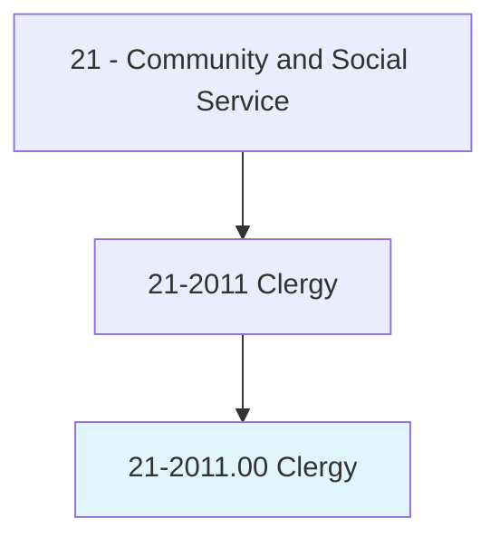
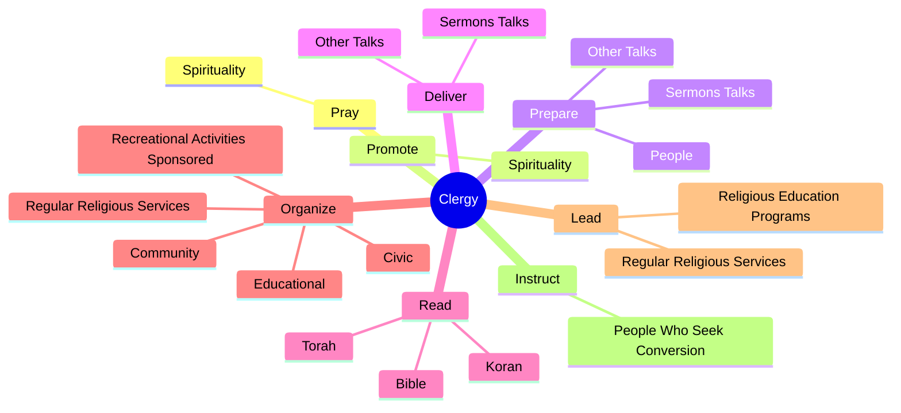
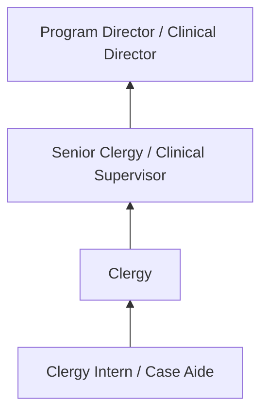
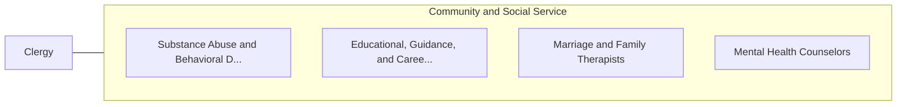

# Clergy

> Conduct religious worship and perform other spiritual functions associated with beliefs and practices of religious faith or denomination. Provide spiritual and moral guidance and assistance to members.

## Overview

Clergy professionals conduct religious worship and perform other spiritual functions associated with beliefs and practices of religious faith or denomination. This occupation falls within the Community and Social Service category and requires a combination of specialized knowledge, technical skills, and practical experience.

These professionals work across diverse settings and organizational contexts, applying their expertise to meet the demands of their field. They must stay current with industry standards, emerging practices, and regulatory requirements that affect their work. The role demands both independent judgment and collaborative skills, as practitioners regularly interact with colleagues, stakeholders, and the public.

As the field continues to evolve, Clergy professionals increasingly leverage technology and data-driven approaches to enhance their effectiveness. Career opportunities span the public and private sectors, with demand influenced by economic conditions, demographic shifts, and technological advancement.

## Classification Hierarchy



## Key Statistics

| Metric | Value |
|--------|-------|
| SOC Code | 21-2011.00 |
| Job Zone | N/A |
| Category | [Community and Social Service](/occupations/SocialServices/index) |
| Core Tasks | 71+ |
| Salary Range | $35,000 - $80,000 |
| Median Salary | $50,000 |
| Growth Outlook | 10% (Much faster than average) |
| Source | O*NET |

## Core Tasks



### perform.AdministrativeDuties

Clergy perform administrative duties as part of their core responsibilities.

**Actions:**
- `perform.AdministrativeDuties.for.Services` - Perform administrative duties, such as overseeing building management, orderi...
- `perform.AdministrativeDuties.for.Repairs` - Perform administrative duties, such as overseeing building management, orderi...
- `perform.AdministrativeDuties.for.SupervisingWork.of.StaffMembers` - Perform administrative duties, such as overseeing building management, orderi...
- `perform.AdministrativeDuties.for.Volunteers` - Perform administrative duties, such as overseeing building management, orderi...
- `perform.OverseeingBuildingManagement.for.Services` - Perform administrative duties, such as overseeing building management, orderi...

### organize.RegularReligiousServices

Clergy organize regular religious services as part of their core responsibilities.

**Actions:**
- `organize.RegularReligiousServices` - Organize and lead regular religious services.
- `organize.Community.by.RelatedToReligiousPrograms` - Organize or engage in interfaith, community, civic, educational, or recreatio...
- `organize.Civic.by.RelatedToReligiousPrograms` - Organize or engage in interfaith, community, civic, educational, or recreatio...
- `organize.Educational.by.RelatedToReligiousPrograms` - Organize or engage in interfaith, community, civic, educational, or recreatio...
- `organize.RecreationalActivitiesSponsored.by.RelatedToReligiousPrograms` - Organize or engage in interfaith, community, civic, educational, or recreatio...

### counsel.Individuals

Clergy counsel individuals as part of their core responsibilities.

**Actions:**
- `counsel.Individuals.concerning.Spiritual` - Counsel individuals or groups concerning their spiritual, emotional, or perso...
- `counsel.Groups.concerning.Spiritual` - Counsel individuals or groups concerning their spiritual, emotional, or perso...
- `counsel.Emotional` - Counsel individuals or groups concerning their spiritual, emotional, or perso...
- `counsel.PersonalNeeds` - Counsel individuals or groups concerning their spiritual, emotional, or perso...

### visit.People

Clergy visit people as part of their core responsibilities.

**Actions:**
- `visit.People.in.Homes` - Visit people in homes, hospitals, or prisons to provide them with comfort and...
- `visit.People.in.Hospitals` - Visit people in homes, hospitals, or prisons to provide them with comfort and...
- `visit.People.in.Prisons.to.provide.ThemWithComfort` - Visit people in homes, hospitals, or prisons to provide them with comfort and...
- `visit.People.in.Support` - Visit people in homes, hospitals, or prisons to provide them with comfort and...


## Skills & Competencies

### Technical Skills
- **Assessment and Evaluation** - Expert
- **Case Management** - Advanced
- **Crisis Intervention** - Advanced
- **Treatment Planning** - Advanced
- **Documentation and Reporting** - Advanced
- **Cultural Competency** - Advanced

### Soft Skills
- **Empathy** - Critical
- **Active Listening** - Critical
- **Communication** - Essential
- **Ethical Judgment** - Essential
- **Emotional Resilience** - Essential

## Education & Certifications

| Requirement | Details |
|-------------|---------|
| Typical Education | Bachelor's or Master's degree in social work, counseling, or related field |
| Work Experience | 1-2 years supervised clinical experience |
| On-the-Job Training | Moderate to extensive - supervised practice hours required |
| Certifications | State licensure typically required (LCSW, LPC, etc.) |

## Career Progression



## Industry Variations

### Nonprofit Organizations
Community-based service delivery. Clergy professionals focus on underserved populations with limited resources.

### Healthcare Settings
Integrated behavioral and physical health services. Collaboration with medical teams and emphasis on holistic patient care.

### Government Agencies
Public service delivery and policy implementation. Focus on compliance, documentation, and serving diverse community needs.

### Private Practice
Independent or group practice settings. Greater autonomy in service delivery with focus on building a client base.

## Technology & Tools

- **Case management software**
- **Electronic health records (EHR)**
- **Assessment and screening tools**
- **Telehealth platforms**
- **Documentation and reporting systems**

## Related Occupations



## Industries

- [Social Assistance](/industries/SocialAssistance) - High Employment
- [Healthcare](/industries/Healthcare/index) - High Employment
- [Government](/industries/Government) - Moderate Employment
- [Education](/industries/Education) - Moderate Employment

## Departments

This occupation typically works in:
- [Client Services](/departments/ClientServices)
- [Program Administration](/departments/ProgramAdmin)
- [Community Outreach](/departments/CommunityOutreach)

## GraphDL Semantic Structure

```
Clergy perform:
- pray.Spirituality
- promote.Spirituality
- prepare.SermonsTalks
- prepare.OtherTalks
- deliver.SermonsTalks
- deliver.OtherTalks
```

---

*Source: O*NET 21-2011.00 - ONETOccupation*
