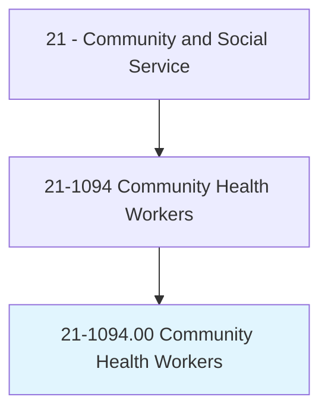
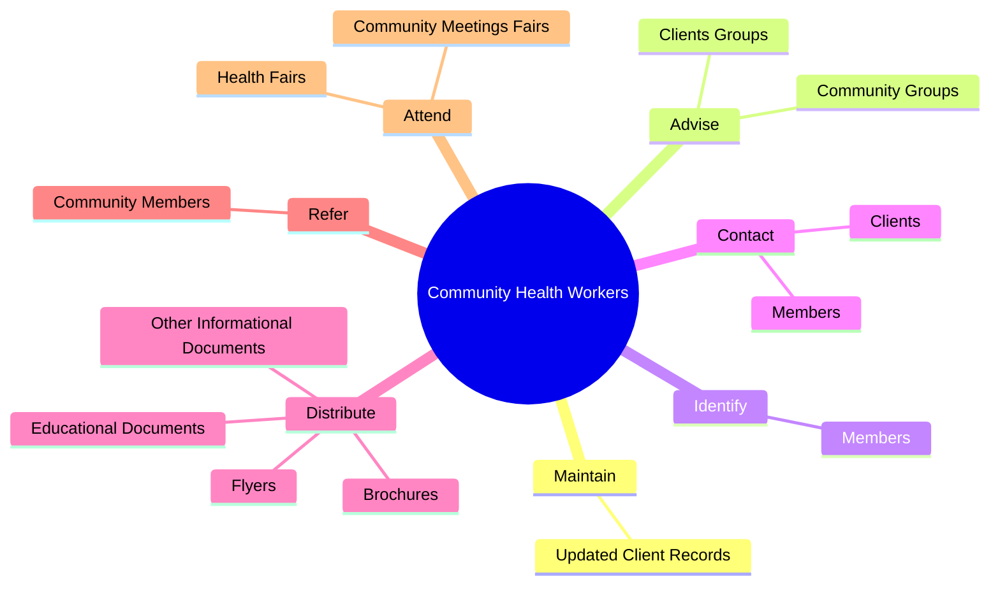

# Community Health Workers

> Promote health within a community by assisting individuals to adopt healthy behaviors. Serve as an advocate for the health needs of individuals by assisting community residents in effectively communicating with healthcare providers or social service agencies. Act as liaison or advocate and implement programs that promote, maintain, and improve individual and overall community health. May deliver health-related preventive services such as blood pressure, glaucoma, and hearing screenings. May collect data to help identify community health needs.

## Overview

Community Health Workers is an occupation within the Community and Social Service category. Promote health within a community by assisting individuals to adopt healthy behaviors. Serve as an advocate for the health needs of individuals by assisting community residents in effectively communicating with healthcare providers or social service agencies.

## Classification Hierarchy

## Key Statistics

| Metric | Value |
|--------|-------|
| SOC Code | 21-1094.00 |
| Category | [Community and Social Service](/occupations/SocialServices) |
| Task Count | 137 |
| Source | O*NET |

## Core Tasks

### maintain.UpdatedClientRecords

Community Health Workers maintain updated client records as part of their core responsibilities.

**Actions:**
- `maintain.UpdatedClientRecords.with.Plans`
- `maintain.UpdatedClientRecords.with.Notes`
- `maintain.UpdatedClientRecords.with.AppropriateForms`
- `maintain.UpdatedClientRecords.with.RelatedInformation`

### advise.ClientsGroups

Community Health Workers advise clients groups as part of their core responsibilities.

**Actions:**
- `advise.ClientsGroups.on.IssuesRelatedToImprovingGeneralHealth`
- `advise.ClientsGroups.on.Diet`
- `advise.ClientsGroups.on.Exercise`
- `advise.CommunityGroups.on.IssuesRelatedToImprovingGeneralHealth`

### identify.Members

Community Health Workers identify members as part of their core responsibilities.

**Actions:**
- `identify.Members.of.HighRiskTargetedGroups`
- `identify.Members.of.OtherwiseTargetedGroups`
- `identify.Members.of.Members.of.MinorityPopulations`
- `identify.Members.of.LowIncomePopulations`

## Skills & Competencies

### Technical Skills
- **Counseling** - Advanced
- **Case Management** - Advanced
- **Community Outreach** - Advanced

### Soft Skills
- **Communication** - Essential
- **Problem Solving** - Essential
- **Critical Thinking** - Important
- **Teamwork** - Important
- **Adaptability** - Important

## Related Occupations

## Industries

This occupation is found across multiple industries. See [Industries](/industries) for sector-specific employment data.

## Career Progression

---

*Source: O*NET 21-1094.00 - ONETOccupation*
