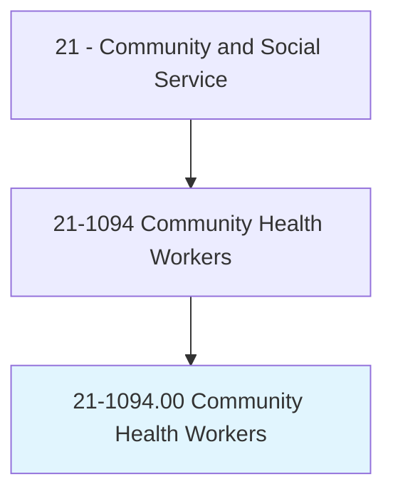
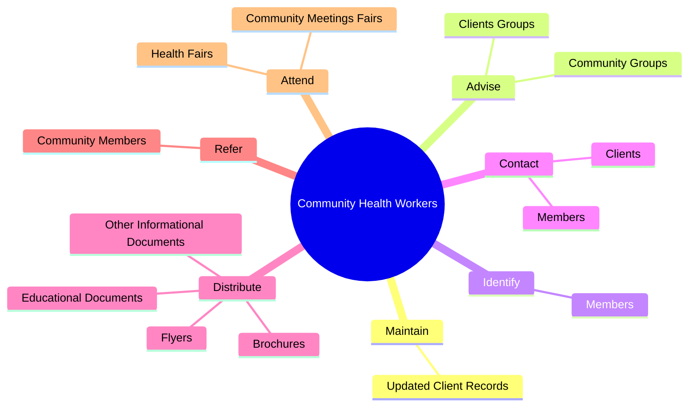
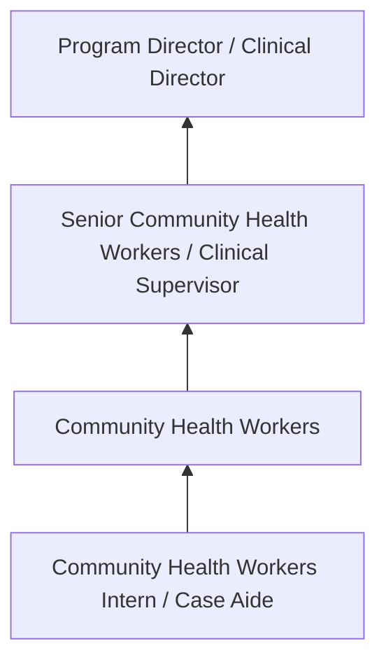
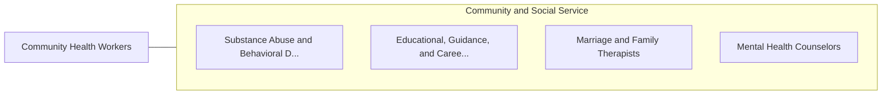

# Community Health Workers

> Promote health within a community by assisting individuals to adopt healthy behaviors. Serve as an advocate for the health needs of individuals by assisting community residents in effectively communicating with healthcare providers or social service agencies. Act as liaison or advocate and implement programs that promote, maintain, and improve individual and overall community health. May deliver health-related preventive services such as blood pressure, glaucoma, and hearing screenings. May collect data to help identify community health needs.

## Overview

Community Health Workers professionals promote health within a community by assisting individuals to adopt healthy behaviors. This occupation falls within the Community and Social Service category and requires a combination of specialized knowledge, technical skills, and practical experience.

These professionals work across diverse settings and organizational contexts, applying their expertise to meet the demands of their field. They must stay current with industry standards, emerging practices, and regulatory requirements that affect their work. The role demands both independent judgment and collaborative skills, as practitioners regularly interact with colleagues, stakeholders, and the public.

As the field continues to evolve, Community Health Workers professionals increasingly leverage technology and data-driven approaches to enhance their effectiveness. Career opportunities span the public and private sectors, with demand influenced by economic conditions, demographic shifts, and technological advancement.

## Classification Hierarchy



## Key Statistics

| Metric | Value |
|--------|-------|
| SOC Code | 21-1094.00 |
| Job Zone | N/A |
| Category | [Community and Social Service](/occupations/SocialServices/index) |
| Core Tasks | 137+ |
| Salary Range | $35,000 - $80,000 |
| Median Salary | $50,000 |
| Growth Outlook | 10% (Much faster than average) |
| Source | O*NET |

## Core Tasks



### advise.ClientsGroups

Community Health Workers advise clients groups as part of their core responsibilities.

**Actions:**
- `advise.ClientsGroups.on.IssuesRelatedToImprovingGeneralHealth` - Advise clients or community groups on issues related to improving general hea...
- `advise.ClientsGroups.on.Diet` - Advise clients or community groups on issues related to improving general hea...
- `advise.ClientsGroups.on.Exercise` - Advise clients or community groups on issues related to improving general hea...
- `advise.CommunityGroups.on.IssuesRelatedToImprovingGeneralHealth` - Advise clients or community groups on issues related to improving general hea...
- `advise.CommunityGroups.on.Diet` - Advise clients or community groups on issues related to improving general hea...

### contact.Members

Community Health Workers contact members as part of their core responsibilities.

**Actions:**
- `contact.Members.of.HighRiskTargetedGroups` - Identify or contact members of high-risk or otherwise targeted groups, such a...
- `contact.Members.of.OtherwiseTargetedGroups` - Identify or contact members of high-risk or otherwise targeted groups, such a...
- `contact.Members.of.Members.of.MinorityPopulations` - Identify or contact members of high-risk or otherwise targeted groups, such a...
- `contact.Members.of.LowIncomePopulations` - Identify or contact members of high-risk or otherwise targeted groups, such a...
- `contact.Members.of.PregnantWomen` - Identify or contact members of high-risk or otherwise targeted groups, such a...

### teach.ClassesDisseminateMedicalDentalHealthInformation

Community Health Workers teach classes disseminate medical dental health information as part of their core responsibilities.

**Actions:**
- `teach.ClassesDisseminateMedicalDentalHealthInformation.to.SchoolGroups` - Teach classes or otherwise disseminate medical or dental health information t...
- `teach.ClassesDisseminateMedicalDentalHealthInformation.to.CommunityGroups` - Teach classes or otherwise disseminate medical or dental health information t...
- `teach.ClassesDisseminateMedicalDentalHealthInformation.to.targeted.FamiliesInMannerConsistentWithCulturalNorms` - Teach classes or otherwise disseminate medical or dental health information t...
- `teach.ClassesDisseminateMedicalDentalHealthInformation.to.IndividualsInMannerConsistentWithCulturalNorms` - Teach classes or otherwise disseminate medical or dental health information t...
- `teach.OtherwiseDisseminateMedicalDentalHealthInformation.to.SchoolGroups` - Teach classes or otherwise disseminate medical or dental health information t...

### identify.Members

Community Health Workers identify members as part of their core responsibilities.

**Actions:**
- `identify.Members.of.HighRiskTargetedGroups` - Identify or contact members of high-risk or otherwise targeted groups, such a...
- `identify.Members.of.OtherwiseTargetedGroups` - Identify or contact members of high-risk or otherwise targeted groups, such a...
- `identify.Members.of.Members.of.MinorityPopulations` - Identify or contact members of high-risk or otherwise targeted groups, such a...
- `identify.Members.of.LowIncomePopulations` - Identify or contact members of high-risk or otherwise targeted groups, such a...
- `identify.Members.of.PregnantWomen` - Identify or contact members of high-risk or otherwise targeted groups, such a...


## Skills & Competencies

### Technical Skills
- **Assessment and Evaluation** - Expert
- **Case Management** - Advanced
- **Crisis Intervention** - Advanced
- **Treatment Planning** - Advanced
- **Documentation and Reporting** - Advanced
- **Cultural Competency** - Advanced

### Soft Skills
- **Empathy** - Critical
- **Active Listening** - Critical
- **Communication** - Essential
- **Ethical Judgment** - Essential
- **Emotional Resilience** - Essential

## Education & Certifications

| Requirement | Details |
|-------------|---------|
| Typical Education | Bachelor's or Master's degree in social work, counseling, or related field |
| Work Experience | 1-2 years supervised clinical experience |
| On-the-Job Training | Moderate to extensive - supervised practice hours required |
| Certifications | State licensure typically required (LCSW, LPC, etc.) |

## Career Progression



## Industry Variations

### Nonprofit Organizations
Community-based service delivery. Community Health Workers professionals focus on underserved populations with limited resources.

### Healthcare Settings
Integrated behavioral and physical health services. Collaboration with medical teams and emphasis on holistic patient care.

### Government Agencies
Public service delivery and policy implementation. Focus on compliance, documentation, and serving diverse community needs.

### Private Practice
Independent or group practice settings. Greater autonomy in service delivery with focus on building a client base.

## Technology & Tools

- **Case management software**
- **Electronic health records (EHR)**
- **Assessment and screening tools**
- **Telehealth platforms**
- **Documentation and reporting systems**

## Related Occupations



## Industries

- Social Assistance - High Employment
- [Healthcare](/industries/Healthcare/index) - High Employment
- [Government](/industries/PublicAdministration) - Moderate Employment
- [Education](/industries/Education) - Moderate Employment

## Departments

This occupation typically works in:
- Client Services
- Program Administration
- Community Outreach

## GraphDL Semantic Structure

```graphdl
Community Health Workers perform:
- maintain.UpdatedClientRecords.with.Plans
- maintain.UpdatedClientRecords.with.Notes
- maintain.UpdatedClientRecords.with.AppropriateForms
- maintain.UpdatedClientRecords.with.RelatedInformation
- advise.ClientsGroups.on.IssuesRelatedToImprovingGeneralHealth
- advise.ClientsGroups.on.Diet
```

---

*Source: O*NET 21-1094.00 - ONETOccupation*
