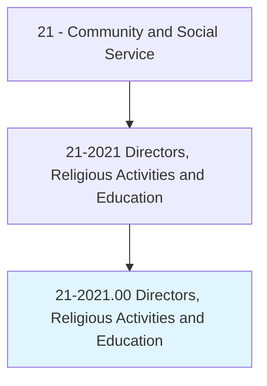
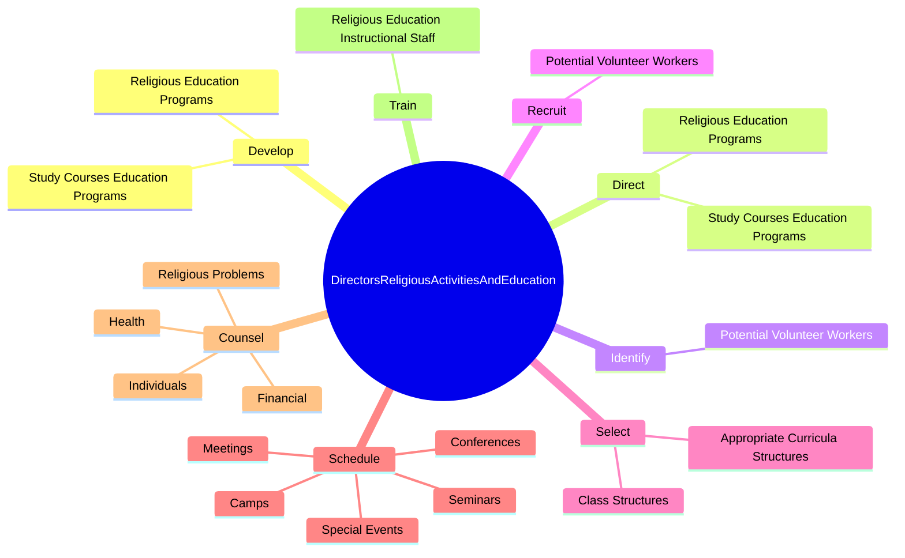

# Directors, Religious Activities and Education

> Coordinate or design programs and conduct outreach to promote the religious education or activities of a denominational group. May provide counseling, guidance, and leadership relative to marital, health, financial, and religious problems.

## Overview

Directors, Religious Activities and Education is an occupation within the Community and Social Service category. Coordinate or design programs and conduct outreach to promote the religious education or activities of a denominational group. 

## Classification Hierarchy

## Key Statistics

| Metric | Value |
|--------|-------|
| SOC Code | 21-2021.00 |
| Category | [Community and Social Service](/occupations/SocialServices) |
| Task Count | 63 |
| Source | O*NET |

## Core Tasks

### develop.StudyCoursesEducationPrograms

Directors, Religious Activities and Education develop study courses education programs as part of their core responsibilities.

**Actions:**
- `develop.StudyCoursesEducationPrograms.within.Congregations`
- `develop.ReligiousEducationPrograms.within.Congregations`

### direct.StudyCoursesEducationPrograms

Directors, Religious Activities and Education direct study courses education programs as part of their core responsibilities.

**Actions:**
- `direct.StudyCoursesEducationPrograms.within.Congregations`
- `direct.ReligiousEducationPrograms.within.Congregations`

### identify.PotentialVolunteerWorkers

Directors, Religious Activities and Education identify potential volunteer workers as part of their core responsibilities.

**Actions:**
- `identify.PotentialVolunteerWorkers`

## Skills & Competencies

### Technical Skills
- **Counseling** - Advanced
- **Case Management** - Advanced
- **Community Outreach** - Advanced

### Soft Skills
- **Communication** - Essential
- **Problem Solving** - Essential
- **Critical Thinking** - Important
- **Teamwork** - Important
- **Adaptability** - Important

## Related Occupations

## Industries

This occupation is found across multiple industries. See [Industries](/industries) for sector-specific employment data.

## Career Progression

---

*Source: O*NET 21-2021.00 - ONETOccupation*
