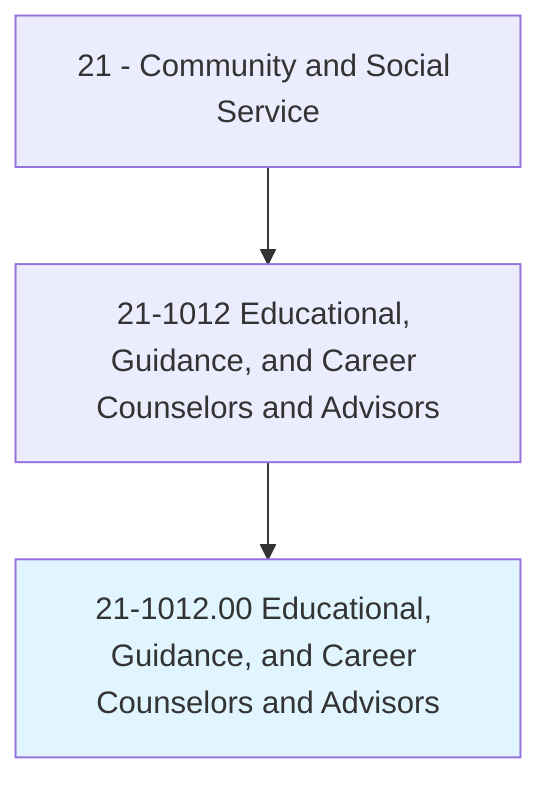
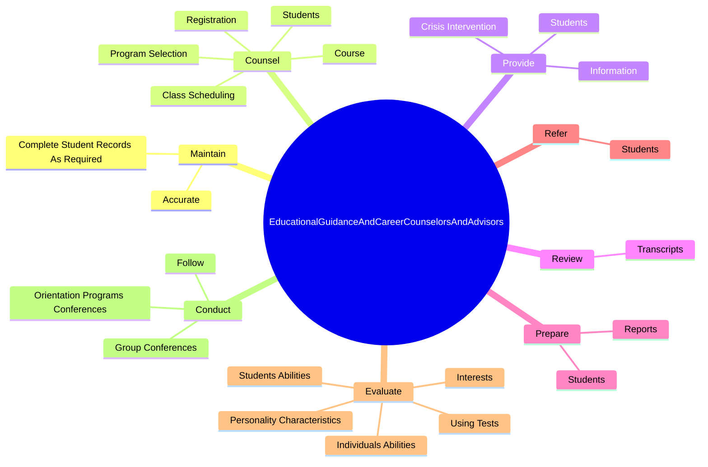
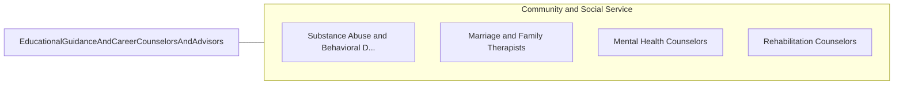

# Educational, Guidance, and Career Counselors and Advisors

> Advise and assist students and provide educational and vocational guidance services.

## Overview

Educational, Guidance, and Career Counselors and Advisors is classified under Community and Social Service (SOC 21). Advise and assist students and provide educational and vocational guidance services.

## Classification Hierarchy

## Key Statistics

| Metric | Value |
|--------|-------|
| SOC Code | 21-1012.00 |
| Category | [Community and Social Service](/occupations/SocialServices) |
| Task Count | 197 |
| Source | O*NET |

## Core Tasks

### maintain.Accurate

Educational, Guidance, and Career Counselors and Advisors maintain accurate as part of their core responsibilities.

**Actions:**
- `maintain.Accurate.by.Laws`
- `maintain.Accurate.by.DistrictPolicies`
- `maintain.Accurate.by.AdministrativeRegulations`
- `maintain.CompleteStudentRecordsAsRequired.by.Laws`

### counsel.Students

Educational, Guidance, and Career Counselors and Advisors counsel students as part of their core responsibilities.

**Actions:**
- `counsel.Students.regarding.EducationalIssues`
- `counsel.Course`
- `counsel.ProgramSelection`
- `counsel.ClassScheduling`

### provide.CrisisIntervention

Educational, Guidance, and Career Counselors and Advisors provide crisis intervention as part of their core responsibilities.

**Actions:**
- `provide.CrisisIntervention.to.StudentsWhenDifficultSituationsOccurAtSchools`
- `provide.Students.with.Information.on.Topics`
- `provide.Students.with.CollegeDegreePrograms`
- `provide.Students.with.AdmissionRequirements`

## Skills & Competencies

### Technical Skills
- **Counseling** - Advanced
- **Case Management** - Advanced
- **Community Outreach** - Advanced

### Soft Skills
- **Communication** - Essential
- **Problem Solving** - Essential
- **Critical Thinking** - Important
- **Teamwork** - Important
- **Adaptability** - Important

## Related Occupations

## Industries

This occupation is found across multiple industries. See [Industries](/industries) for sector-specific employment data.

## Career Progression

---

*Source: O*NET 21-1012.00 - ONETOccupation*
