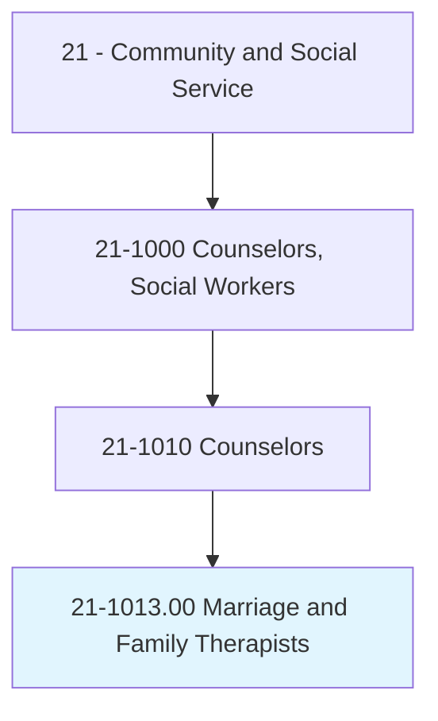
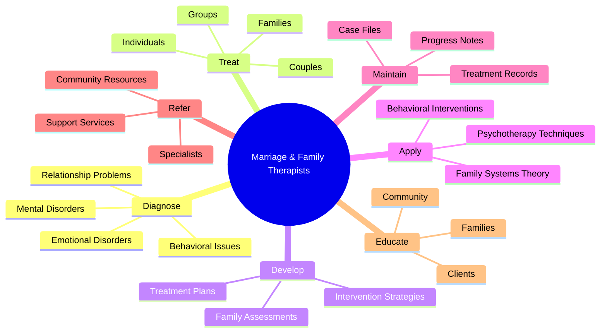
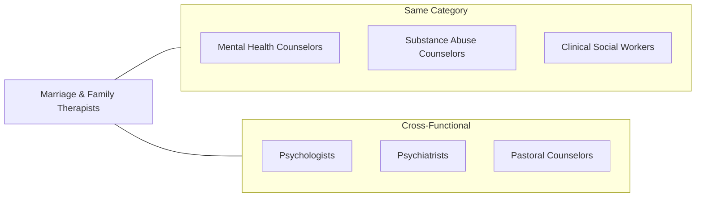
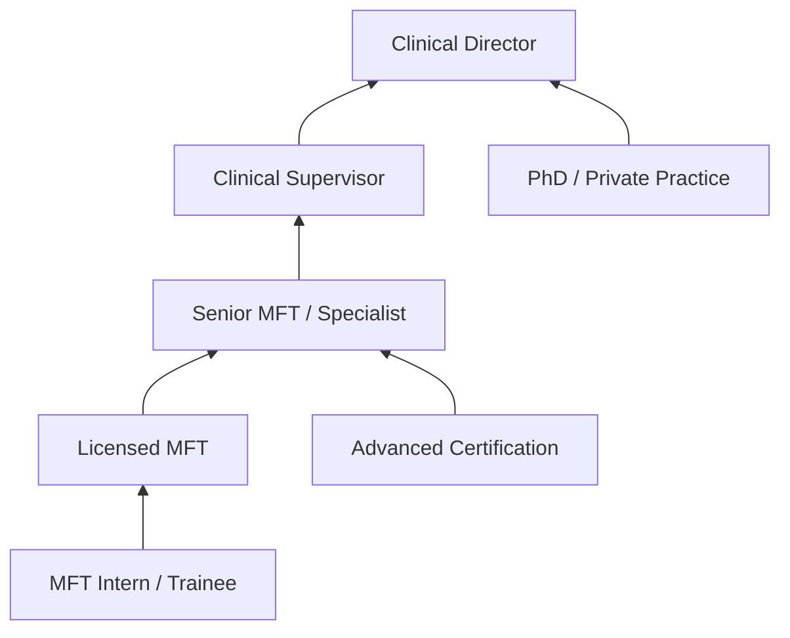

# Marriage and Family Therapists

> Diagnose and treat mental and emotional disorders, whether cognitive, affective, or behavioral, within the context of marriage and family systems. Apply psychotherapeutic and family systems theories and techniques in the delivery of services to individuals, couples, and families for the purpose of treating such diagnosed nervous and mental disorders.

## Overview

Marriage and Family Therapists (MFTs) are specialized mental health professionals who work with individuals, couples, and families to address relationship dynamics and emotional disorders within the context of family systems. They apply systemic therapy approaches that view individual problems as embedded within and influenced by family relationships and interactions. MFTs help clients understand destructive patterns, improve communication, resolve conflicts, and strengthen relational bonds. Their work spans from couples counseling and premarital therapy to child behavioral issues and family crisis intervention.

## Classification Hierarchy



## Key Statistics

| Metric | Value |
|--------|-------|
| SOC Code | 21-1013.00 |
| Job Zone | 5 (Extensive Preparation) |
| Category | [Community and Social Service](/occupations/SocialServices) |
| Education Level | Master's degree required |
| Source | O*NET |

## Core Tasks



### diagnose.Disorders

Therapists assess and diagnose mental, emotional, and behavioral disorders within the family context.

**Actions:**
- `diagnose.MentalDisorders.within.FamilyContext` - Identify cognitive and psychiatric conditions
- `diagnose.EmotionalDisorders.affecting.Relationships` - Assess affective conditions
- `diagnose.BehavioralIssues.in.FamilyMembers` - Evaluate conduct and behavioral patterns
- `diagnose.RelationshipProblems.using.SystemicAssessment` - Understand relational dynamics

### treat.Clients

Therapists provide psychotherapeutic treatment to individuals, couples, and families.

**Actions:**
- `treat.Individuals.using.FamilySystemsApproach` - Work with individuals in relational context
- `treat.Couples.for.RelationshipIssues` - Address marital and partnership challenges
- `treat.Families.to.improve.Functioning` - Enhance family dynamics and communication
- `treat.Children.with.BehavioralProblems` - Address child-focused concerns

### develop.TreatmentPlans

Therapists create individualized treatment strategies addressing family relationship problems.

**Actions:**
- `develop.TreatmentPlans.addressing.RelationshipProblems` - Create intervention roadmaps
- `develop.InterventionStrategies.for.DestructivePatterns` - Address harmful behaviors
- `develop.CommunicationSkills.with.Families` - Build healthy interaction patterns
- `develop.CopingStrategies.for.FamilyStress` - Enhance resilience and adaptation

### apply.TherapeuticTechniques

Therapists utilize specialized theories and techniques in service delivery.

**Actions:**
- `apply.FamilySystemsTheory.in.Treatment` - Use systemic frameworks
- `apply.PsychotherapeuticTechniques.with.Clients` - Implement evidence-based interventions
- `apply.BehavioralInterventions.for.Change` - Modify problematic behaviors
- `apply.CommunicationTechniques.to.improve.Relationships` - Enhance dialogue skills

### maintain.Records

Therapists document treatment activities and client progress.

**Actions:**
- `maintain.CaseFiles.including.Activities` - Keep comprehensive client records
- `maintain.ProgressNotes.for.Treatment` - Document session content and outcomes
- `maintain.Evaluations.of.ClientProgress` - Track therapeutic gains
- `maintain.Recommendations.for.ContinuedCare` - Plan ongoing treatment

### encourage.Clients

Therapists support clients in developing skills for addressing problems constructively.

**Actions:**
- `encourage.Clients.to.express.Feelings` - Facilitate emotional expression
- `encourage.FamilyMembers.to.develop.CopingSkills` - Build resilience
- `encourage.Couples.to.use.HealthyCommunication` - Improve interaction patterns
- `encourage.Clients.to.identify.DestructivePatterns` - Increase self-awareness

## Skills & Competencies

### Technical Skills
- **Family Systems Theory** - Expert
- **Psychotherapy Techniques** - Expert
- **Clinical Assessment** - Advanced
- **Treatment Planning** - Advanced
- **Crisis Intervention** - Advanced
- **Couples Therapy** - Advanced
- **Child Therapy** - Proficient

### Soft Skills
- **Active Listening** - Critical
- **Empathy** - Critical
- **Non-judgmental Stance** - Critical
- **Patience** - Essential
- **Conflict Resolution** - Essential
- **Cultural Sensitivity** - Essential
- **Boundary Maintenance** - Essential

## Related Occupations



### Same Category
- [Mental Health Counselors](./MentalHealthCounselors.mdx) - Individual mental health treatment
- [Substance Abuse Counselors](./SubstanceAbuseCounselors.mdx) - Addiction within families
- Clinical Social Workers - Family case management

### Cross-Functional
- Psychologists - Psychological assessment and therapy
- Psychiatrists - Medical treatment and medication
- Pastoral Counselors - Faith-based family counseling

## Industries

- [Healthcare and Social Assistance](/industries/Healthcare) - High Employment
- [Private Practice](/industries/ProfessionalServices) - High Employment
- [Government](/industries/Government) - Moderate Employment
- [Educational Services](/industries/Education) - Moderate Employment
- [Religious Organizations](/industries/Religious) - Low Employment

## Industry Variations

### Private Practice
Independent practitioners serving voluntary clients. Greater flexibility in therapeutic approaches, schedule, and specializations. Focus on building referral networks and managing business operations.

### Healthcare Settings
Work within hospitals, clinics, or integrated care systems. Emphasis on coordination with medical teams, insurance documentation, and evidence-based practices. Often work with more severe presentations.

### Community Mental Health
Serve underserved populations with diverse needs. Work with sliding scale fees, grant funding, and multidisciplinary teams. Address social determinants of mental health.

### School-Based Settings
Focus on child and adolescent issues affecting academic performance. Coordinate with teachers, parents, and school administrators. Address family dynamics impacting student success.

### Military and Government
Serve military families dealing with deployment, trauma, and transition. Understand unique military culture and stressors. Often provide telehealth services across locations.

## Career Progression



### Career Levels

| Level | Title | Experience | Typical Responsibilities |
|-------|-------|------------|-------------------------|
| Entry | MFT Intern/Trainee | 0-2 years | Supervised clinical practice |
| Mid | Licensed MFT (LMFT) | 2-5 years | Independent practice, full caseload |
| Senior | Senior MFT/Specialist | 5-10 years | Complex cases, specialty areas |
| Supervisor | Clinical Supervisor | 10-15 years | Supervise trainees, quality assurance |
| Director | Clinical Director | 15+ years | Program leadership, strategy |

## Education & Training

| Requirement | Details |
|-------------|---------|
| Typical Education | Master's degree in Marriage and Family Therapy or related field |
| Work Experience | 2-3 years supervised clinical experience (2,000-4,000 hours) |
| On-the-Job Training | Extensive - supervised practice required for licensure |
| Common Certifications | LMFT (Licensed Marriage and Family Therapist), AAMFT Clinical Member |

### Licensure Path

1. **Education**: Master's degree in MFT from COAMFTE-accredited program
2. **Supervised Hours**: Complete required supervised clinical hours
3. **Examination**: Pass national licensing examination (typically AMFTRB)
4. **State Licensure**: Obtain LMFT from state licensing board
5. **Continuing Education**: Maintain licensure through ongoing education

## Alternative Job Titles

- Licensed Marriage and Family Therapist (LMFT)
- Family Therapist
- Marriage Counselor
- Couples Therapist
- Relationship Counselor
- Family Counselor
- Clinical Therapist
- Behavioral Health Clinician
- Child and Family Therapist
- Play Therapist

## Departments

This occupation typically works in:
- [Behavioral Health](/departments/BehavioralHealth)
- [Counseling Services](/departments/CounselingServices)
- [Social Services](/departments/SocialServices)
- [Student Services](/departments/StudentServices)
- [Employee Assistance Programs](/departments/EAP)

## Therapeutic Approaches

Common therapeutic modalities used by MFTs:

| Approach | Description | Application |
|----------|-------------|-------------|
| Structural Family Therapy | Focus on family structure and boundaries | Reorganizing family dynamics |
| Strategic Family Therapy | Problem-focused, directive approach | Breaking dysfunctional patterns |
| Emotionally Focused Therapy | Attachment-based couples therapy | Strengthening emotional bonds |
| Cognitive Behavioral | Thought and behavior modification | Specific symptom reduction |
| Narrative Therapy | Reauthoring client stories | Identity and meaning work |
| Solution-Focused | Future-oriented, strengths-based | Brief intervention |

## GraphDL Semantic Structure

```
Entity: MarriageAndFamilyTherapists
Namespace: occupations.org.ai
Type: Occupation

Core Actions:
- diagnose.Disorders.within.FamilyContext
- treat.Clients.using.FamilySystemsApproach
- develop.TreatmentPlans.addressing.RelationshipProblems
- apply.TherapeuticTechniques.in.Sessions
- maintain.CaseFiles.for.Documentation
- encourage.Clients.to.develop.CopingSkills
- refer.Clients.to.CommunityResources

Related Concepts:
- concepts.org.ai/Marriage
- concepts.org.ai/Family
- concepts.org.ai/Therapists
```

## Process Alignment

Marriage and Family Therapists support key healthcare and social service processes:

| Process Area | Process | Role |
|--------------|---------|------|
| Mental Health Treatment | Psychotherapy | Primary |
| Family Services | Family Intervention | Primary |
| Crisis Response | Crisis Counseling | Primary |
| Child Welfare | Family Assessment | Support |

---

*Source: O*NET 21-1013.00 - ONETOccupation*
