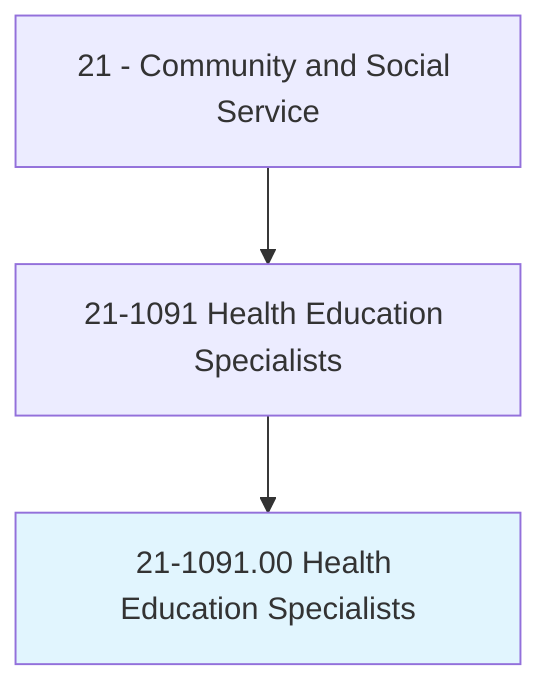
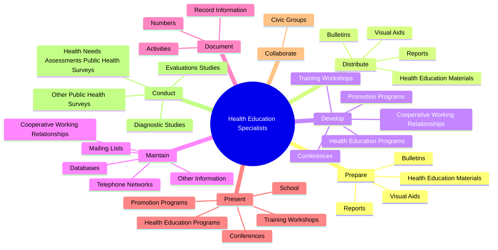
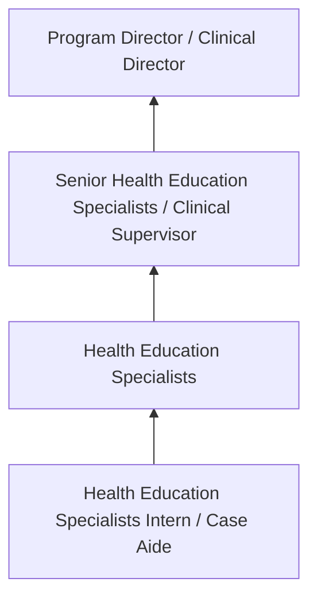

# Health Education Specialists

> Provide and manage health education programs that help individuals, families, and their communities maximize and maintain healthy lifestyles. Use data to identify community needs prior to planning, implementing, monitoring, and evaluating programs designed to encourage healthy lifestyles, policies, and environments. May link health systems, health providers, insurers, and patients to address individual and population health needs. May serve as resource to assist individuals, other health professionals, or the community, and may administer fiscal resources for health education programs.

## Overview

Health Education Specialists professionals provide and manage health education programs that help individuals, families, and their communities maximize and maintain healthy lifestyles. This occupation falls within the Community and Social Service category and requires a combination of specialized knowledge, technical skills, and practical experience.

These professionals work across diverse settings and organizational contexts, applying their expertise to meet the demands of their field. They must stay current with industry standards, emerging practices, and regulatory requirements that affect their work. The role demands both independent judgment and collaborative skills, as practitioners regularly interact with colleagues, stakeholders, and the public.

As the field continues to evolve, Health Education Specialists professionals increasingly leverage technology and data-driven approaches to enhance their effectiveness. Career opportunities span the public and private sectors, with demand influenced by economic conditions, demographic shifts, and technological advancement.

## Classification Hierarchy



## Key Statistics

| Metric | Value |
|--------|-------|
| SOC Code | 21-1091.00 |
| Job Zone | N/A |
| Category | [Community and Social Service](/occupations/SocialServices/index) |
| Core Tasks | 101+ |
| Salary Range | $35,000 - $80,000 |
| Median Salary | $50,000 |
| Growth Outlook | 10% (Much faster than average) |
| Source | O*NET |

## Core Tasks



### develop.CooperativeWorkingRelationships

Health Education Specialists develop cooperative working relationships as part of their core responsibilities.

**Actions:**
- `develop.CooperativeWorkingRelationships.with.AgenciesInterested.in.PublicHealthCare` - Develop and maintain cooperative working relationships with agencies and orga...
- `develop.CooperativeWorkingRelationships.with.OrganizationsInterested.in.PublicHealthCare` - Develop and maintain cooperative working relationships with agencies and orga...
- `develop.HealthEducationPrograms` - Develop and present health education and promotion programs, such as training...
- `develop.PromotionPrograms` - Develop and present health education and promotion programs, such as training...
- `develop.TrainingWorkshops` - Develop and present health education and promotion programs, such as training...

### prepare.HealthEducationMaterials

Health Education Specialists prepare health education materials as part of their core responsibilities.

**Actions:**
- `prepare.HealthEducationMaterials.to.address.Smoking` - Prepare and distribute health education materials, such as reports, bulletins...
- `prepare.HealthEducationMaterials.to.Vaccines` - Prepare and distribute health education materials, such as reports, bulletins...
- `prepare.HealthEducationMaterials.to.OtherPublicHealthConcerns` - Prepare and distribute health education materials, such as reports, bulletins...
- `prepare.Reports.to.address.Smoking` - Prepare and distribute health education materials, such as reports, bulletins...
- `prepare.Reports.to.Vaccines` - Prepare and distribute health education materials, such as reports, bulletins...

### distribute.HealthEducationMaterials

Health Education Specialists distribute health education materials as part of their core responsibilities.

**Actions:**
- `distribute.HealthEducationMaterials.to.address.Smoking` - Prepare and distribute health education materials, such as reports, bulletins...
- `distribute.HealthEducationMaterials.to.Vaccines` - Prepare and distribute health education materials, such as reports, bulletins...
- `distribute.HealthEducationMaterials.to.OtherPublicHealthConcerns` - Prepare and distribute health education materials, such as reports, bulletins...
- `distribute.Reports.to.address.Smoking` - Prepare and distribute health education materials, such as reports, bulletins...
- `distribute.Reports.to.Vaccines` - Prepare and distribute health education materials, such as reports, bulletins...

### document.Activities

Health Education Specialists document activities as part of their core responsibilities.

**Actions:**
- `document.Activities.of.ApplicationsCompleted` - Document activities and record information, such as the numbers of applicatio...
- `document.Activities.of.PresentationsConducted` - Document activities and record information, such as the numbers of applicatio...
- `document.Activities.of.PersonsAssisted` - Document activities and record information, such as the numbers of applicatio...
- `document.RecordInformation.of.ApplicationsCompleted` - Document activities and record information, such as the numbers of applicatio...
- `document.RecordInformation.of.PresentationsConducted` - Document activities and record information, such as the numbers of applicatio...


## Skills & Competencies

### Technical Skills
- **Assessment and Evaluation** - Expert
- **Case Management** - Advanced
- **Crisis Intervention** - Advanced
- **Treatment Planning** - Advanced
- **Documentation and Reporting** - Advanced
- **Cultural Competency** - Advanced

### Soft Skills
- **Empathy** - Critical
- **Active Listening** - Critical
- **Communication** - Essential
- **Ethical Judgment** - Essential
- **Emotional Resilience** - Essential

## Education & Certifications

| Requirement | Details |
|-------------|---------|
| Typical Education | Bachelor's or Master's degree in social work, counseling, or related field |
| Work Experience | 1-2 years supervised clinical experience |
| On-the-Job Training | Moderate to extensive - supervised practice hours required |
| Certifications | State licensure typically required (LCSW, LPC, etc.) |

## Career Progression



## Industry Variations

### Nonprofit Organizations
Community-based service delivery. Health Education Specialists professionals focus on underserved populations with limited resources.

### Healthcare Settings
Integrated behavioral and physical health services. Collaboration with medical teams and emphasis on holistic patient care.

### Government Agencies
Public service delivery and policy implementation. Focus on compliance, documentation, and serving diverse community needs.

### Private Practice
Independent or group practice settings. Greater autonomy in service delivery with focus on building a client base.

## Technology & Tools

- **Case management software**
- **Electronic health records (EHR)**
- **Assessment and screening tools**
- **Telehealth platforms**
- **Documentation and reporting systems**

## Related Occupations


## Industries

- Social Assistance - High Employment
- [Healthcare](/industries/Healthcare/index) - High Employment
- [Government](/industries/PublicAdministration) - Moderate Employment
- [Education](/industries/Education) - Moderate Employment

## Departments

This occupation typically works in:
- Client Services
- Program Administration
- Community Outreach

## GraphDL Semantic Structure

```graphdl
Health Education Specialists perform:
- prepare.HealthEducationMaterials.to.address.Smoking
- prepare.HealthEducationMaterials.to.Vaccines
- prepare.HealthEducationMaterials.to.OtherPublicHealthConcerns
- prepare.Reports.to.address.Smoking
- prepare.Reports.to.Vaccines
- prepare.Reports.to.OtherPublicHealthConcerns
```

---

*Source: O*NET 21-1091.00 - ONETOccupation*
