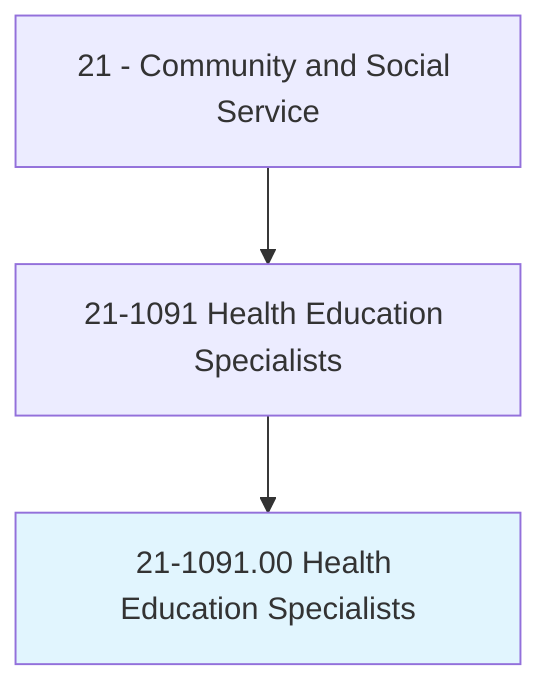
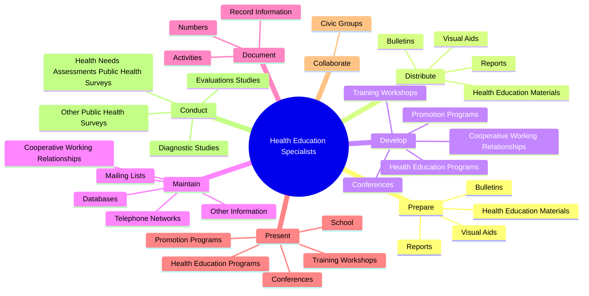

# Health Education Specialists

> Provide and manage health education programs that help individuals, families, and their communities maximize and maintain healthy lifestyles. Use data to identify community needs prior to planning, implementing, monitoring, and evaluating programs designed to encourage healthy lifestyles, policies, and environments. May link health systems, health providers, insurers, and patients to address individual and population health needs. May serve as resource to assist individuals, other health professionals, or the community, and may administer fiscal resources for health education programs.

## Overview

Health Education Specialists is an occupation within the Community and Social Service category. Provide and manage health education programs that help individuals, families, and their communities maximize and maintain healthy lifestyles. Use data to identify community needs prior to planning, implementing, monitoring, and evaluating programs designed to encourage healthy lifestyles, policies, and environments.

## Classification Hierarchy

## Key Statistics

| Metric | Value |
|--------|-------|
| SOC Code | 21-1091.00 |
| Category | [Community and Social Service](/occupations/SocialServices) |
| Task Count | 101 |
| Source | O*NET |

## Core Tasks

### prepare.HealthEducationMaterials

Health Education Specialists prepare health education materials as part of their core responsibilities.

**Actions:**
- `prepare.HealthEducationMaterials.to.address.Smoking`
- `prepare.HealthEducationMaterials.to.Vaccines`
- `prepare.HealthEducationMaterials.to.OtherPublicHealthConcerns`
- `prepare.Reports.to.address.Smoking`

### distribute.HealthEducationMaterials

Health Education Specialists distribute health education materials as part of their core responsibilities.

**Actions:**
- `distribute.HealthEducationMaterials.to.address.Smoking`
- `distribute.HealthEducationMaterials.to.Vaccines`
- `distribute.HealthEducationMaterials.to.OtherPublicHealthConcerns`
- `distribute.Reports.to.address.Smoking`

### develop.CooperativeWorkingRelationships

Health Education Specialists develop cooperative working relationships as part of their core responsibilities.

**Actions:**
- `develop.CooperativeWorkingRelationships.with.AgenciesInterested.in.PublicHealthCare`
- `develop.CooperativeWorkingRelationships.with.OrganizationsInterested.in.PublicHealthCare`
- `develop.HealthEducationPrograms`
- `develop.PromotionPrograms`

## Skills & Competencies

### Technical Skills
- **Counseling** - Advanced
- **Case Management** - Advanced
- **Community Outreach** - Advanced

### Soft Skills
- **Communication** - Essential
- **Problem Solving** - Essential
- **Critical Thinking** - Important
- **Teamwork** - Important
- **Adaptability** - Important

## Related Occupations

## Industries

This occupation is found across multiple industries. See [Industries](/industries) for sector-specific employment data.

## Career Progression

---

*Source: O*NET 21-1091.00 - ONETOccupation*
