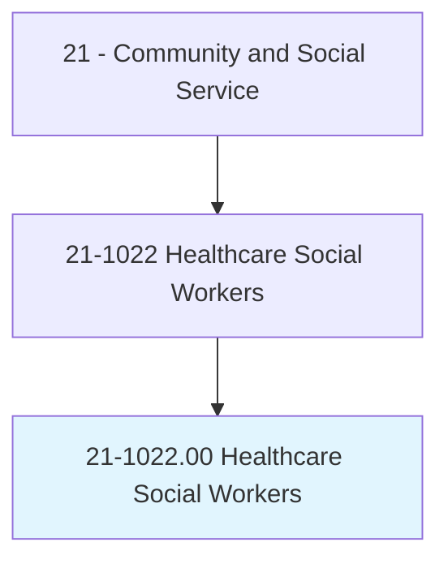
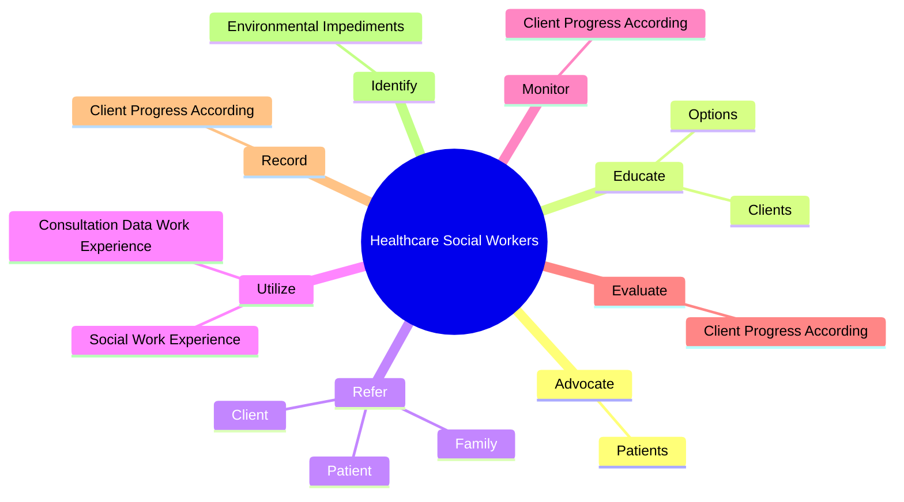
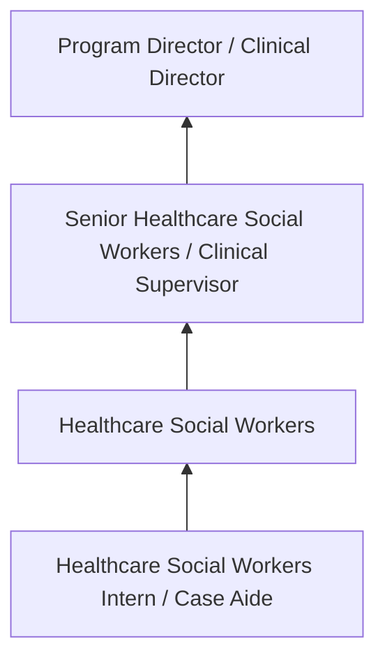
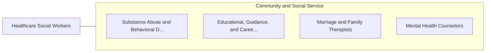

# Healthcare Social Workers

> Provide individuals, families, and groups with the psychosocial support needed to cope with chronic, acute, or terminal illnesses. Services include advising family caregivers. Provide patients with information and counseling, and make referrals for other services. May also provide case and care management or interventions designed to promote health, prevent disease, and address barriers to access to healthcare.

## Overview

Healthcare Social Workers professionals provide individuals, families, and groups with the psychosocial support needed to cope with chronic, acute, or terminal illnesses. This occupation falls within the Community and Social Service category and requires a combination of specialized knowledge, technical skills, and practical experience.

These professionals work across diverse settings and organizational contexts, applying their expertise to meet the demands of their field. They must stay current with industry standards, emerging practices, and regulatory requirements that affect their work. The role demands both independent judgment and collaborative skills, as practitioners regularly interact with colleagues, stakeholders, and the public.

As the field continues to evolve, Healthcare Social Workers professionals increasingly leverage technology and data-driven approaches to enhance their effectiveness. Career opportunities span the public and private sectors, with demand influenced by economic conditions, demographic shifts, and technological advancement.

## Classification Hierarchy



## Key Statistics

| Metric | Value |
|--------|-------|
| SOC Code | 21-1022.00 |
| Job Zone | N/A |
| Category | [Community and Social Service](/occupations/SocialServices/index) |
| Core Tasks | 66+ |
| Salary Range | $35,000 - $80,000 |
| Median Salary | $50,000 |
| Growth Outlook | 10% (Much faster than average) |
| Source | O*NET |

## Core Tasks



### refer.Patient

Healthcare Social Workers refer patient as part of their core responsibilities.

**Actions:**
- `refer.Patient.to.CommunityResourcesToAssistInRecoveryFromMentalIllnessToProvideAccessToServices` - Refer patient, client, or family to community resources to assist in recovery...
- `refer.Patient.to.PhysicalIllnessToProvideAccessToServices` - Refer patient, client, or family to community resources to assist in recovery...
- `refer.Patient.to.FinancialAssistance` - Refer patient, client, or family to community resources to assist in recovery...
- `refer.Patient.to.LegalAid` - Refer patient, client, or family to community resources to assist in recovery...
- `refer.Patient.to.Housing` - Refer patient, client, or family to community resources to assist in recovery...

### counsel.Clients

Healthcare Social Workers counsel clients as part of their core responsibilities.

**Actions:**
- `counsel.Clients.in.IndividualSessions.to.help.ThemOvercomeDependencies` - Counsel clients and patients in individual and group sessions to help them ov...
- `counsel.Clients.in.GroupSessions.to.help.ThemOvercomeDependencies` - Counsel clients and patients in individual and group sessions to help them ov...
- `counsel.Clients.in.Recover.from.Illness` - Counsel clients and patients in individual and group sessions to help them ov...
- `counsel.Clients.in.Adjust.to.Life` - Counsel clients and patients in individual and group sessions to help them ov...
- `counsel.Patients.in.IndividualSessions.to.help.ThemOvercomeDependencies` - Counsel clients and patients in individual and group sessions to help them ov...

### organize.SupportGroups

Healthcare Social Workers organize support groups as part of their core responsibilities.

**Actions:**
- `organize.SupportGroups.to.assist.ThemInUnderstanding` - Organize support groups or counsel family members to assist them in understan...
- `organize.SupportGroups.to.DealingWith` - Organize support groups or counsel family members to assist them in understan...
- `organize.SupportGroups.to.SupportingClient` - Organize support groups or counsel family members to assist them in understan...
- `organize.SupportGroups.to.Patient` - Organize support groups or counsel family members to assist them in understan...
- `organize.CounselFamilyMembers.to.assist.ThemInUnderstanding` - Organize support groups or counsel family members to assist them in understan...

### utilize.ConsultationDataWorkExperience

Healthcare Social Workers utilize consultation data work experience as part of their core responsibilities.

**Actions:**
- `utilize.ConsultationDataWorkExperience.to.plan.ClientPatientCareRehabilitationFollowingThroughToEnsureServiceEfficacy` - Utilize consultation data and social work experience to plan and coordinate c...
- `utilize.ConsultationDataWorkExperience.to.coordinate.ClientPatientCareRehabilitationFollowingThroughToEnsureServiceEfficacy` - Utilize consultation data and social work experience to plan and coordinate c...
- `utilize.SocialWorkExperience.to.plan.ClientPatientCareRehabilitationFollowingThroughToEnsureServiceEfficacy` - Utilize consultation data and social work experience to plan and coordinate c...
- `utilize.SocialWorkExperience.to.coordinate.ClientPatientCareRehabilitationFollowingThroughToEnsureServiceEfficacy` - Utilize consultation data and social work experience to plan and coordinate c...


## Skills & Competencies

### Technical Skills
- **Assessment and Evaluation** - Expert
- **Case Management** - Advanced
- **Crisis Intervention** - Advanced
- **Treatment Planning** - Advanced
- **Documentation and Reporting** - Advanced
- **Cultural Competency** - Advanced

### Soft Skills
- **Empathy** - Critical
- **Active Listening** - Critical
- **Communication** - Essential
- **Ethical Judgment** - Essential
- **Emotional Resilience** - Essential

## Education & Certifications

| Requirement | Details |
|-------------|---------|
| Typical Education | Bachelor's or Master's degree in social work, counseling, or related field |
| Work Experience | 1-2 years supervised clinical experience |
| On-the-Job Training | Moderate to extensive - supervised practice hours required |
| Certifications | State licensure typically required (LCSW, LPC, etc.) |

## Career Progression



## Industry Variations

### Nonprofit Organizations
Community-based service delivery. Healthcare Social Workers professionals focus on underserved populations with limited resources.

### Healthcare Settings
Integrated behavioral and physical health services. Collaboration with medical teams and emphasis on holistic patient care.

### Government Agencies
Public service delivery and policy implementation. Focus on compliance, documentation, and serving diverse community needs.

### Private Practice
Independent or group practice settings. Greater autonomy in service delivery with focus on building a client base.

## Technology & Tools

- **Case management software**
- **Electronic health records (EHR)**
- **Assessment and screening tools**
- **Telehealth platforms**
- **Documentation and reporting systems**

## Related Occupations



## Industries

- [Social Assistance](/industries/SocialAssistance) - High Employment
- [Healthcare](/industries/Healthcare/index) - High Employment
- [Government](/industries/Government) - Moderate Employment
- [Education](/industries/Education) - Moderate Employment

## Departments

This occupation typically works in:
- [Client Services](/departments/ClientServices)
- [Program Administration](/departments/ProgramAdmin)
- [Community Outreach](/departments/CommunityOutreach)

## GraphDL Semantic Structure

```
Healthcare Social Workers perform:
- advocate.Patients.to.resolve.Crises
- educate.Clients.about.EndOfLifeSymptoms.to.assist.ThemInMakingInformedDecisions
- educate.Options.to.assist.ThemInMakingInformedDecisions
- refer.Patient.to.CommunityResourcesToAssistInRecoveryFromMentalIllnessToProvideAccessToServices
- refer.Patient.to.PhysicalIllnessToProvideAccessToServices
- refer.Patient.to.FinancialAssistance
```

---

*Source: O*NET 21-1022.00 - ONETOccupation*
