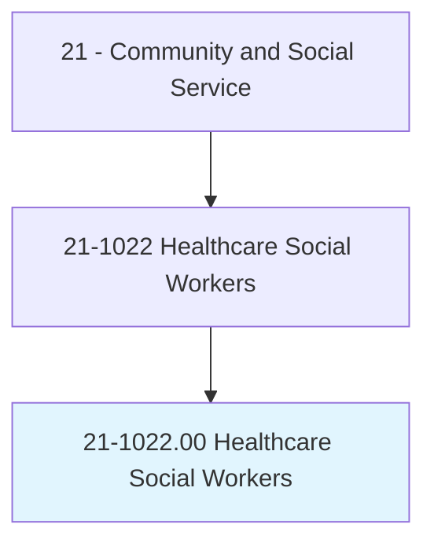
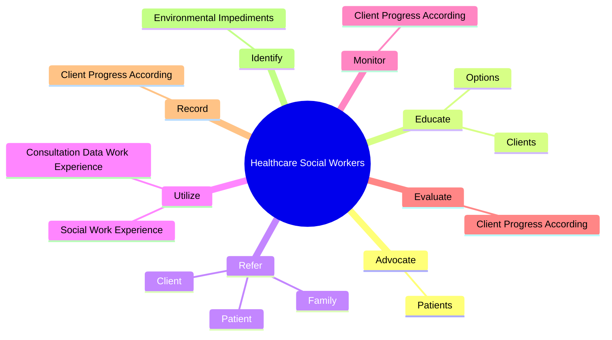

# Healthcare Social Workers

> Provide individuals, families, and groups with the psychosocial support needed to cope with chronic, acute, or terminal illnesses. Services include advising family caregivers. Provide patients with information and counseling, and make referrals for other services. May also provide case and care management or interventions designed to promote health, prevent disease, and address barriers to access to healthcare.

## Overview

Healthcare Social Workers is an occupation within the Community and Social Service category. Provide individuals, families, and groups with the psychosocial support needed to cope with chronic, acute, or terminal illnesses. Services include advising family caregivers.

## Classification Hierarchy

## Key Statistics

| Metric | Value |
|--------|-------|
| SOC Code | 21-1022.00 |
| Category | [Community and Social Service](/occupations/SocialServices/index) |
| Task Count | 66 |
| Source | O*NET |

## Core Tasks

### advocate.Patients

Healthcare Social Workers advocate patients as part of their core responsibilities.

**Actions:**
- `advocate.Patients.to.resolve.Crises`

### educate.Clients

Healthcare Social Workers educate clients as part of their core responsibilities.

**Actions:**
- `educate.Clients.about.EndOfLifeSymptoms.to.assist.ThemInMakingInformedDecisions`
- `educate.Options.to.assist.ThemInMakingInformedDecisions`

### refer.Patient

Healthcare Social Workers refer patient as part of their core responsibilities.

**Actions:**
- `refer.Patient.to.CommunityResourcesToAssistInRecoveryFromMentalIllnessToProvideAccessToServices`
- `refer.Patient.to.PhysicalIllnessToProvideAccessToServices`
- `refer.Patient.to.FinancialAssistance`
- `refer.Patient.to.LegalAid`

## Skills & Competencies

### Technical Skills
- **Counseling** - Advanced
- **Case Management** - Advanced
- **Community Outreach** - Advanced

### Soft Skills
- **Communication** - Essential
- **Problem Solving** - Essential
- **Critical Thinking** - Important
- **Teamwork** - Important
- **Adaptability** - Important

## Related Occupations

## Industries

This occupation is found across multiple industries. See [Industries](/industries) for sector-specific employment data.

## Career Progression

---

*Source: O*NET 21-1022.00 - ONETOccupation*
