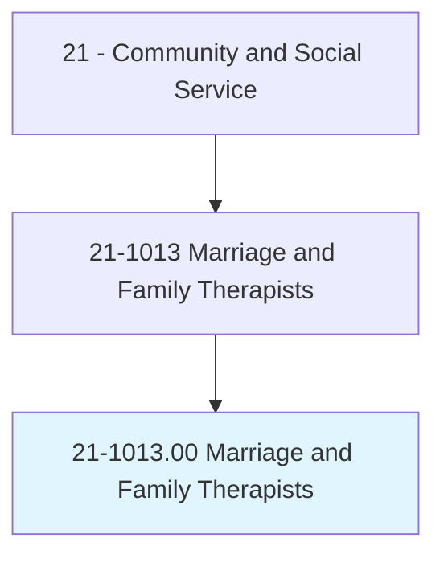
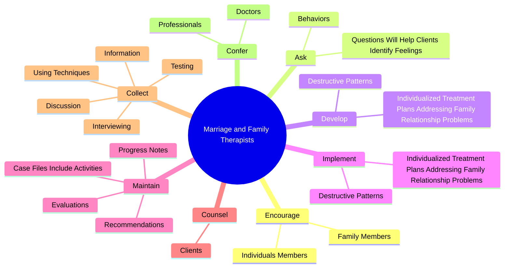

# Marriage and Family Therapists

> Diagnose and treat mental and emotional disorders, whether cognitive, affective, or behavioral, within the context of marriage and family systems. Apply psychotherapeutic and family systems theories and techniques in the delivery of services to individuals, couples, and families for the purpose of treating such diagnosed nervous and mental disorders.

## Overview

Marriage and Family Therapists is an occupation within the Community and Social Service category. Diagnose and treat mental and emotional disorders, whether cognitive, affective, or behavioral, within the context of marriage and family systems. 

## Classification Hierarchy

## Key Statistics

| Metric | Value |
|--------|-------|
| SOC Code | 21-1013.00 |
| Category | [Community and Social Service](/occupations/SocialServices/index) |
| Task Count | 68 |
| Source | O*NET |

## Core Tasks

### encourage.IndividualsMembers

Marriage and Family Therapists encourage individuals members as part of their core responsibilities.

**Actions:**
- `encourage.IndividualsMembers.to.develop.SkillsStrategiesForConfrontingProblemsInConstructiveManner`
- `encourage.IndividualsMembers.to.use.SkillsStrategiesForConfrontingProblemsInConstructiveManner`
- `encourage.FamilyMembers.to.develop.SkillsStrategiesForConfrontingProblemsInConstructiveManner`
- `encourage.FamilyMembers.to.use.SkillsStrategiesForConfrontingProblemsInConstructiveManner`

### ask.QuestionsWillHelpClientsIdentifyFeelings

Marriage and Family Therapists ask questions will help clients identify feelings as part of their core responsibilities.

**Actions:**
- `ask.QuestionsWillHelpClientsIdentifyFeelings`
- `ask.Behaviors`

### develop.IndividualizedTreatmentPlansAddressingFamilyRelationshipProblems

Marriage and Family Therapists develop individualized treatment plans addressing family relationship problems as part of their core responsibilities.

**Actions:**
- `develop.IndividualizedTreatmentPlansAddressingFamilyRelationshipProblems.of.Behavior`
- `develop.IndividualizedTreatmentPlansAddressingFamilyRelationshipProblems.of.OtherPersonalIssues`
- `develop.DestructivePatterns.of.Behavior`
- `develop.DestructivePatterns.of.OtherPersonalIssues`

## Skills & Competencies

### Technical Skills
- **Counseling** - Advanced
- **Case Management** - Advanced
- **Community Outreach** - Advanced

### Soft Skills
- **Communication** - Essential
- **Problem Solving** - Essential
- **Critical Thinking** - Important
- **Teamwork** - Important
- **Adaptability** - Important

## Related Occupations

## Industries

This occupation is found across multiple industries. See [Industries](/industries) for sector-specific employment data.

## Career Progression

---

*Source: O*NET 21-1013.00 - ONETOccupation*
