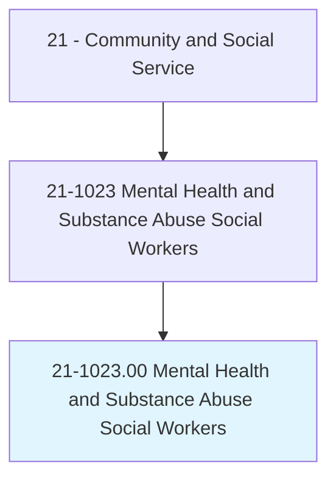
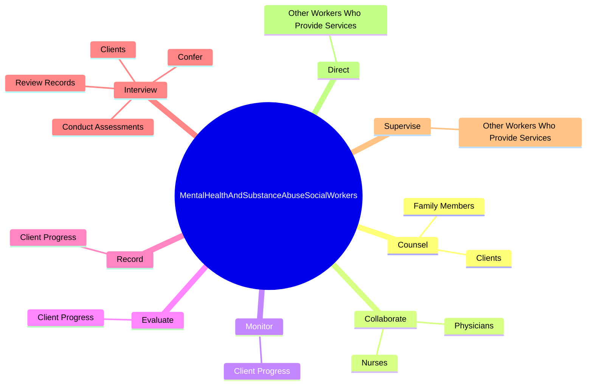
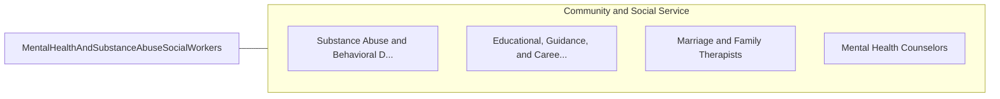

# Mental Health and Substance Abuse Social Workers

> Assess and treat individuals with mental, emotional, or substance abuse problems, including abuse of alcohol, tobacco, and/or other drugs. Activities may include individual and group therapy, crisis intervention, case management, client advocacy, prevention, and education.

## Overview

Mental Health and Substance Abuse Social Workers is an occupation within the Community and Social Service category. Assess and treat individuals with mental, emotional, or substance abuse problems, including abuse of alcohol, tobacco, and/or other drugs. 

## Classification Hierarchy

## Key Statistics

| Metric | Value |
|--------|-------|
| SOC Code | 21-1023.00 |
| Category | [Community and Social Service](/occupations/SocialServices/index) |
| Task Count | 60 |
| Source | O*NET |

## Core Tasks

### counsel.Clients

Mental Health and Substance Abuse Social Workers counsel clients as part of their core responsibilities.

**Actions:**
- `counsel.Clients.in.Individual.dealing.with.SubstanceAbuse`
- `counsel.Clients.in.Individual.dealing.with.Mental`
- `counsel.Clients.in.Individual.dealing.with.PhysicalIllnessPovertyUnemploymentPhysicalAbuse`
- `counsel.Clients.in.GroupSessions.to.assist.ThemInDealingWithSubstanceAbuse`

### collaborate.Physicians

Mental Health and Substance Abuse Social Workers collaborate physicians as part of their core responsibilities.

**Actions:**
- `collaborate.Physicians.to.plan.Treatment`
- `collaborate.Physicians.to.coordinate.Treatment`
- `collaborate.Physicians.to.DrawingOnSocialWorkExperience`
- `collaborate.Physicians.to.PatientNeeds`

### monitor.ClientProgress

Mental Health and Substance Abuse Social Workers monitor client progress as part of their core responsibilities.

**Actions:**
- `monitor.ClientProgress.with.RespectToTreatmentGoals`

## Skills & Competencies

### Technical Skills
- **Counseling** - Advanced
- **Case Management** - Advanced
- **Community Outreach** - Advanced

### Soft Skills
- **Communication** - Essential
- **Problem Solving** - Essential
- **Critical Thinking** - Important
- **Teamwork** - Important
- **Adaptability** - Important

## Related Occupations

## Industries

This occupation is found across multiple industries. See [Industries](/industries) for sector-specific employment data.

## Career Progression

---

*Source: O*NET 21-1023.00 - ONETOccupation*
