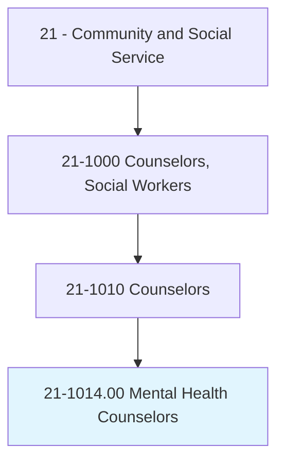
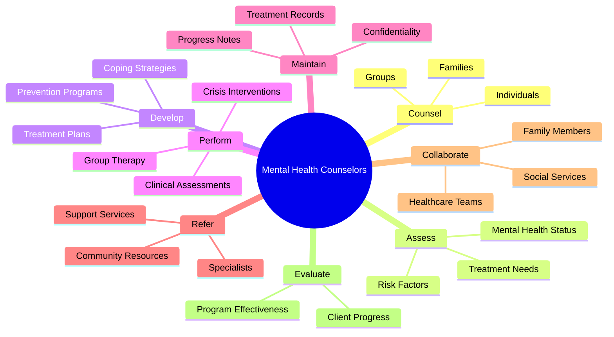
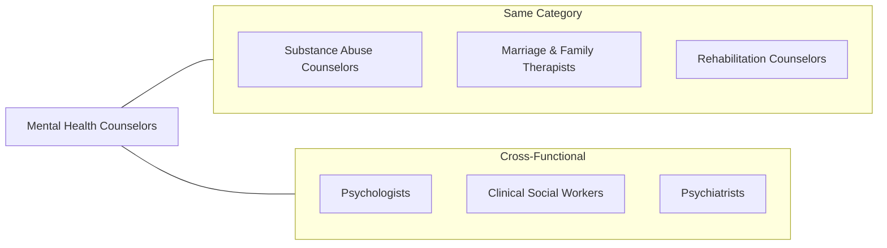
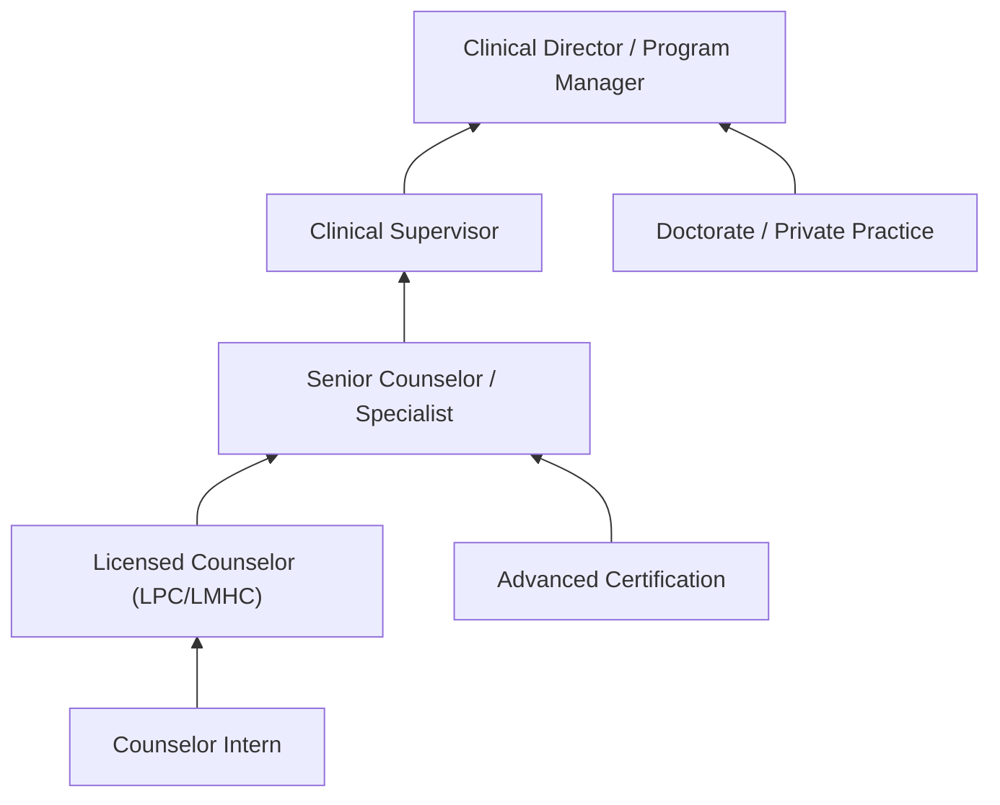

# Mental Health Counselors

> Counsel and advise individuals and groups to promote optimum mental and emotional health, with an emphasis on prevention. May help individuals deal with a broad range of mental health issues, such as those associated with addictions and substance abuse; family, parenting, and marital problems; stress management; self-esteem; or aging.

## Overview

Mental Health Counselors are licensed professionals who provide therapeutic support to individuals and groups dealing with emotional, psychological, and behavioral challenges. With an emphasis on prevention and wellness, they help clients address a wide spectrum of issues including anxiety, depression, trauma, relationship difficulties, life transitions, and stress management. Mental Health Counselors work across diverse settings from private practices to hospitals, schools, and community organizations, utilizing evidence-based therapeutic approaches to promote mental wellness and help clients develop coping skills for life's challenges.

## Classification Hierarchy



## Key Statistics

| Metric | Value |
|--------|-------|
| SOC Code | 21-1014.00 |
| Job Zone | 5 (Extensive Preparation) |
| Category | [Community and Social Service](/occupations/SocialServices) |
| Education Level | Master's degree required |
| Source | O*NET |

## Core Tasks



### counsel.Clients

Mental Health Counselors provide therapeutic support to help clients address emotional and psychological issues.

**Actions:**
- `counsel.Individuals.to.promote.MentalHealth` - Provide individual therapy sessions
- `counsel.Groups.for.SharedSupport` - Facilitate group therapy and support groups
- `counsel.Families.on.RelationshipDynamics` - Address family system issues
- `counsel.Clients.on.StressManagement` - Help develop stress reduction techniques

### assess.Clients

Counselors evaluate clients to determine mental health status and appropriate treatment approaches.

**Actions:**
- `assess.Patients.for.Risk.of.SuicideAttempts` - Screen for self-harm risk
- `assess.MentalCondition.based.on.ClientInformation` - Conduct intake assessments
- `assess.PhysicalCondition.based.on.Review` - Consider physical health factors
- `assess.TreatmentNeeds.through.ClinicalInterviews` - Determine service requirements

### develop.TreatmentPlans

Counselors create individualized treatment strategies based on clinical assessment and client goals.

**Actions:**
- `develop.TreatmentPlans.based.on.ClinicalExperience` - Create evidence-based treatment approaches
- `develop.TreatmentPlans.based.on.Knowledge` - Apply clinical expertise to care planning
- `develop.CopingStrategies.for.ClientProblems` - Build skills for managing challenges
- `develop.PreventionPrograms.for.CommunityHealth` - Design wellness initiatives

### perform.CrisisInterventions

Counselors respond to mental health emergencies to ensure client safety.

**Actions:**
- `perform.CrisisInterventions.to.ensure.PatientSafety` - Respond to acute mental health crises
- `perform.CrisisInterventions.with.Clients` - Provide immediate stabilization support
- `perform.ClinicalAssessments.for.TreatmentPlanning` - Conduct comprehensive evaluations
- `perform.GroupTherapy.for.PeerSupport` - Lead therapeutic group sessions

### maintain.Records

Counselors document treatment activities while protecting client confidentiality.

**Actions:**
- `maintain.Confidentiality.of.RecordsRelatingToClientsTreatment` - Protect client privacy
- `maintain.RequiredTreatmentRecords` - Keep comprehensive documentation
- `maintain.ProgressNotes.for.Sessions` - Document therapeutic progress
- `maintain.DiagnosticRecords.for.Compliance` - Maintain clinical documentation

### encourage.Clients

Counselors support clients in developing insight and skills for addressing life challenges.

**Actions:**
- `encourage.Clients.to.express.Feelings` - Facilitate emotional expression
- `encourage.Clients.to.discuss.WhatIsHappeningInLives` - Explore life circumstances
- `encourage.Clients.to.developInsight.intoThemselves` - Promote self-awareness
- `encourage.Clients.to.developInsight.intoRelationships` - Understand interpersonal patterns

### guide.Clients

Counselors help clients develop practical skills for managing problems.

**Actions:**
- `guide.Clients.in.DevelopmentOfSkills.for.Problems` - Build coping capabilities
- `guide.Clients.in.Strategies.for.Problems` - Develop problem-solving approaches
- `guide.Families.through.Transitions` - Support life changes
- `guide.Clients.toward.RecoveryGoals` - Support treatment objectives

### collaborate.Teams

Counselors work with other professionals to provide comprehensive care.

**Actions:**
- `collaborate.MentalHealthProfessionals.to.perform.ClinicalAssessments` - Coordinate evaluations
- `collaborate.StaffMembers.to.develop.TreatmentPlans` - Team-based care planning
- `collaborate.CommunityResources.to.support.Clients` - Connect with external services
- `collaborate.Families.to.support.ClientRecovery` - Engage support systems

### refer.Clients

Counselors connect clients with additional resources and specialized services.

**Actions:**
- `refer.Patients.to.CommunityResources` - Connect with local support services
- `refer.Clients.to.Specialists` - Coordinate specialized care
- `refer.FamilyMembers.to.SupportServices` - Engage family in treatment
- `refer.Clients.to.MedicalProfessionals` - Coordinate physical health care

### evaluate.Progress

Counselors monitor treatment effectiveness and client outcomes.

**Actions:**
- `evaluate.Effectiveness.of.CounselingPrograms` - Assess treatment impact
- `evaluate.ClientProgress.in.ResolvingProblems` - Track therapeutic gains
- `evaluate.Progress.toward.DefinedObjectives` - Monitor goal achievement
- `evaluate.Programs.for.QualityImprovement` - Enhance service delivery

### modify.Treatment

Counselors adjust treatment approaches based on client progress and changing needs.

**Actions:**
- `modify.TreatmentActivities.to.comply.with.ClientStatus` - Adapt interventions
- `modify.Approaches.based.on.ClientNeeds` - Customize treatment
- `modify.Goals.with.ClientInput` - Adjust objectives collaboratively
- `modify.Frequency.based.on.Progress` - Adjust session scheduling

## Skills & Competencies

### Technical Skills
- **Clinical Assessment** - Expert
- **Treatment Planning** - Expert
- **Crisis Intervention** - Advanced
- **Evidence-Based Therapies** - Advanced
- **Group Facilitation** - Advanced
- **Psychological Testing** - Proficient
- **Case Documentation** - Proficient

### Soft Skills
- **Active Listening** - Critical
- **Empathy** - Critical
- **Non-judgmental Attitude** - Critical
- **Patience** - Essential
- **Emotional Regulation** - Essential
- **Cultural Competency** - Essential
- **Boundary Setting** - Essential

## Related Occupations



### Same Category
- [Substance Abuse Counselors](./SubstanceAbuseCounselors.mdx) - Addiction treatment overlap
- [Marriage and Family Therapists](./FamilyTherapists.mdx) - Relationship-focused therapy
- [Rehabilitation Counselors](./RehabilitationCounselors.mdx) - Disability and mental health

### Cross-Functional
- Psychologists - Psychological assessment and advanced therapy
- Clinical Social Workers - Case management and community resources
- Psychiatrists - Medical treatment and medication management

## Industries

- [Healthcare and Social Assistance](/industries/Healthcare) - High Employment
- [Government](/industries/Government) - Moderate Employment
- [Educational Services](/industries/Education) - Moderate Employment
- [Private Practice](/industries/ProfessionalServices) - Moderate Employment
- [Religious Organizations](/industries/Religious) - Low Employment

## Industry Variations

### Outpatient Mental Health Centers
Work with diverse populations presenting with various mental health concerns. Focus on evidence-based treatments, insurance documentation, and productivity metrics. Often part of multidisciplinary teams.

### Private Practice
Independent practitioners with flexibility in approach and scheduling. Focus on building client base, managing business operations, and maintaining professional networks. Greater autonomy in treatment decisions.

### Hospitals and Inpatient Settings
Work with acute presentations requiring intensive treatment. Coordinate with medical teams, provide crisis stabilization, and facilitate discharge planning. Fast-paced environment with higher acuity clients.

### School-Based Programs
Address mental health needs affecting academic performance. Coordinate with teachers, parents, and administrators. Focus on child and adolescent development and school-based prevention.

### Employee Assistance Programs (EAP)
Provide short-term counseling for workplace-related issues. Focus on brief intervention models, work-life balance, and organizational consultation. Serve diverse employee populations.

### Telehealth/Virtual Practice
Deliver services remotely through video platforms. Requires technology proficiency and adaptation of traditional techniques. Expanded geographic reach with licensing considerations.

## Career Progression



### Career Levels

| Level | Title | Experience | Typical Responsibilities |
|-------|-------|------------|-------------------------|
| Entry | Counselor Intern | 0-2 years | Supervised clinical practice |
| Mid | Licensed Counselor (LPC/LMHC) | 2-5 years | Independent practice, full caseload |
| Senior | Senior Counselor/Specialist | 5-10 years | Complex cases, specialty populations |
| Supervisor | Clinical Supervisor | 10-15 years | Supervise staff, quality assurance |
| Director | Clinical Director | 15+ years | Program leadership, organizational strategy |

## Education & Training

| Requirement | Details |
|-------------|---------|
| Typical Education | Master's degree in Counseling, Clinical Mental Health Counseling, or related field |
| Work Experience | 2-3 years supervised clinical experience (2,000-4,000 hours) |
| On-the-Job Training | Extensive - supervised practice required for licensure |
| Common Certifications | LPC, LMHC, LCPC, NCC, and state-specific licenses |

### Licensure Path

1. **Education**: Master's degree in counseling from CACREP-accredited program
2. **Supervised Hours**: Complete required post-graduate supervised hours
3. **Examination**: Pass National Counselor Examination (NCE) or equivalent
4. **State Licensure**: Obtain state license (LPC, LMHC, LCPC varies by state)
5. **Continuing Education**: Maintain license through ongoing professional development

### Specialty Certifications

- National Certified Counselor (NCC)
- Certified Clinical Mental Health Counselor (CCMHC)
- Board Certified Telemental Health Provider (BC-TMH)
- Certified Trauma Professional (CTP)
- EMDR Certification

## Alternative Job Titles

- Licensed Professional Counselor (LPC)
- Licensed Mental Health Counselor (LMHC)
- Licensed Clinical Professional Counselor (LCPC)
- Clinical Counselor
- Behavioral Health Counselor
- Therapist
- Psychotherapist
- Outpatient Therapist
- Community Mental Health Counselor

## Departments

This occupation typically works in:
- [Behavioral Health](/departments/BehavioralHealth)
- [Counseling Services](/departments/CounselingServices)
- [Student Services](/departments/StudentServices)
- [Employee Assistance Programs](/departments/EAP)
- [Crisis Services](/departments/CrisisServices)

## Therapeutic Approaches

Common evidence-based modalities used by Mental Health Counselors:

| Approach | Description | Common Applications |
|----------|-------------|---------------------|
| Cognitive Behavioral Therapy (CBT) | Change thought patterns affecting emotions/behavior | Anxiety, depression, phobias |
| Person-Centered Therapy | Client-directed, empathic relationship | General counseling, personal growth |
| Solution-Focused Brief Therapy | Future-oriented, goal-focused | Brief intervention, crisis |
| Dialectical Behavior Therapy (DBT) | Skills training for emotional regulation | Borderline PD, self-harm |
| EMDR | Trauma processing through bilateral stimulation | PTSD, trauma |
| Motivational Interviewing | Enhance motivation for change | Ambivalence, addictions |
| Mindfulness-Based Approaches | Present-moment awareness | Stress, anxiety, depression |

## GraphDL Semantic Structure

```
Entity: MentalHealthCounselors
Namespace: occupations.org.ai
Type: Occupation

Core Actions:
- counsel.Clients.to.promote.MentalHealth
- assess.Patients.for.RiskFactors
- develop.TreatmentPlans.based.on.Assessment
- perform.CrisisInterventions.for.Safety
- maintain.Confidentiality.of.Records
- encourage.Clients.to.express.Feelings
- guide.Clients.in.DevelopingSkills
- collaborate.Teams.for.ComprehensiveCare
- refer.Clients.to.Resources
- evaluate.ClientProgress.toward.Goals
- modify.Treatment.based.on.Progress

Related Concepts:
- concepts.org.ai/MentalHealth
- concepts.org.ai/Counselors
```

## Process Alignment

Mental Health Counselors support key healthcare and wellness processes:

| Process Area | Process | Role |
|--------------|---------|------|
| Mental Health Treatment | Psychotherapy | Primary |
| Crisis Response | Crisis Intervention | Primary |
| Prevention | Wellness Programs | Primary |
| Care Coordination | Referral Management | Support |
| Quality Improvement | Outcomes Evaluation | Support |

---

*Source: O*NET 21-1014.00 - ONETOccupation*
