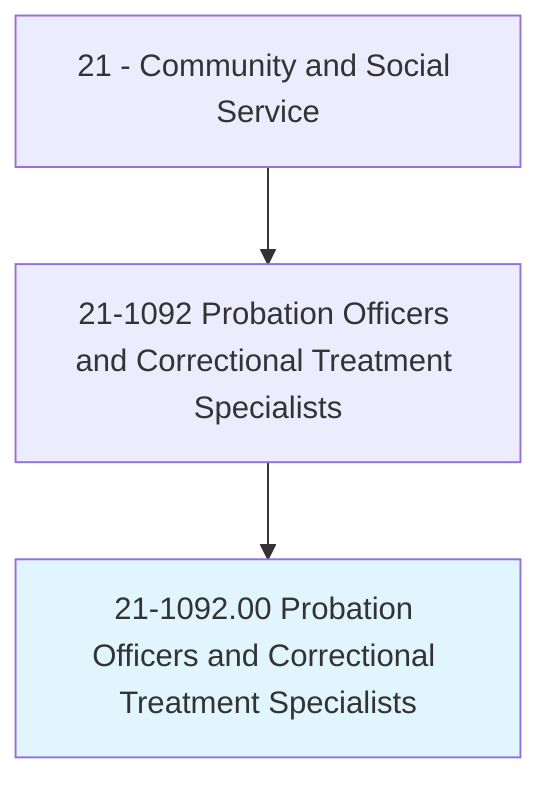
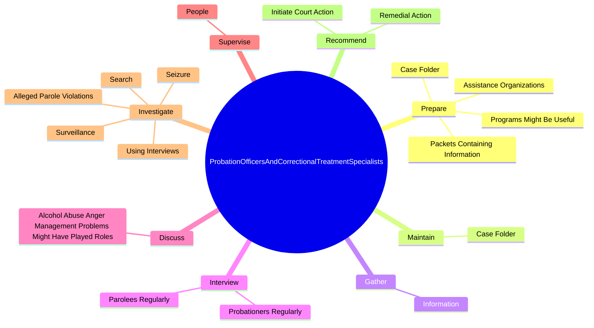

# Probation Officers and Correctional Treatment Specialists

> Provide social services to assist in rehabilitation of law offenders in custody or on probation or parole. Make recommendations for actions involving formulation of rehabilitation plan and treatment of offender, including conditional release and education and employment stipulations.

## Overview

Probation Officers and Correctional Treatment Specialists is an occupation within the Community and Social Service category. Provide social services to assist in rehabilitation of law offenders in custody or on probation or parole. 

## Classification Hierarchy

## Key Statistics

| Metric | Value |
|--------|-------|
| SOC Code | 21-1092.00 |
| Category | [Community and Social Service](/occupations/SocialServices) |
| Task Count | 101 |
| Source | O*NET |

## Core Tasks

### prepare.CaseFolder

Probation Officers and Correctional Treatment Specialists prepare case folder as part of their core responsibilities.

**Actions:**
- `prepare.CaseFolder.for.AssignedInmate`
- `prepare.CaseFolder.for.Offender`
- `prepare.PacketsContainingInformation.about.SocialServiceAgencies.for.Inmates`
- `prepare.PacketsContainingInformation.about.SocialServiceAgencies.for.Offenders`

### maintain.CaseFolder

Probation Officers and Correctional Treatment Specialists maintain case folder as part of their core responsibilities.

**Actions:**
- `maintain.CaseFolder.for.AssignedInmate`
- `maintain.CaseFolder.for.Offender`

### gather.Information

Probation Officers and Correctional Treatment Specialists gather information as part of their core responsibilities.

**Actions:**
- `gather.Information.about.OffendersBackgrounds.by.TalkingToOffenders`
- `gather.Information.about.OffendersBackgrounds.by.Families`
- `gather.Information.about.OffendersBackgrounds.by.Friends`
- `gather.Information.about.OffendersBackgrounds.by.OtherPeopleWhoHaveRelevantInformation`

## Skills & Competencies

### Technical Skills
- **Counseling** - Advanced
- **Case Management** - Advanced
- **Community Outreach** - Advanced

### Soft Skills
- **Communication** - Essential
- **Problem Solving** - Essential
- **Critical Thinking** - Important
- **Teamwork** - Important
- **Adaptability** - Important

## Related Occupations

## Industries

This occupation is found across multiple industries. See [Industries](/industries) for sector-specific employment data.

## Career Progression

---

*Source: O*NET 21-1092.00 - ONETOccupation*
