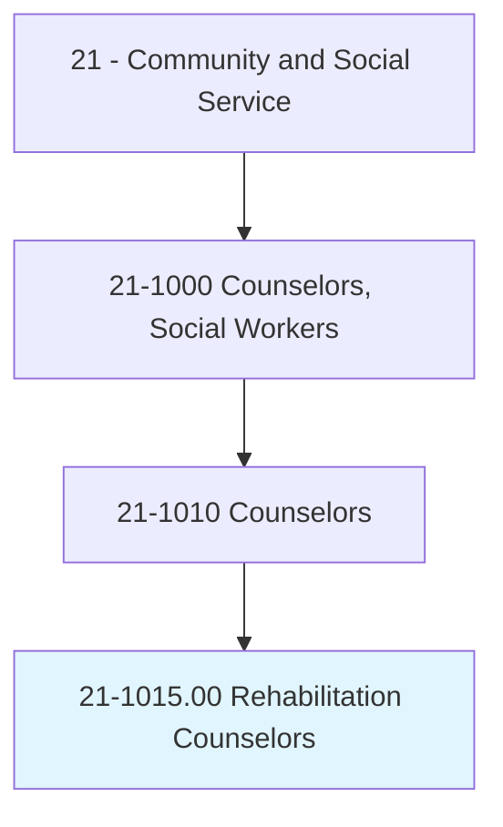
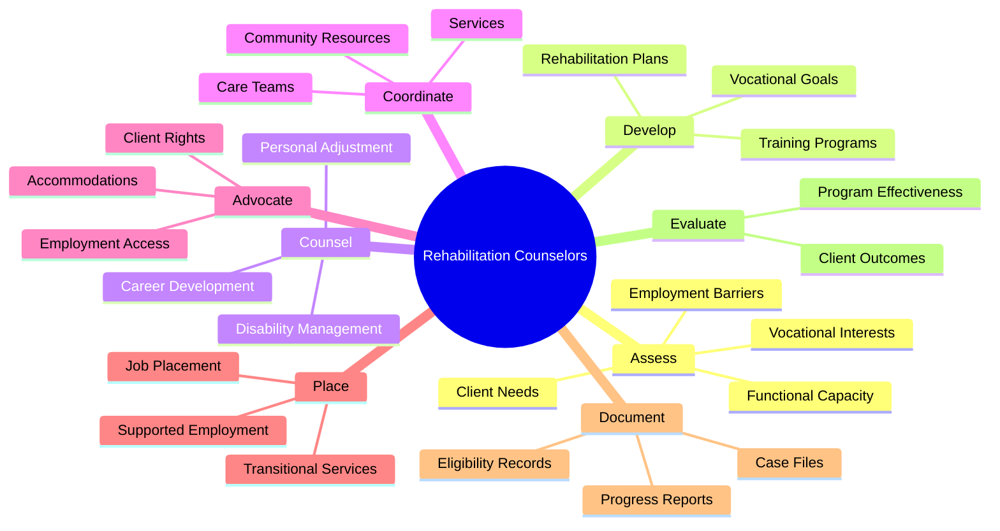
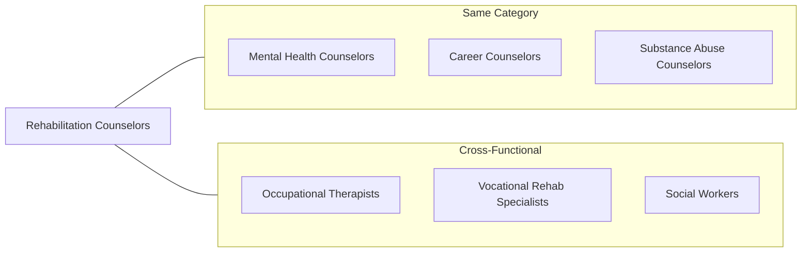
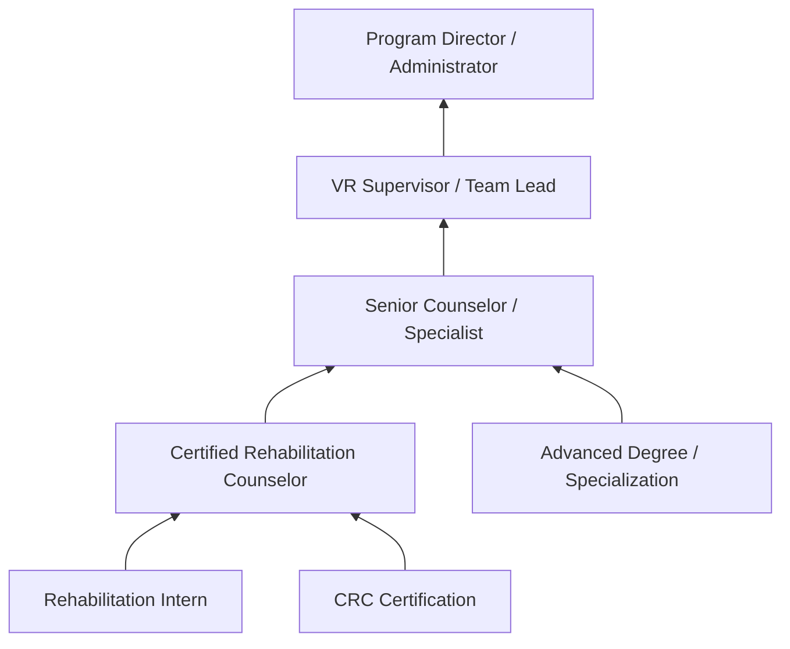

# Rehabilitation Counselors

> Counsel individuals to maximize the independence and employability of persons coping with personal, social, and vocational difficulties that result from birth defects, illness, disease, accidents, aging, or the stress of daily life. Coordinate activities for residents of care and treatment facilities. Assess client needs and design and implement rehabilitation programs that may include personal and vocational counseling, training, and job placement.

## Overview

Rehabilitation Counselors are specialized professionals who help individuals with physical, mental, developmental, or emotional disabilities achieve personal independence and employment goals. They work with clients affected by congenital conditions, injuries, illnesses, or aging-related challenges to develop rehabilitation plans that maximize functional capacity and quality of life. These counselors coordinate comprehensive services including vocational assessment, job training, placement assistance, and personal counseling while advocating for clients within healthcare, educational, and employment systems.

## Classification Hierarchy



## Key Statistics

| Metric | Value |
|--------|-------|
| SOC Code | 21-1015.00 |
| Job Zone | 5 (Extensive Preparation) |
| Category | [Community and Social Service](/occupations/SocialServices/index) |
| Education Level | Master's degree required |
| Source | O*NET |

## Core Tasks



### assess.ClientNeeds

Rehabilitation Counselors evaluate clients to understand their abilities, limitations, and service requirements.

**Actions:**
- `assess.ClientNeeds.for.RehabilitationPlanning` - Conduct comprehensive intake evaluations
- `assess.FunctionalCapacity.to.determine.Abilities` - Evaluate physical and cognitive functioning
- `assess.VocationalInterests.using.Assessments` - Administer career interest inventories
- `assess.EmploymentBarriers.for.Intervention` - Identify obstacles to employment

### develop.RehabilitationPlans

Counselors create individualized plans that address client goals and service needs.

**Actions:**
- `develop.RehabilitationPlans.based.on.Assessment` - Create comprehensive service strategies
- `develop.VocationalGoals.with.ClientInput` - Establish employment objectives
- `develop.TrainingPrograms.for.SkillDevelopment` - Design skill-building interventions
- `develop.IndependentLivingPlans.for.Autonomy` - Support daily living skills

### counsel.Clients

Counselors provide therapeutic support for personal adjustment and career development.

**Actions:**
- `counsel.Clients.on.PersonalAdjustment` - Address disability-related emotional issues
- `counsel.Clients.on.CareerDevelopment` - Guide vocational exploration
- `counsel.Clients.on.DisabilityManagement` - Develop coping strategies
- `counsel.Families.on.SupportStrategies` - Educate family systems

### coordinate.Services

Counselors orchestrate comprehensive rehabilitation services across multiple providers.

**Actions:**
- `coordinate.Services.for.ComprehensiveCare` - Manage service delivery
- `coordinate.CareTeams.for.Integration` - Facilitate team collaboration
- `coordinate.CommunityResources.for.Support` - Connect clients with services
- `coordinate.EmployerContacts.for.Placement` - Build employment partnerships

### prepare.Records

Counselors maintain comprehensive documentation of client information and services.

**Actions:**
- `prepare.RecordsFiles.including.Documentation.of.ClientContacts` - Document all interactions
- `prepare.CaseFiles.including.EligibilityInformation` - Maintain eligibility records
- `prepare.ServicesProvided.for.Accountability` - Track service delivery
- `prepare.RelevantCorrespondence.for.Coordination` - Manage communications

### confer.Specialists

Counselors collaborate with medical and vocational professionals to serve clients.

**Actions:**
- `confer.MedicalProfessionals.to.understand.ClientCapabilities` - Gather medical input
- `confer.Psychologists.to.assess.ClientFunctioning` - Coordinate psychological services
- `confer.EmploymentSpecialists.to.plan.Placement` - Strategize job development
- `confer.Educators.to.coordinate.Training` - Align educational services

### locate.Resources

Counselors identify and connect clients with appropriate support services.

**Actions:**
- `locate.AssistiveTechnology.for.ClientNeeds` - Source adaptive equipment
- `locate.TrainingPrograms.for.SkillDevelopment` - Find educational opportunities
- `locate.EmploymentOpportunities.for.Placement` - Identify job openings
- `locate.SupportServices.for.ClientWellbeing` - Connect with community resources

### monitor.ClientProgress

Counselors track rehabilitation outcomes and adjust services as needed.

**Actions:**
- `monitor.ClientProgress.toward.RehabilitationGoals` - Track goal achievement
- `monitor.EmploymentRetention.for.JobSuccess` - Follow-up on placements
- `monitor.ServiceDelivery.for.QualityAssurance` - Ensure service quality
- `monitor.PlanImplementation.for.Compliance` - Verify plan execution

### participate.Staffings

Counselors engage in team meetings to coordinate client care.

**Actions:**
- `participate.InterdisciplinaryTeamMeetings.for.Coordination` - Attend care conferences
- `participate.CasePlanning.with.Stakeholders` - Engage in collaborative planning
- `participate.ProgramDevelopment.for.ServiceImprovement` - Contribute to program design
- `participate.TrainingSessions.for.ProfessionalDevelopment` - Enhance competencies

## Skills & Competencies

### Technical Skills
- **Vocational Assessment** - Expert
- **Rehabilitation Planning** - Expert
- **Case Management** - Advanced
- **Job Placement** - Advanced
- **Disability Knowledge** - Advanced
- **Assistive Technology** - Proficient
- **Medical Terminology** - Proficient

### Soft Skills
- **Advocacy** - Critical
- **Empathy** - Critical
- **Active Listening** - Critical
- **Problem Solving** - Essential
- **Communication** - Essential
- **Cultural Competency** - Essential
- **Patience** - Essential

## Related Occupations



### Same Category
- [Mental Health Counselors](./MentalHealthCounselors.mdx) - Mental health support
- [Career Counselors](./CareerCounselors.mdx) - Vocational guidance overlap
- [Substance Abuse Counselors](./SubstanceAbuseCounselors.mdx) - Co-occurring treatment

### Cross-Functional
- Occupational Therapists - Functional rehabilitation
- Vocational Rehabilitation Specialists - Employment services
- Social Workers - Case management and advocacy

## Industries

- [Government](/industries/Government) - High Employment (State VR agencies)
- [Healthcare and Social Assistance](/industries/Healthcare/index) - High Employment
- [Educational Services](/industries/Education) - Moderate Employment
- [Insurance](/industries/FinanceInsurance) - Moderate Employment
- [Private Rehabilitation](/industries/ProfessionalServices) - Moderate Employment

## Industry Variations

### State Vocational Rehabilitation Agencies
Work within public VR system serving individuals with disabilities. Focus on eligibility determination, individualized plans for employment (IPE), and outcome-based services. Adhere to federal regulations and reporting requirements.

### Private Rehabilitation Companies
Serve insurance companies, employers, and self-referred clients. Emphasis on return-to-work outcomes, workers' compensation cases, and medical case management. More business-oriented focus.

### Healthcare Settings
Work within hospitals, rehabilitation centers, or outpatient clinics. Coordinate with medical teams, focus on functional restoration, and facilitate discharge planning. Integration with physical and occupational therapy.

### Community Rehabilitation Programs
Serve individuals with developmental disabilities or severe mental illness. Focus on supported employment, community integration, and long-term support services. Often nonprofit organizations.

### Educational Settings
Work in transition programs for students with disabilities. Focus on school-to-work transition, post-secondary planning, and coordination with special education. Collaborate with IEP teams.

### Workers' Compensation
Manage injured worker cases for insurance carriers. Focus on return-to-work facilitation, job analysis, and vocational expert testimony. Requires understanding of legal and medical systems.

## Career Progression



### Career Levels

| Level | Title | Experience | Typical Responsibilities |
|-------|-------|------------|-------------------------|
| Entry | Rehabilitation Intern | 0-2 years | Supervised casework, assessments |
| Mid | Certified Rehab Counselor (CRC) | 2-5 years | Full caseload, plan development |
| Senior | Senior Counselor/Specialist | 5-10 years | Complex cases, specialized populations |
| Supervisor | VR Supervisor | 10-15 years | Staff supervision, quality assurance |
| Director | Program Director | 15+ years | Program administration, policy |

## Education & Training

| Requirement | Details |
|-------------|---------|
| Typical Education | Master's degree in Rehabilitation Counseling or related field |
| Work Experience | Supervised clinical internship (typically 600+ hours) |
| On-the-Job Training | Moderate - agency-specific training required |
| Common Certifications | CRC (Certified Rehabilitation Counselor), CVE (Certified Vocational Evaluator) |

### Certification Path

1. **Education**: Master's degree from CACREP or CORE-accredited program
2. **Internship**: Complete supervised clinical experience
3. **Examination**: Pass CRC examination administered by CRCC
4. **Certification**: Obtain Certified Rehabilitation Counselor (CRC) credential
5. **Maintenance**: Complete continuing education for certification renewal

### Specialty Certifications

- Certified Rehabilitation Counselor (CRC)
- Certified Vocational Evaluator (CVE)
- Certified Disability Management Specialist (CDMS)
- Certified Life Care Planner (CLCP)
- Certified Case Manager (CCM)

## Alternative Job Titles

- Vocational Rehabilitation Counselor
- Disability Counselor
- Vocational Counselor
- Employment Specialist
- Job Placement Specialist
- Case Manager
- Disability Management Specialist
- Return-to-Work Coordinator
- Transition Specialist
- Independent Living Specialist

## Departments

This occupation typically works in:
- [Vocational Rehabilitation](/departments/VocationalRehabilitation)
- [Disability Services](/departments/DisabilityServices)
- [Case Management](/departments/CaseManagement)
- [Human Resources](/departments/HR/index)
- [Student Services](/departments/StudentServices)

## Client Populations

Rehabilitation Counselors work with diverse populations including:

| Population | Focus Areas | Common Services |
|------------|-------------|-----------------|
| Physical Disabilities | Mobility, sensory, chronic conditions | Assistive tech, job accommodations |
| Mental Health | Psychiatric disabilities | Supported employment, counseling |
| Developmental Disabilities | Intellectual, autism spectrum | Life skills, competitive employment |
| Acquired Injuries | TBI, spinal cord, amputation | Medical coordination, retraining |
| Substance Use | Addiction in recovery | Dual diagnosis, employment support |
| Youth/Transition | Students with disabilities | School-to-work, post-secondary |
| Aging | Age-related limitations | Adjustment, vocational change |

## Service Models

Common rehabilitation service delivery approaches:

| Model | Description | Application |
|-------|-------------|-------------|
| Medical Model | Focus on treating impairments | Clinical rehabilitation settings |
| Psychosocial Model | Address environmental/social barriers | Community-based services |
| Supported Employment | Place-then-train approach | Competitive employment for severe disabilities |
| Customized Employment | Negotiate individualized positions | Complex employment barriers |
| Clubhouse Model | Member-operated work programs | Psychiatric rehabilitation |
| Transitional Employment | Time-limited work placements | Building work history |

## GraphDL Semantic Structure

```
Entity: RehabilitationCounselors
Namespace: occupations.org.ai
Type: Occupation

Core Actions:
- assess.ClientNeeds.for.RehabilitationPlanning
- develop.RehabilitationPlans.based.on.Assessment
- counsel.Clients.on.PersonalAdjustment
- coordinate.Services.for.ComprehensiveCare
- prepare.CaseFiles.including.Documentation
- confer.Specialists.to.plan.Services
- locate.Resources.for.ClientNeeds
- monitor.ClientProgress.toward.Goals
- participate.TeamMeetings.for.Coordination

Related Concepts:
- concepts.org.ai/Rehabilitation
- concepts.org.ai/Counselors
```

## Process Alignment

Rehabilitation Counselors support key disability services and employment processes:

| Process Area | Process | Role |
|--------------|---------|------|
| Vocational Rehabilitation | Employment Planning | Primary |
| Disability Services | Accommodation Coordination | Primary |
| Case Management | Service Coordination | Primary |
| Healthcare | Rehabilitation Support | Support |
| Education | Transition Planning | Support |

## Regulatory Framework

Rehabilitation Counselors operate within specific regulatory contexts:

- **Rehabilitation Act**: Federal law governing state VR programs
- **WIOA**: Workforce Innovation and Opportunity Act provisions
- **ADA**: Americans with Disabilities Act compliance
- **IDEA**: Individuals with Disabilities Education Act (transition)
- **State Regulations**: Agency-specific requirements and policies

---

*Source: O*NET 21-1015.00 - ONETOccupation*
