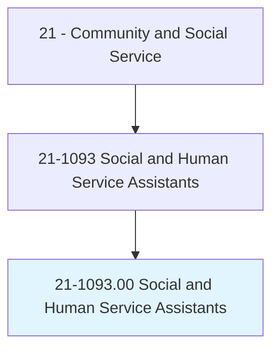
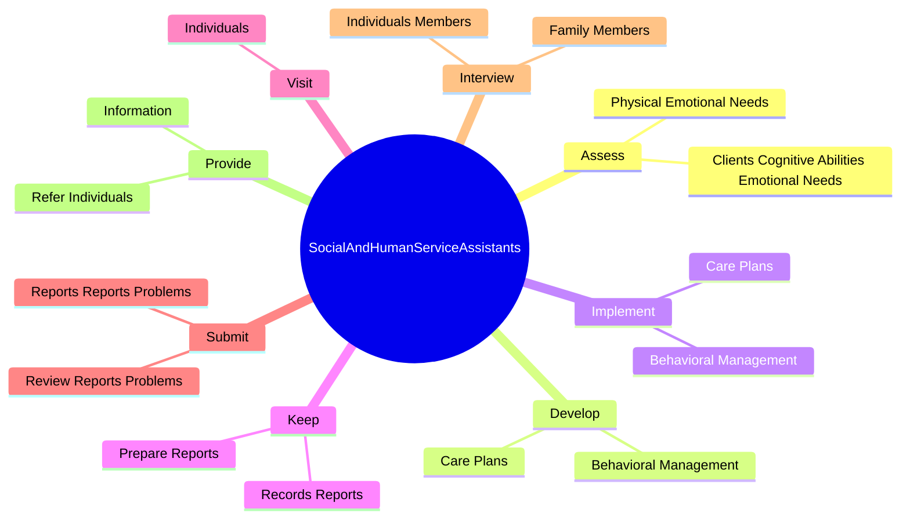
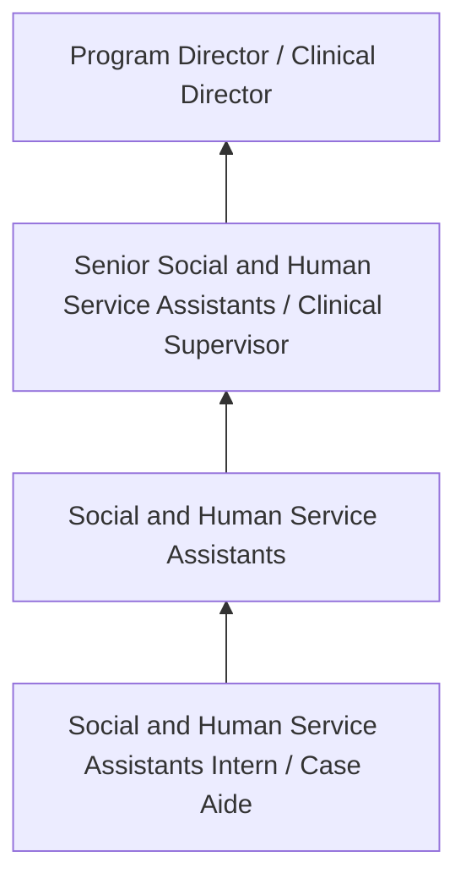
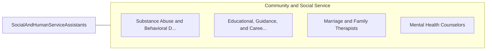

# Social and Human Service Assistants

> Assist other social and human service providers in providing client services in a wide variety of fields, such as psychology, rehabilitation, or social work, including support for families. May assist clients in identifying and obtaining available benefits and social and community services. May assist social workers with developing, organizing, and conducting programs to prevent and resolve problems relevant to substance abuse, human relationships, rehabilitation, or dependent care.

## Overview

Social and Human Service Assistants professionals assist other social and human service providers in providing client services in a wide variety of fields, such as psychology, rehabilitation, or social work, including support for families. This occupation falls within the Community and Social Service category and requires a combination of specialized knowledge, technical skills, and practical experience.

These professionals work across diverse settings and organizational contexts, applying their expertise to meet the demands of their field. They must stay current with industry standards, emerging practices, and regulatory requirements that affect their work. The role demands both independent judgment and collaborative skills, as practitioners regularly interact with colleagues, stakeholders, and the public.

As the field continues to evolve, Social and Human Service Assistants professionals increasingly leverage technology and data-driven approaches to enhance their effectiveness. Career opportunities span the public and private sectors, with demand influenced by economic conditions, demographic shifts, and technological advancement.

## Classification Hierarchy



## Key Statistics

| Metric | Value |
|--------|-------|
| SOC Code | 21-1093.00 |
| Job Zone | N/A |
| Category | [Community and Social Service](/occupations/SocialServices/index) |
| Core Tasks | N/A+ |
| Salary Range | $35,000 - $80,000 |
| Median Salary | $50,000 |
| Growth Outlook | 10% (Much faster than average) |
| Source | O*NET |

## Core Tasks



### assess.ClientsCognitiveAbilitiesEmotionalNeeds

Social and Human Service Assistants assess clients cognitive abilities emotional needs as part of their core responsibilities.

**Actions:**
- `assess.ClientsCognitiveAbilitiesEmotionalNeeds.to.determine.AppropriateInterventions`
- `assess.PhysicalEmotionalNeeds.to.determine.AppropriateInterventions`

### develop.BehavioralManagement

Social and Human Service Assistants develop behavioral management as part of their core responsibilities.

**Actions:**
- `develop.BehavioralManagement.for.Clients`
- `develop.CarePlans.for.Clients`

### implement.BehavioralManagement

Social and Human Service Assistants implement behavioral management as part of their core responsibilities.

**Actions:**
- `implement.BehavioralManagement.for.Clients`
- `implement.CarePlans.for.Clients`

### Technical Skills
- **Counseling** - Advanced
- **Case Management** - Advanced
- **Community Outreach** - Advanced

### Soft Skills
- **Communication** - Essential
- **Problem Solving** - Essential
- **Critical Thinking** - Important
- **Teamwork** - Important
- **Adaptability** - Important


## Skills & Competencies

### Technical Skills
- **Assessment and Evaluation** - Expert
- **Case Management** - Advanced
- **Crisis Intervention** - Advanced
- **Treatment Planning** - Advanced
- **Documentation and Reporting** - Advanced
- **Cultural Competency** - Advanced

### Soft Skills
- **Empathy** - Critical
- **Active Listening** - Critical
- **Communication** - Essential
- **Ethical Judgment** - Essential
- **Emotional Resilience** - Essential

## Education & Certifications

| Requirement | Details |
|-------------|---------|
| Typical Education | Bachelor's or Master's degree in social work, counseling, or related field |
| Work Experience | 1-2 years supervised clinical experience |
| On-the-Job Training | Moderate to extensive - supervised practice hours required |
| Certifications | State licensure typically required (LCSW, LPC, etc.) |

## Career Progression



## Industry Variations

### Nonprofit Organizations
Community-based service delivery. Social and Human Service Assistants professionals focus on underserved populations with limited resources.

### Healthcare Settings
Integrated behavioral and physical health services. Collaboration with medical teams and emphasis on holistic patient care.

### Government Agencies
Public service delivery and policy implementation. Focus on compliance, documentation, and serving diverse community needs.

### Private Practice
Independent or group practice settings. Greater autonomy in service delivery with focus on building a client base.

## Technology & Tools

- **Case management software**
- **Electronic health records (EHR)**
- **Assessment and screening tools**
- **Telehealth platforms**
- **Documentation and reporting systems**

## Related Occupations



## Industries

- Social Assistance - High Employment
- [Healthcare](/industries/Healthcare/index) - High Employment
- [Government](/industries/PublicAdministration) - Moderate Employment
- [Education](/industries/Education) - Moderate Employment

## Departments

This occupation typically works in:
- Client Services
- Program Administration
- Community Outreach

## GraphDL Semantic Structure

```graphdl
Social and Human Service Assistants perform:
- assess.Clients.for.ServiceNeeds
- develop.Plans.for.ClientInterventions
- provide.Counseling.to.ClientsAndFamilies
- coordinate.Services.with.CommunityResources
- document.Progress.in.ClientRecords
```

---

*Source: O*NET 21-1093.00 - ONETOccupation*
