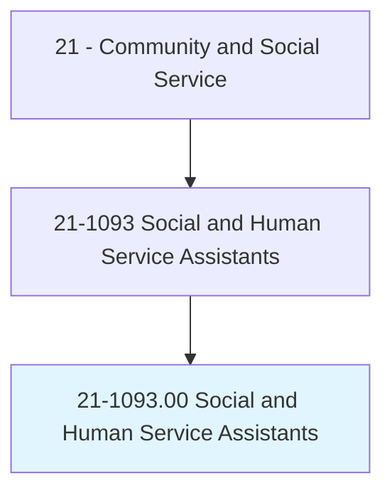
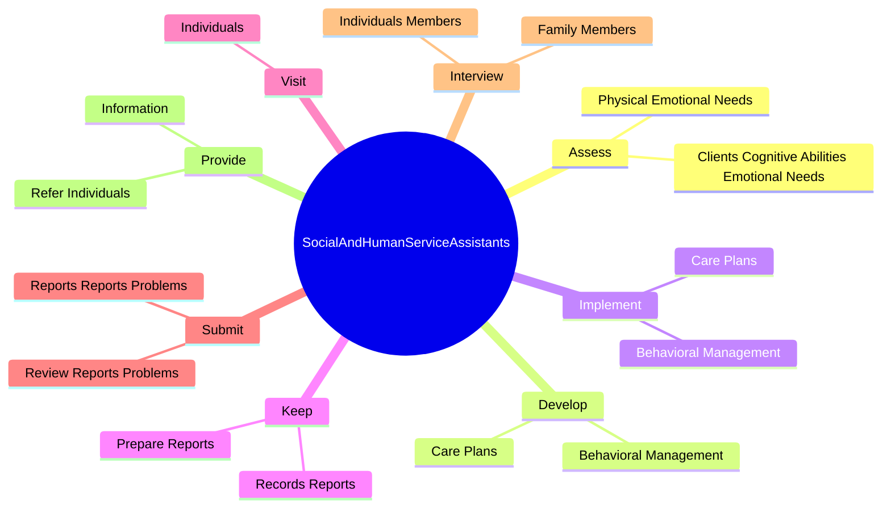
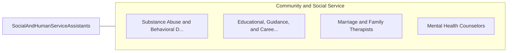

# Social and Human Service Assistants

> Assist other social and human service providers in providing client services in a wide variety of fields, such as psychology, rehabilitation, or social work, including support for families. May assist clients in identifying and obtaining available benefits and social and community services. May assist social workers with developing, organizing, and conducting programs to prevent and resolve problems relevant to substance abuse, human relationships, rehabilitation, or dependent care.

## Overview

Social and Human Service Assistants is an occupation within the Community and Social Service category. Assist other social and human service providers in providing client services in a wide variety of fields, such as psychology, rehabilitation, or social work, including support for families. May assist clients in identifying and obtaining available benefits and social and community services.

## Classification Hierarchy

## Key Statistics

| Metric | Value |
|--------|-------|
| SOC Code | 21-1093.00 |
| Category | [Community and Social Service](/occupations/SocialServices/index) |
| Task Count | 63 |
| Source | O*NET |

## Core Tasks

### assess.ClientsCognitiveAbilitiesEmotionalNeeds

Social and Human Service Assistants assess clients cognitive abilities emotional needs as part of their core responsibilities.

**Actions:**
- `assess.ClientsCognitiveAbilitiesEmotionalNeeds.to.determine.AppropriateInterventions`
- `assess.PhysicalEmotionalNeeds.to.determine.AppropriateInterventions`

### develop.BehavioralManagement

Social and Human Service Assistants develop behavioral management as part of their core responsibilities.

**Actions:**
- `develop.BehavioralManagement.for.Clients`
- `develop.CarePlans.for.Clients`

### implement.BehavioralManagement

Social and Human Service Assistants implement behavioral management as part of their core responsibilities.

**Actions:**
- `implement.BehavioralManagement.for.Clients`
- `implement.CarePlans.for.Clients`

## Skills & Competencies

### Technical Skills
- **Counseling** - Advanced
- **Case Management** - Advanced
- **Community Outreach** - Advanced

### Soft Skills
- **Communication** - Essential
- **Problem Solving** - Essential
- **Critical Thinking** - Important
- **Teamwork** - Important
- **Adaptability** - Important

## Related Occupations

## Industries

This occupation is found across multiple industries. See [Industries](/industries) for sector-specific employment data.

## Career Progression

---

*Source: O*NET 21-1093.00 - ONETOccupation*
